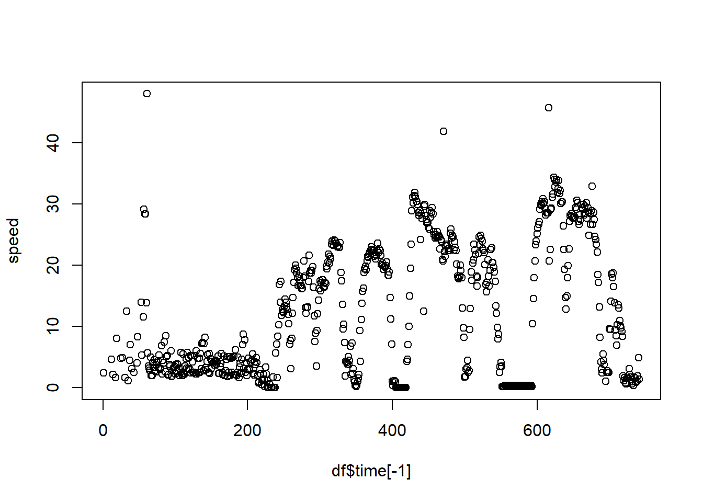
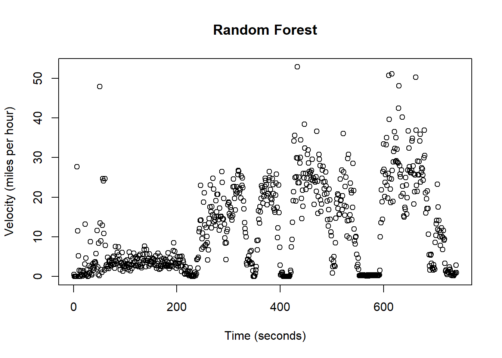

# Activity 1


```r

url <- 'https://www.dropbox.com/scl/fi/2mufv5tlloz06k5ncwyx8/Afternoon_Walk.gpx?rlkey=6jzq31fonrs95glnfibi7lscp&dl=1'

st_layers(url)
data <- st_read(url, layer = "track_points")
```

## Plot/map your movement data. I would recommend using R and/or Google earth as I demonstrated in class.


```r
coords <- as.data.frame(st_coordinates(data))
coords$time <- data$time

leaflet(coords) %>% 
  addTiles(group = "OSM (default)") %>% 
  addProviderTiles(providers$Esri.WorldImagery, group = "World Imagery") %>% 
  addCircleMarkers(~X, ~Y, color = ~time, radius = 2, fillOpacity = .8, group = "Data Points") %>% 
  addLayersControl(
    baseGroups = c("OSM (default)", "World Imagery"),
    overlayGroups = c("Data Points"),
    options = layersControlOptions(collapsed = FALSE)
  )
```


```{=html}
<div class="leaflet html-widget html-fill-item" id="htmlwidget-29669e4542f138ad17c7" style="width:672px;height:480px;"></div>
<script type="application/json" data-for="htmlwidget-29669e4542f138ad17c7">{"x":{"options":{"crs":{"crsClass":"L.CRS.EPSG3857","code":null,"proj4def":null,"projectedBounds":null,"options":{}}},"calls":[{"method":"addTiles","args":["https://{s}.tile.openstreetmap.org/{z}/{x}/{y}.png",null,"OSM (default)",{"minZoom":0,"maxZoom":18,"tileSize":256,"subdomains":"abc","errorTileUrl":"","tms":false,"noWrap":false,"zoomOffset":0,"zoomReverse":false,"opacity":1,"zIndex":1,"detectRetina":false,"attribution":"&copy; <a href=\"https://openstreetmap.org/copyright/\">OpenStreetMap<\/a>,  <a href=\"https://opendatacommons.org/licenses/odbl/\">ODbL<\/a>"}]},{"method":"addProviderTiles","args":["Esri.WorldImagery",null,"World Imagery",{"errorTileUrl":"","noWrap":false,"detectRetina":false}]},{"method":"addCircleMarkers","args":[[39.193263,39.193272,39.193282,39.193282,39.193267,39.193254,39.193329,39.193345,39.193323,39.193265,39.193258,39.193281,39.1933,39.193316,39.19334,39.19335,39.193351,39.193373,39.193386,39.193433,39.193364,39.193296,39.193228,39.193246,39.193355,39.193343,39.193338,39.193341,39.19335,39.19337,39.193378,39.193386,39.193402,39.193414,39.193422,39.193429,39.193436,39.193447,39.193462,39.193479,39.193492,39.193512,39.193523,39.193534,39.193559,39.193567,39.193583,39.193598,39.193626,39.193636,39.193664,39.193676,39.193697,39.193705,39.193713,39.193728,39.19374,39.193764,39.193771,39.193778,39.193788,39.193801,39.193812,39.19382,39.193835,39.193845,39.193859,39.193872,39.193884,39.19389,39.1939,39.193923,39.193932,39.19394,39.193961,39.19397,39.193979,39.193993,39.194012,39.194024,39.194047,39.194055,39.194074,39.194086,39.194107,39.194115,39.194136,39.194153,39.194163,39.194173,39.194194,39.194203,39.194227,39.194234,39.194253,39.194262,39.194281,39.194291,39.194313,39.194317,39.194321,39.194328,39.19432,39.194328,39.194319,39.194319,39.194321,39.194319,39.194317,39.194317,39.194316,39.194316,39.19432,39.194319,39.194316,39.194316,39.194316,39.194317,39.194319,39.194318,39.194318,39.194319,39.194326,39.194326,39.194326,39.19433,39.194339,39.194349,39.194351,39.194353,39.194357,39.194358,39.19436,39.194367,39.194369,39.194373,39.194371,39.194378,39.194379,39.194383,39.194384,39.194384,39.194388,39.19439,39.194392,39.194394,39.194396,39.194397,39.194399,39.194406,39.194415,39.194419,39.194416,39.194413,39.194412,39.194405,39.19438,39.194353,39.194344,39.194319,39.194312,39.194301,39.194302,39.194303,39.194308,39.194312,39.194316,39.19432,39.194325,39.194333,39.194355,39.194364,39.194372,39.194388,39.194403,39.194406,39.194397,39.194389,39.194389,39.194386,39.194385,39.194388,39.19439,39.194387,39.194382,39.194376,39.194373,39.194373,39.194386,39.194395,39.194391,39.194391,39.194391,39.19439,39.194388,39.194388,39.194388,39.194388,39.194388,39.194388,39.194388,39.194388,39.194376,39.194399,39.194393,39.194408,39.194404,39.194371,39.194375,39.19439,39.194387,39.194388,39.194386,39.194381,39.194386,39.194395,39.194394,39.194396,39.194397,39.194394,39.194393,39.194384,39.194369,39.194361,39.194334,39.194286,39.194227,39.194158,39.194081,39.194001,39.193923,39.193848,39.193776,39.193709,39.193636,39.193566,39.193499,39.193432,39.193367,39.193302,39.19323,39.193147,39.193074,39.193022,39.192983,39.192952,39.192955,39.192958,39.192971,39.192974,39.192979,39.192982,39.192988,39.192996,39.193007,39.193013,39.193016,39.19302,39.193021,39.193029,39.193036,39.193052,39.193069,39.19309,39.193114,39.193138,39.193167,39.193196,39.193223,39.193249,39.193276,39.193309,39.19335,39.193386,39.193427,39.193473,39.193513,39.193555,39.193595,39.193641,39.193688,39.193734,39.193778,39.193825,39.193872,39.193916,39.193959,39.194007,39.194055,39.194101,39.194148,39.194193,39.19423,39.194268,39.194294,39.194313,39.19433,39.194345,39.194348,39.194358,39.194368,39.194376,39.194388,39.194397,39.194406,39.194419,39.194423,39.194436,39.19444,39.194447,39.194452,39.19445,39.19445,39.19445,39.194449,39.19445,39.194453,39.194457,39.194477,39.194486,39.194508,39.194534,39.194565,39.194599,39.194633,39.194672,39.194704,39.194742,39.194782,39.19482,39.194856,39.194891,39.194925,39.194957,39.194988,39.195016,39.195042,39.195066,39.195086,39.195109,39.195125,39.195143,39.195155,39.195163,39.195168,39.195175,39.19518,39.195184,39.195187,39.195192,39.195191,39.195188,39.195183,39.195181,39.195177,39.195171,39.195164,39.195158,39.195155,39.195155,39.195153,39.195152,39.195152,39.195149,39.195148,39.195146,39.195142,39.195142,39.195142,39.195142,39.195142,39.195142,39.195142,39.195142,39.195142,39.195142,39.195142,39.195142,39.195142,39.195142,39.195142,39.195142,39.195142,39.19514,39.195138,39.19513,39.19511,39.195059,39.194981,39.194887,39.194771,39.194646,39.194525,39.194399,39.194271,39.194146,39.194024,39.193902,39.193782,39.193667,39.193554,39.193438,39.193341,39.193227,39.193116,39.193016,39.192897,39.192777,39.192664,39.192554,39.192446,39.192338,39.192233,39.192129,39.192013,39.191901,39.191786,39.191668,39.191554,39.191452,39.191352,39.191254,39.191154,39.191055,39.190953,39.190854,39.190754,39.190655,39.190564,39.190467,39.190371,39.190287,39.190204,39.190036,39.189947,39.189861,39.189768,39.189674,39.189581,39.189491,39.1894,39.18931,39.189209,39.189105,39.189007,39.188907,39.188808,39.188718,39.188623,39.188532,39.188443,39.188362,39.188289,39.188217,39.188146,39.188073,39.187993,39.187916,39.187844,39.187792,39.187753,39.18772,39.187713,39.187706,39.187695,39.187682,39.187664,39.187654,39.187643,39.187605,39.187553,39.187477,39.187407,39.187328,39.187246,39.187152,39.187062,39.186975,39.186902,39.186842,39.186793,39.186765,39.186755,39.186758,39.18676,39.186765,39.186763,39.186757,39.186744,39.186736,39.186737,39.186734,39.186732,39.186733,39.186732,39.186736,39.186734,39.186737,39.186739,39.186742,39.186741,39.18674,39.186738,39.18674,39.186738,39.186737,39.186734,39.186734,39.186732,39.18673,39.18673,39.186726,39.186724,39.186721,39.186721,39.186721,39.186721,39.18672,39.18672,39.18672,39.18672,39.186719,39.186719,39.186719,39.186719,39.186718,39.186718,39.186718,39.186718,39.186717,39.186717,39.186717,39.186717,39.186716,39.186716,39.186716,39.186716,39.186715,39.186715,39.186715,39.186715,39.186714,39.186714,39.186714,39.186713,39.186713,39.186713,39.186713,39.186712,39.186712,39.186712,39.186712,39.186711,39.186711,39.186711,39.186711,39.186714,39.186713,39.186714,39.186713,39.186712,39.186713,39.186716,39.186721,39.186728,39.186729,39.186724,39.186721,39.18672,39.186718,39.186716,39.186715,39.186713,39.18671,39.186709,39.186709,39.18671,39.18671,39.18671,39.186712,39.186712,39.18671,39.186708,39.186707,39.186706,39.186705,39.186706,39.186704,39.186702,39.1867,39.186697,39.186689,39.186674,39.18667,39.186671,39.186664,39.186666,39.186667,39.186666,39.186665,39.186666,39.186644,39.186594,39.186522,39.186442,39.186351,39.186242,39.186129,39.186015,39.185903,39.185792,39.18568,39.185568,39.185456,39.185338,39.185221,39.185098,39.184977,39.184868,39.184761,39.184648,39.184538,39.184418,39.1843,39.184183,39.184063,39.18395,39.183831,39.183717,39.183596,39.183485,39.183367,39.183252,39.183152,39.183038,39.182931,39.182815,39.182683,39.182576,39.182461,39.182351,39.182252,39.182155,39.182061,39.181972,39.181898,39.181829,39.181776,39.181743,39.181726,39.181714,39.181705,39.181683,39.181665,39.18165,39.181642,39.181632,39.181621,39.181611,39.181601,39.181563,39.181532,39.181519,39.18152,39.181524,39.181523,39.181516,39.181508,39.181495,39.181465,39.181438,39.181398,39.181344,39.181293,39.18125,39.18121,39.181173,39.181148,39.181133,39.181136,39.181136,39.181132,39.181129,39.181129,39.181124,39.181118,39.181115,39.181103,39.181102,39.181099,39.181097,39.181097,39.181094,39.181094,39.181093,39.181093,39.181094,39.181091,39.181087,39.181081,39.181094,39.181094],[-96.584378,-96.584383,-96.58464499999999,-96.584667,-96.584695,-96.58465700000001,-96.584772,-96.584818,-96.584801,-96.584695,-96.584687,-96.584722,-96.584749,-96.584773,-96.58479699999999,-96.584879,-96.58492200000001,-96.58528099999999,-96.58525899999999,-96.585362,-96.58548399999999,-96.58560199999999,-96.58571999999999,-96.585652,-96.585447,-96.585472,-96.585489,-96.585505,-96.585514,-96.585515,-96.585516,-96.585516,-96.585511,-96.585504,-96.585483,-96.585472,-96.58546200000001,-96.585449,-96.58544000000001,-96.58543400000001,-96.585431,-96.585421,-96.585415,-96.585408,-96.585393,-96.58538799999999,-96.58537800000001,-96.58537,-96.585357,-96.585353,-96.585328,-96.585307,-96.585308,-96.585311,-96.58531499999999,-96.58531600000001,-96.585306,-96.585309,-96.585306,-96.585302,-96.585311,-96.585311,-96.5853,-96.58530500000001,-96.58530500000001,-96.585311,-96.58532,-96.58533,-96.585335,-96.585342,-96.585341,-96.58533799999999,-96.585337,-96.585336,-96.58532700000001,-96.58532700000001,-96.585328,-96.58532599999999,-96.58532700000001,-96.58532200000001,-96.58532,-96.585308,-96.585301,-96.58530399999999,-96.585307,-96.5853,-96.585301,-96.585301,-96.5853,-96.58529799999999,-96.585297,-96.585296,-96.585296,-96.585303,-96.585306,-96.585301,-96.585297,-96.585295,-96.585301,-96.58531600000001,-96.585353,-96.58539,-96.58540000000001,-96.585436,-96.585477,-96.585494,-96.585509,-96.585531,-96.585559,-96.585572,-96.585601,-96.585613,-96.58563700000001,-96.58565299999999,-96.58567499999999,-96.585696,-96.585717,-96.585736,-96.585758,-96.585781,-96.585801,-96.585823,-96.585848,-96.58586,-96.58587199999999,-96.58588899999999,-96.58590599999999,-96.585932,-96.585943,-96.585955,-96.585981,-96.58599100000001,-96.586001,-96.586012,-96.58603599999999,-96.586044,-96.58607000000001,-96.586079,-96.586105,-96.58611399999999,-96.586139,-96.586152,-96.58617700000001,-96.58618800000001,-96.586214,-96.586225,-96.586257,-96.586268,-96.58627799999999,-96.586287,-96.58631,-96.58631699999999,-96.58633399999999,-96.586354,-96.586366,-96.586388,-96.586405,-96.586434,-96.586445,-96.58646899999999,-96.586478,-96.586494,-96.58650400000001,-96.586519,-96.58654300000001,-96.586558,-96.586572,-96.58659299999999,-96.586614,-96.586635,-96.586637,-96.586634,-96.586631,-96.58663799999999,-96.58663900000001,-96.586664,-96.586682,-96.58668299999999,-96.586687,-96.58669,-96.58670499999999,-96.586716,-96.58671699999999,-96.58672199999999,-96.58672300000001,-96.586715,-96.586721,-96.58672199999999,-96.58671699999999,-96.586718,-96.586721,-96.586721,-96.586721,-96.586718,-96.586718,-96.586718,-96.586718,-96.586718,-96.586709,-96.586709,-96.586709,-96.586709,-96.58668400000001,-96.586662,-96.586665,-96.586626,-96.586573,-96.58649699999999,-96.58642500000001,-96.586337,-96.586276,-96.58620999999999,-96.586146,-96.586083,-96.58601400000001,-96.58593999999999,-96.585868,-96.58580000000001,-96.585734,-96.585672,-96.585618,-96.585583,-96.585548,-96.585536,-96.58551300000001,-96.58550200000001,-96.585504,-96.585503,-96.585497,-96.585486,-96.58548,-96.585477,-96.585475,-96.585477,-96.58547900000001,-96.585483,-96.58547799999999,-96.585476,-96.58547299999999,-96.585469,-96.585469,-96.585469,-96.585464,-96.585455,-96.58541700000001,-96.585362,-96.585294,-96.585204,-96.585093,-96.584996,-96.584897,-96.5848,-96.584701,-96.584599,-96.584515,-96.58445500000001,-96.584416,-96.58437000000001,-96.584352,-96.584305,-96.584243,-96.584172,-96.584091,-96.584005,-96.583929,-96.58384599999999,-96.583763,-96.58368,-96.583602,-96.583524,-96.58344200000001,-96.583365,-96.583277,-96.58318800000001,-96.583096,-96.583,-96.582908,-96.58281100000001,-96.58271499999999,-96.58260900000001,-96.58250099999999,-96.582396,-96.58229,-96.58218100000001,-96.58207299999999,-96.581965,-96.581856,-96.581754,-96.58165099999999,-96.581548,-96.581446,-96.581338,-96.581253,-96.581177,-96.581115,-96.58107200000001,-96.581023,-96.58099,-96.58098099999999,-96.580963,-96.580946,-96.580929,-96.58090799999999,-96.58089200000001,-96.580872,-96.58084100000001,-96.580831,-96.580797,-96.580786,-96.58077299999999,-96.580772,-96.580776,-96.58077400000001,-96.58077299999999,-96.58077400000001,-96.580769,-96.58076199999999,-96.580752,-96.58071099999999,-96.580692,-96.580642,-96.580579,-96.58050799999999,-96.58043600000001,-96.580349,-96.580262,-96.580168,-96.58008100000001,-96.579987,-96.579887,-96.579787,-96.579683,-96.579577,-96.57946800000001,-96.579356,-96.579245,-96.579134,-96.57902199999999,-96.578914,-96.578805,-96.578698,-96.57858899999999,-96.578474,-96.578352,-96.578238,-96.578121,-96.578005,-96.577893,-96.577789,-96.577684,-96.577581,-96.57748100000001,-96.57737899999999,-96.577277,-96.577174,-96.577068,-96.57696799999999,-96.57687300000001,-96.576778,-96.57668,-96.576604,-96.57654599999999,-96.576509,-96.576505,-96.576504,-96.576509,-96.57651199999999,-96.576517,-96.576517,-96.576517,-96.576517,-96.576517,-96.576517,-96.576517,-96.576517,-96.576517,-96.576517,-96.576517,-96.576517,-96.576517,-96.576517,-96.576517,-96.576517,-96.576539,-96.576515,-96.57648,-96.576435,-96.57639399999999,-96.57638799999999,-96.57639500000001,-96.57639500000001,-96.57639,-96.576391,-96.57638900000001,-96.576384,-96.57637699999999,-96.576385,-96.576392,-96.576392,-96.57639399999999,-96.576393,-96.576397,-96.57640499999999,-96.57640499999999,-96.57640600000001,-96.576409,-96.576404,-96.576409,-96.576413,-96.57641599999999,-96.57641700000001,-96.576429,-96.576432,-96.57643,-96.576425,-96.576425,-96.57642199999999,-96.576427,-96.57642199999999,-96.57643,-96.576435,-96.57643899999999,-96.576447,-96.57644500000001,-96.576454,-96.576452,-96.576452,-96.57645100000001,-96.576453,-96.57645599999999,-96.57646,-96.576458,-96.576459,-96.576454,-96.57646200000001,-96.576466,-96.576472,-96.57647299999999,-96.576472,-96.576476,-96.57648399999999,-96.576489,-96.57649499999999,-96.5765,-96.576503,-96.57650099999999,-96.576499,-96.576491,-96.576475,-96.576459,-96.576444,-96.57643899999999,-96.576435,-96.576437,-96.57642800000001,-96.576425,-96.57641700000001,-96.576418,-96.57642199999999,-96.576426,-96.576431,-96.576432,-96.576431,-96.57643299999999,-96.576427,-96.576424,-96.57642300000001,-96.576421,-96.576419,-96.57641700000001,-96.57641700000001,-96.576419,-96.57642800000001,-96.576455,-96.576476,-96.576482,-96.576489,-96.57648399999999,-96.57647799999999,-96.576441,-96.57637200000001,-96.57626399999999,-96.576137,-96.576016,-96.57588699999999,-96.575761,-96.575637,-96.57552,-96.575405,-96.57529100000001,-96.575187,-96.57510000000001,-96.575019,-96.57492999999999,-96.574822,-96.57472799999999,-96.574642,-96.57454300000001,-96.574426,-96.574308,-96.574202,-96.574096,-96.573994,-96.573896,-96.573806,-96.57373699999999,-96.573674,-96.573623,-96.573582,-96.573537,-96.57352400000001,-96.57350700000001,-96.573486,-96.57346800000001,-96.57346699999999,-96.573466,-96.573465,-96.573464,-96.57346200000001,-96.57346099999999,-96.57346,-96.573459,-96.573458,-96.573457,-96.573455,-96.573454,-96.573453,-96.573452,-96.57345100000001,-96.57344999999999,-96.573448,-96.573447,-96.573446,-96.57344500000001,-96.57344399999999,-96.573443,-96.573441,-96.57344000000001,-96.57343899999999,-96.573438,-96.573437,-96.573436,-96.57343400000001,-96.57343299999999,-96.573432,-96.573431,-96.57343,-96.57342800000001,-96.573427,-96.573426,-96.573425,-96.573424,-96.57342300000001,-96.573421,-96.57342,-96.57336599999999,-96.573291,-96.573198,-96.57309100000001,-96.57297,-96.572846,-96.572716,-96.572581,-96.57244300000001,-96.57230300000001,-96.572152,-96.571997,-96.571843,-96.571686,-96.57152600000001,-96.57137,-96.571213,-96.571061,-96.570915,-96.570767,-96.57061899999999,-96.570471,-96.570234,-96.570127,-96.57001,-96.56985899999999,-96.56970699999999,-96.569546,-96.569382,-96.569204,-96.569028,-96.56885800000001,-96.568684,-96.56850799999999,-96.568343,-96.568175,-96.568,-96.567837,-96.56767000000001,-96.567514,-96.567357,-96.5672,-96.567063,-96.566946,-96.566846,-96.56677000000001,-96.56671,-96.566667,-96.56667,-96.566675,-96.566677,-96.566676,-96.56667899999999,-96.566676,-96.566671,-96.566667,-96.566666,-96.56666300000001,-96.566666,-96.566672,-96.566672,-96.566672,-96.566678,-96.56667899999999,-96.566683,-96.56669100000001,-96.566695,-96.566694,-96.566697,-96.566698,-96.56670099999999,-96.56670699999999,-96.566711,-96.56671799999999,-96.566723,-96.566726,-96.566728,-96.566733,-96.56673600000001,-96.56674599999999,-96.56674700000001,-96.566751,-96.566756,-96.56675799999999,-96.56676299999999,-96.566767,-96.566771,-96.56677500000001,-96.566774,-96.566776,-96.566779,-96.566783,-96.56677999999999,-96.56677999999999,-96.56677999999999,-96.566778,-96.566782,-96.56677999999999,-96.566779,-96.566778,-96.566776,-96.56677500000001,-96.566773,-96.566772,-96.566771,-96.56676400000001,-96.56673499999999,-96.566664,-96.566568,-96.566475,-96.566378,-96.566293,-96.566222,-96.566176,-96.56615499999999,-96.566147,-96.56613400000001,-96.566142,-96.566157,-96.566168,-96.566176,-96.566193,-96.566228,-96.566267,-96.566276,-96.566282,-96.566289,-96.566289,-96.566292,-96.56629599999999,-96.56629700000001,-96.56629,-96.566294,-96.566283,-96.566275,-96.56626900000001,-96.566272,-96.56626900000001,-96.566271,-96.56626199999999,-96.56627,-96.566265,-96.56626300000001,-96.566265,-96.566271,-96.56629,-96.56629700000001],2,null,"Data Points",{"interactive":true,"className":"","stroke":true,"color":["2024-01-29T23:46:22Z","2024-01-29T23:46:23Z","2024-01-29T23:46:34Z","2024-01-29T23:46:36Z","2024-01-29T23:46:40Z","2024-01-29T23:46:41Z","2024-01-29T23:46:47Z","2024-01-29T23:46:49Z","2024-01-29T23:46:53Z","2024-01-29T23:46:55Z","2024-01-29T23:46:57Z","2024-01-29T23:46:59Z","2024-01-29T23:47:00Z","2024-01-29T23:47:02Z","2024-01-29T23:47:05Z","2024-01-29T23:47:09Z","2024-01-29T23:47:10Z","2024-01-29T23:47:15Z","2024-01-29T23:47:16Z","2024-01-29T23:47:18Z","2024-01-29T23:47:19Z","2024-01-29T23:47:20Z","2024-01-29T23:47:21Z","2024-01-29T23:47:22Z","2024-01-29T23:47:23Z","2024-01-29T23:47:24Z","2024-01-29T23:47:25Z","2024-01-29T23:47:26Z","2024-01-29T23:47:27Z","2024-01-29T23:47:28Z","2024-01-29T23:47:29Z","2024-01-29T23:47:30Z","2024-01-29T23:47:31Z","2024-01-29T23:47:32Z","2024-01-29T23:47:33Z","2024-01-29T23:47:34Z","2024-01-29T23:47:35Z","2024-01-29T23:47:36Z","2024-01-29T23:47:37Z","2024-01-29T23:47:38Z","2024-01-29T23:47:39Z","2024-01-29T23:47:40Z","2024-01-29T23:47:41Z","2024-01-29T23:47:42Z","2024-01-29T23:47:43Z","2024-01-29T23:47:44Z","2024-01-29T23:47:45Z","2024-01-29T23:47:46Z","2024-01-29T23:47:47Z","2024-01-29T23:47:48Z","2024-01-29T23:47:49Z","2024-01-29T23:47:50Z","2024-01-29T23:47:51Z","2024-01-29T23:47:52Z","2024-01-29T23:47:53Z","2024-01-29T23:47:54Z","2024-01-29T23:47:55Z","2024-01-29T23:47:56Z","2024-01-29T23:47:57Z","2024-01-29T23:47:58Z","2024-01-29T23:47:59Z","2024-01-29T23:48:00Z","2024-01-29T23:48:01Z","2024-01-29T23:48:02Z","2024-01-29T23:48:03Z","2024-01-29T23:48:04Z","2024-01-29T23:48:05Z","2024-01-29T23:48:06Z","2024-01-29T23:48:07Z","2024-01-29T23:48:08Z","2024-01-29T23:48:09Z","2024-01-29T23:48:10Z","2024-01-29T23:48:11Z","2024-01-29T23:48:12Z","2024-01-29T23:48:13Z","2024-01-29T23:48:14Z","2024-01-29T23:48:15Z","2024-01-29T23:48:16Z","2024-01-29T23:48:17Z","2024-01-29T23:48:18Z","2024-01-29T23:48:19Z","2024-01-29T23:48:20Z","2024-01-29T23:48:21Z","2024-01-29T23:48:22Z","2024-01-29T23:48:23Z","2024-01-29T23:48:24Z","2024-01-29T23:48:25Z","2024-01-29T23:48:26Z","2024-01-29T23:48:27Z","2024-01-29T23:48:28Z","2024-01-29T23:48:29Z","2024-01-29T23:48:30Z","2024-01-29T23:48:31Z","2024-01-29T23:48:32Z","2024-01-29T23:48:33Z","2024-01-29T23:48:34Z","2024-01-29T23:48:35Z","2024-01-29T23:48:36Z","2024-01-29T23:48:37Z","2024-01-29T23:48:38Z","2024-01-29T23:48:39Z","2024-01-29T23:48:40Z","2024-01-29T23:48:41Z","2024-01-29T23:48:42Z","2024-01-29T23:48:43Z","2024-01-29T23:48:44Z","2024-01-29T23:48:45Z","2024-01-29T23:48:46Z","2024-01-29T23:48:47Z","2024-01-29T23:48:48Z","2024-01-29T23:48:49Z","2024-01-29T23:48:50Z","2024-01-29T23:48:51Z","2024-01-29T23:48:52Z","2024-01-29T23:48:53Z","2024-01-29T23:48:54Z","2024-01-29T23:48:55Z","2024-01-29T23:48:56Z","2024-01-29T23:48:57Z","2024-01-29T23:48:58Z","2024-01-29T23:48:59Z","2024-01-29T23:49:00Z","2024-01-29T23:49:01Z","2024-01-29T23:49:02Z","2024-01-29T23:49:03Z","2024-01-29T23:49:04Z","2024-01-29T23:49:05Z","2024-01-29T23:49:06Z","2024-01-29T23:49:07Z","2024-01-29T23:49:08Z","2024-01-29T23:49:09Z","2024-01-29T23:49:10Z","2024-01-29T23:49:11Z","2024-01-29T23:49:12Z","2024-01-29T23:49:13Z","2024-01-29T23:49:14Z","2024-01-29T23:49:15Z","2024-01-29T23:49:16Z","2024-01-29T23:49:17Z","2024-01-29T23:49:18Z","2024-01-29T23:49:19Z","2024-01-29T23:49:20Z","2024-01-29T23:49:21Z","2024-01-29T23:49:22Z","2024-01-29T23:49:23Z","2024-01-29T23:49:24Z","2024-01-29T23:49:25Z","2024-01-29T23:49:26Z","2024-01-29T23:49:27Z","2024-01-29T23:49:28Z","2024-01-29T23:49:29Z","2024-01-29T23:49:30Z","2024-01-29T23:49:31Z","2024-01-29T23:49:32Z","2024-01-29T23:49:33Z","2024-01-29T23:49:34Z","2024-01-29T23:49:35Z","2024-01-29T23:49:36Z","2024-01-29T23:49:37Z","2024-01-29T23:49:38Z","2024-01-29T23:49:39Z","2024-01-29T23:49:40Z","2024-01-29T23:49:41Z","2024-01-29T23:49:42Z","2024-01-29T23:49:43Z","2024-01-29T23:49:44Z","2024-01-29T23:49:45Z","2024-01-29T23:49:46Z","2024-01-29T23:49:47Z","2024-01-29T23:49:48Z","2024-01-29T23:49:49Z","2024-01-29T23:49:50Z","2024-01-29T23:49:51Z","2024-01-29T23:49:52Z","2024-01-29T23:49:53Z","2024-01-29T23:49:54Z","2024-01-29T23:49:55Z","2024-01-29T23:49:56Z","2024-01-29T23:49:57Z","2024-01-29T23:49:58Z","2024-01-29T23:49:59Z","2024-01-29T23:50:00Z","2024-01-29T23:50:01Z","2024-01-29T23:50:02Z","2024-01-29T23:50:03Z","2024-01-29T23:50:04Z","2024-01-29T23:50:05Z","2024-01-29T23:50:06Z","2024-01-29T23:50:07Z","2024-01-29T23:50:08Z","2024-01-29T23:50:09Z","2024-01-29T23:50:10Z","2024-01-29T23:50:11Z","2024-01-29T23:50:12Z","2024-01-29T23:50:13Z","2024-01-29T23:50:14Z","2024-01-29T23:50:15Z","2024-01-29T23:50:16Z","2024-01-29T23:50:17Z","2024-01-29T23:50:18Z","2024-01-29T23:50:19Z","2024-01-29T23:50:20Z","2024-01-29T23:50:21Z","2024-01-29T23:50:22Z","2024-01-29T23:50:23Z","2024-01-29T23:50:24Z","2024-01-29T23:50:25Z","2024-01-29T23:50:26Z","2024-01-29T23:50:27Z","2024-01-29T23:50:28Z","2024-01-29T23:50:29Z","2024-01-29T23:50:30Z","2024-01-29T23:50:31Z","2024-01-29T23:50:32Z","2024-01-29T23:50:33Z","2024-01-29T23:50:34Z","2024-01-29T23:50:35Z","2024-01-29T23:50:36Z","2024-01-29T23:50:37Z","2024-01-29T23:50:38Z","2024-01-29T23:50:39Z","2024-01-29T23:50:40Z","2024-01-29T23:50:41Z","2024-01-29T23:50:42Z","2024-01-29T23:50:43Z","2024-01-29T23:50:44Z","2024-01-29T23:50:45Z","2024-01-29T23:50:46Z","2024-01-29T23:50:47Z","2024-01-29T23:50:48Z","2024-01-29T23:50:49Z","2024-01-29T23:50:50Z","2024-01-29T23:50:51Z","2024-01-29T23:50:52Z","2024-01-29T23:50:53Z","2024-01-29T23:50:54Z","2024-01-29T23:50:55Z","2024-01-29T23:50:56Z","2024-01-29T23:50:57Z","2024-01-29T23:50:58Z","2024-01-29T23:50:59Z","2024-01-29T23:51:00Z","2024-01-29T23:51:01Z","2024-01-29T23:51:02Z","2024-01-29T23:51:03Z","2024-01-29T23:51:04Z","2024-01-29T23:51:05Z","2024-01-29T23:51:06Z","2024-01-29T23:51:07Z","2024-01-29T23:51:08Z","2024-01-29T23:51:09Z","2024-01-29T23:51:10Z","2024-01-29T23:51:11Z","2024-01-29T23:51:12Z","2024-01-29T23:51:13Z","2024-01-29T23:51:14Z","2024-01-29T23:51:15Z","2024-01-29T23:51:16Z","2024-01-29T23:51:17Z","2024-01-29T23:51:18Z","2024-01-29T23:51:19Z","2024-01-29T23:51:20Z","2024-01-29T23:51:21Z","2024-01-29T23:51:22Z","2024-01-29T23:51:23Z","2024-01-29T23:51:24Z","2024-01-29T23:51:25Z","2024-01-29T23:51:26Z","2024-01-29T23:51:27Z","2024-01-29T23:51:28Z","2024-01-29T23:51:29Z","2024-01-29T23:51:30Z","2024-01-29T23:51:31Z","2024-01-29T23:51:32Z","2024-01-29T23:51:33Z","2024-01-29T23:51:34Z","2024-01-29T23:51:35Z","2024-01-29T23:51:36Z","2024-01-29T23:51:37Z","2024-01-29T23:51:38Z","2024-01-29T23:51:39Z","2024-01-29T23:51:40Z","2024-01-29T23:51:41Z","2024-01-29T23:51:42Z","2024-01-29T23:51:43Z","2024-01-29T23:51:44Z","2024-01-29T23:51:45Z","2024-01-29T23:51:46Z","2024-01-29T23:51:47Z","2024-01-29T23:51:48Z","2024-01-29T23:51:49Z","2024-01-29T23:51:50Z","2024-01-29T23:51:51Z","2024-01-29T23:51:52Z","2024-01-29T23:51:53Z","2024-01-29T23:51:54Z","2024-01-29T23:51:55Z","2024-01-29T23:51:56Z","2024-01-29T23:51:57Z","2024-01-29T23:51:58Z","2024-01-29T23:51:59Z","2024-01-29T23:52:00Z","2024-01-29T23:52:01Z","2024-01-29T23:52:02Z","2024-01-29T23:52:03Z","2024-01-29T23:52:04Z","2024-01-29T23:52:05Z","2024-01-29T23:52:06Z","2024-01-29T23:52:07Z","2024-01-29T23:52:08Z","2024-01-29T23:52:09Z","2024-01-29T23:52:10Z","2024-01-29T23:52:11Z","2024-01-29T23:52:12Z","2024-01-29T23:52:13Z","2024-01-29T23:52:14Z","2024-01-29T23:52:15Z","2024-01-29T23:52:16Z","2024-01-29T23:52:17Z","2024-01-29T23:52:18Z","2024-01-29T23:52:19Z","2024-01-29T23:52:20Z","2024-01-29T23:52:21Z","2024-01-29T23:52:22Z","2024-01-29T23:52:23Z","2024-01-29T23:52:24Z","2024-01-29T23:52:25Z","2024-01-29T23:52:26Z","2024-01-29T23:52:27Z","2024-01-29T23:52:28Z","2024-01-29T23:52:29Z","2024-01-29T23:52:30Z","2024-01-29T23:52:31Z","2024-01-29T23:52:32Z","2024-01-29T23:52:33Z","2024-01-29T23:52:34Z","2024-01-29T23:52:35Z","2024-01-29T23:52:36Z","2024-01-29T23:52:37Z","2024-01-29T23:52:38Z","2024-01-29T23:52:39Z","2024-01-29T23:52:40Z","2024-01-29T23:52:41Z","2024-01-29T23:52:42Z","2024-01-29T23:52:43Z","2024-01-29T23:52:44Z","2024-01-29T23:52:45Z","2024-01-29T23:52:46Z","2024-01-29T23:52:47Z","2024-01-29T23:52:48Z","2024-01-29T23:52:49Z","2024-01-29T23:52:50Z","2024-01-29T23:52:51Z","2024-01-29T23:52:52Z","2024-01-29T23:52:53Z","2024-01-29T23:52:54Z","2024-01-29T23:52:55Z","2024-01-29T23:52:56Z","2024-01-29T23:52:57Z","2024-01-29T23:52:58Z","2024-01-29T23:52:59Z","2024-01-29T23:53:00Z","2024-01-29T23:53:01Z","2024-01-29T23:53:02Z","2024-01-29T23:53:03Z","2024-01-29T23:53:04Z","2024-01-29T23:53:05Z","2024-01-29T23:53:06Z","2024-01-29T23:53:07Z","2024-01-29T23:53:08Z","2024-01-29T23:53:09Z","2024-01-29T23:53:10Z","2024-01-29T23:53:11Z","2024-01-29T23:53:12Z","2024-01-29T23:53:13Z","2024-01-29T23:53:14Z","2024-01-29T23:53:15Z","2024-01-29T23:53:16Z","2024-01-29T23:53:17Z","2024-01-29T23:53:18Z","2024-01-29T23:53:19Z","2024-01-29T23:53:20Z","2024-01-29T23:53:21Z","2024-01-29T23:53:22Z","2024-01-29T23:53:23Z","2024-01-29T23:53:24Z","2024-01-29T23:53:25Z","2024-01-29T23:53:26Z","2024-01-29T23:53:27Z","2024-01-29T23:53:28Z","2024-01-29T23:53:29Z","2024-01-29T23:53:30Z","2024-01-29T23:53:31Z","2024-01-29T23:53:32Z","2024-01-29T23:53:33Z","2024-01-29T23:53:34Z","2024-01-29T23:53:35Z","2024-01-29T23:53:36Z","2024-01-29T23:53:37Z","2024-01-29T23:53:38Z","2024-01-29T23:53:39Z","2024-01-29T23:53:40Z","2024-01-29T23:53:41Z","2024-01-29T23:53:42Z","2024-01-29T23:53:43Z","2024-01-29T23:53:45Z","2024-01-29T23:53:46Z","2024-01-29T23:53:47Z","2024-01-29T23:53:48Z","2024-01-29T23:53:49Z","2024-01-29T23:53:50Z","2024-01-29T23:53:51Z","2024-01-29T23:53:52Z","2024-01-29T23:53:53Z","2024-01-29T23:53:54Z","2024-01-29T23:53:55Z","2024-01-29T23:53:56Z","2024-01-29T23:53:57Z","2024-01-29T23:53:58Z","2024-01-29T23:53:59Z","2024-01-29T23:54:00Z","2024-01-29T23:54:01Z","2024-01-29T23:54:02Z","2024-01-29T23:54:03Z","2024-01-29T23:54:04Z","2024-01-29T23:54:05Z","2024-01-29T23:54:06Z","2024-01-29T23:54:07Z","2024-01-29T23:54:08Z","2024-01-29T23:54:09Z","2024-01-29T23:54:10Z","2024-01-29T23:54:11Z","2024-01-29T23:54:12Z","2024-01-29T23:54:13Z","2024-01-29T23:54:14Z","2024-01-29T23:54:15Z","2024-01-29T23:54:16Z","2024-01-29T23:54:17Z","2024-01-29T23:54:18Z","2024-01-29T23:54:19Z","2024-01-29T23:54:20Z","2024-01-29T23:54:21Z","2024-01-29T23:54:22Z","2024-01-29T23:54:23Z","2024-01-29T23:54:24Z","2024-01-29T23:54:25Z","2024-01-29T23:54:26Z","2024-01-29T23:54:27Z","2024-01-29T23:54:28Z","2024-01-29T23:54:29Z","2024-01-29T23:54:30Z","2024-01-29T23:54:31Z","2024-01-29T23:54:32Z","2024-01-29T23:54:33Z","2024-01-29T23:54:34Z","2024-01-29T23:54:35Z","2024-01-29T23:54:36Z","2024-01-29T23:54:37Z","2024-01-29T23:54:38Z","2024-01-29T23:54:39Z","2024-01-29T23:54:40Z","2024-01-29T23:54:41Z","2024-01-29T23:54:42Z","2024-01-29T23:54:43Z","2024-01-29T23:54:44Z","2024-01-29T23:54:45Z","2024-01-29T23:54:46Z","2024-01-29T23:54:47Z","2024-01-29T23:54:48Z","2024-01-29T23:54:49Z","2024-01-29T23:54:50Z","2024-01-29T23:54:51Z","2024-01-29T23:54:52Z","2024-01-29T23:54:53Z","2024-01-29T23:54:54Z","2024-01-29T23:54:55Z","2024-01-29T23:54:56Z","2024-01-29T23:54:57Z","2024-01-29T23:54:58Z","2024-01-29T23:54:59Z","2024-01-29T23:55:00Z","2024-01-29T23:55:01Z","2024-01-29T23:55:02Z","2024-01-29T23:55:03Z","2024-01-29T23:55:04Z","2024-01-29T23:55:05Z","2024-01-29T23:55:06Z","2024-01-29T23:55:07Z","2024-01-29T23:55:08Z","2024-01-29T23:55:09Z","2024-01-29T23:55:10Z","2024-01-29T23:55:11Z","2024-01-29T23:55:12Z","2024-01-29T23:55:13Z","2024-01-29T23:55:14Z","2024-01-29T23:55:15Z","2024-01-29T23:55:16Z","2024-01-29T23:55:17Z","2024-01-29T23:55:18Z","2024-01-29T23:55:19Z","2024-01-29T23:55:20Z","2024-01-29T23:55:21Z","2024-01-29T23:55:22Z","2024-01-29T23:55:23Z","2024-01-29T23:55:24Z","2024-01-29T23:55:25Z","2024-01-29T23:55:26Z","2024-01-29T23:55:27Z","2024-01-29T23:55:28Z","2024-01-29T23:55:29Z","2024-01-29T23:55:30Z","2024-01-29T23:55:31Z","2024-01-29T23:55:32Z","2024-01-29T23:55:33Z","2024-01-29T23:55:34Z","2024-01-29T23:55:35Z","2024-01-29T23:55:36Z","2024-01-29T23:55:37Z","2024-01-29T23:55:38Z","2024-01-29T23:55:39Z","2024-01-29T23:55:40Z","2024-01-29T23:55:41Z","2024-01-29T23:55:42Z","2024-01-29T23:55:43Z","2024-01-29T23:55:44Z","2024-01-29T23:55:45Z","2024-01-29T23:55:46Z","2024-01-29T23:55:47Z","2024-01-29T23:55:48Z","2024-01-29T23:55:49Z","2024-01-29T23:55:51Z","2024-01-29T23:55:52Z","2024-01-29T23:55:53Z","2024-01-29T23:55:54Z","2024-01-29T23:55:55Z","2024-01-29T23:55:56Z","2024-01-29T23:55:57Z","2024-01-29T23:55:58Z","2024-01-29T23:55:59Z","2024-01-29T23:56:00Z","2024-01-29T23:56:01Z","2024-01-29T23:56:02Z","2024-01-29T23:56:03Z","2024-01-29T23:56:04Z","2024-01-29T23:56:05Z","2024-01-29T23:56:06Z","2024-01-29T23:56:07Z","2024-01-29T23:56:08Z","2024-01-29T23:56:09Z","2024-01-29T23:56:10Z","2024-01-29T23:56:11Z","2024-01-29T23:56:12Z","2024-01-29T23:56:13Z","2024-01-29T23:56:14Z","2024-01-29T23:56:15Z","2024-01-29T23:56:16Z","2024-01-29T23:56:17Z","2024-01-29T23:56:18Z","2024-01-29T23:56:19Z","2024-01-29T23:56:20Z","2024-01-29T23:56:21Z","2024-01-29T23:56:22Z","2024-01-29T23:56:23Z","2024-01-29T23:56:24Z","2024-01-29T23:56:25Z","2024-01-29T23:56:26Z","2024-01-29T23:56:27Z","2024-01-29T23:56:28Z","2024-01-29T23:56:29Z","2024-01-29T23:56:30Z","2024-01-29T23:56:31Z","2024-01-29T23:56:32Z","2024-01-29T23:56:33Z","2024-01-29T23:56:34Z","2024-01-29T23:56:35Z","2024-01-29T23:56:36Z","2024-01-29T23:56:37Z","2024-01-29T23:56:38Z","2024-01-29T23:56:39Z","2024-01-29T23:56:40Z","2024-01-29T23:56:41Z","2024-01-29T23:56:42Z","2024-01-29T23:56:43Z","2024-01-29T23:56:44Z","2024-01-29T23:56:45Z","2024-01-29T23:56:46Z","2024-01-29T23:56:47Z","2024-01-29T23:56:48Z","2024-01-29T23:56:49Z","2024-01-29T23:56:50Z","2024-01-29T23:56:51Z","2024-01-29T23:56:52Z","2024-01-29T23:56:53Z","2024-01-29T23:56:54Z","2024-01-29T23:56:55Z","2024-01-29T23:56:56Z","2024-01-29T23:56:57Z","2024-01-29T23:56:58Z","2024-01-29T23:56:59Z","2024-01-29T23:57:00Z","2024-01-29T23:57:01Z","2024-01-29T23:57:02Z","2024-01-29T23:57:03Z","2024-01-29T23:57:04Z","2024-01-29T23:57:05Z","2024-01-29T23:57:06Z","2024-01-29T23:57:07Z","2024-01-29T23:57:08Z","2024-01-29T23:57:09Z","2024-01-29T23:57:10Z","2024-01-29T23:57:11Z","2024-01-29T23:57:12Z","2024-01-29T23:57:13Z","2024-01-29T23:57:14Z","2024-01-29T23:57:15Z","2024-01-29T23:57:16Z","2024-01-29T23:57:17Z","2024-01-29T23:57:18Z","2024-01-29T23:57:19Z","2024-01-29T23:57:20Z","2024-01-29T23:57:21Z","2024-01-29T23:57:22Z","2024-01-29T23:57:23Z","2024-01-29T23:57:24Z","2024-01-29T23:57:25Z","2024-01-29T23:57:26Z","2024-01-29T23:57:27Z","2024-01-29T23:57:28Z","2024-01-29T23:57:29Z","2024-01-29T23:57:30Z","2024-01-29T23:57:31Z","2024-01-29T23:57:32Z","2024-01-29T23:57:33Z","2024-01-29T23:57:34Z","2024-01-29T23:57:35Z","2024-01-29T23:57:36Z","2024-01-29T23:57:37Z","2024-01-29T23:57:38Z","2024-01-29T23:57:39Z","2024-01-29T23:57:40Z","2024-01-29T23:57:41Z","2024-01-29T23:57:42Z","2024-01-29T23:57:43Z","2024-01-29T23:57:44Z","2024-01-29T23:57:45Z","2024-01-29T23:57:46Z","2024-01-29T23:57:47Z","2024-01-29T23:57:48Z","2024-01-29T23:57:49Z","2024-01-29T23:57:50Z","2024-01-29T23:57:51Z","2024-01-29T23:57:52Z","2024-01-29T23:57:53Z","2024-01-29T23:57:54Z","2024-01-29T23:57:55Z","2024-01-29T23:57:57Z","2024-01-29T23:57:58Z","2024-01-29T23:57:59Z","2024-01-29T23:58:00Z","2024-01-29T23:58:01Z","2024-01-29T23:58:02Z","2024-01-29T23:58:03Z","2024-01-29T23:58:04Z","2024-01-29T23:58:05Z","2024-01-29T23:58:06Z","2024-01-29T23:58:07Z","2024-01-29T23:58:08Z","2024-01-29T23:58:09Z","2024-01-29T23:58:10Z","2024-01-29T23:58:11Z","2024-01-29T23:58:12Z","2024-01-29T23:58:13Z","2024-01-29T23:58:14Z","2024-01-29T23:58:15Z","2024-01-29T23:58:16Z","2024-01-29T23:58:17Z","2024-01-29T23:58:18Z","2024-01-29T23:58:19Z","2024-01-29T23:58:20Z","2024-01-29T23:58:21Z","2024-01-29T23:58:22Z","2024-01-29T23:58:23Z","2024-01-29T23:58:24Z","2024-01-29T23:58:25Z","2024-01-29T23:58:26Z","2024-01-29T23:58:27Z","2024-01-29T23:58:28Z","2024-01-29T23:58:29Z","2024-01-29T23:58:30Z","2024-01-29T23:58:31Z","2024-01-29T23:58:32Z","2024-01-29T23:58:33Z","2024-01-29T23:58:34Z","2024-01-29T23:58:35Z","2024-01-29T23:58:36Z","2024-01-29T23:58:37Z","2024-01-29T23:58:38Z","2024-01-29T23:58:39Z","2024-01-29T23:58:40Z","2024-01-29T23:58:41Z","2024-01-29T23:58:42Z","2024-01-29T23:58:43Z"],"weight":5,"opacity":0.5,"fill":true,"fillColor":["2024-01-29T23:46:22Z","2024-01-29T23:46:23Z","2024-01-29T23:46:34Z","2024-01-29T23:46:36Z","2024-01-29T23:46:40Z","2024-01-29T23:46:41Z","2024-01-29T23:46:47Z","2024-01-29T23:46:49Z","2024-01-29T23:46:53Z","2024-01-29T23:46:55Z","2024-01-29T23:46:57Z","2024-01-29T23:46:59Z","2024-01-29T23:47:00Z","2024-01-29T23:47:02Z","2024-01-29T23:47:05Z","2024-01-29T23:47:09Z","2024-01-29T23:47:10Z","2024-01-29T23:47:15Z","2024-01-29T23:47:16Z","2024-01-29T23:47:18Z","2024-01-29T23:47:19Z","2024-01-29T23:47:20Z","2024-01-29T23:47:21Z","2024-01-29T23:47:22Z","2024-01-29T23:47:23Z","2024-01-29T23:47:24Z","2024-01-29T23:47:25Z","2024-01-29T23:47:26Z","2024-01-29T23:47:27Z","2024-01-29T23:47:28Z","2024-01-29T23:47:29Z","2024-01-29T23:47:30Z","2024-01-29T23:47:31Z","2024-01-29T23:47:32Z","2024-01-29T23:47:33Z","2024-01-29T23:47:34Z","2024-01-29T23:47:35Z","2024-01-29T23:47:36Z","2024-01-29T23:47:37Z","2024-01-29T23:47:38Z","2024-01-29T23:47:39Z","2024-01-29T23:47:40Z","2024-01-29T23:47:41Z","2024-01-29T23:47:42Z","2024-01-29T23:47:43Z","2024-01-29T23:47:44Z","2024-01-29T23:47:45Z","2024-01-29T23:47:46Z","2024-01-29T23:47:47Z","2024-01-29T23:47:48Z","2024-01-29T23:47:49Z","2024-01-29T23:47:50Z","2024-01-29T23:47:51Z","2024-01-29T23:47:52Z","2024-01-29T23:47:53Z","2024-01-29T23:47:54Z","2024-01-29T23:47:55Z","2024-01-29T23:47:56Z","2024-01-29T23:47:57Z","2024-01-29T23:47:58Z","2024-01-29T23:47:59Z","2024-01-29T23:48:00Z","2024-01-29T23:48:01Z","2024-01-29T23:48:02Z","2024-01-29T23:48:03Z","2024-01-29T23:48:04Z","2024-01-29T23:48:05Z","2024-01-29T23:48:06Z","2024-01-29T23:48:07Z","2024-01-29T23:48:08Z","2024-01-29T23:48:09Z","2024-01-29T23:48:10Z","2024-01-29T23:48:11Z","2024-01-29T23:48:12Z","2024-01-29T23:48:13Z","2024-01-29T23:48:14Z","2024-01-29T23:48:15Z","2024-01-29T23:48:16Z","2024-01-29T23:48:17Z","2024-01-29T23:48:18Z","2024-01-29T23:48:19Z","2024-01-29T23:48:20Z","2024-01-29T23:48:21Z","2024-01-29T23:48:22Z","2024-01-29T23:48:23Z","2024-01-29T23:48:24Z","2024-01-29T23:48:25Z","2024-01-29T23:48:26Z","2024-01-29T23:48:27Z","2024-01-29T23:48:28Z","2024-01-29T23:48:29Z","2024-01-29T23:48:30Z","2024-01-29T23:48:31Z","2024-01-29T23:48:32Z","2024-01-29T23:48:33Z","2024-01-29T23:48:34Z","2024-01-29T23:48:35Z","2024-01-29T23:48:36Z","2024-01-29T23:48:37Z","2024-01-29T23:48:38Z","2024-01-29T23:48:39Z","2024-01-29T23:48:40Z","2024-01-29T23:48:41Z","2024-01-29T23:48:42Z","2024-01-29T23:48:43Z","2024-01-29T23:48:44Z","2024-01-29T23:48:45Z","2024-01-29T23:48:46Z","2024-01-29T23:48:47Z","2024-01-29T23:48:48Z","2024-01-29T23:48:49Z","2024-01-29T23:48:50Z","2024-01-29T23:48:51Z","2024-01-29T23:48:52Z","2024-01-29T23:48:53Z","2024-01-29T23:48:54Z","2024-01-29T23:48:55Z","2024-01-29T23:48:56Z","2024-01-29T23:48:57Z","2024-01-29T23:48:58Z","2024-01-29T23:48:59Z","2024-01-29T23:49:00Z","2024-01-29T23:49:01Z","2024-01-29T23:49:02Z","2024-01-29T23:49:03Z","2024-01-29T23:49:04Z","2024-01-29T23:49:05Z","2024-01-29T23:49:06Z","2024-01-29T23:49:07Z","2024-01-29T23:49:08Z","2024-01-29T23:49:09Z","2024-01-29T23:49:10Z","2024-01-29T23:49:11Z","2024-01-29T23:49:12Z","2024-01-29T23:49:13Z","2024-01-29T23:49:14Z","2024-01-29T23:49:15Z","2024-01-29T23:49:16Z","2024-01-29T23:49:17Z","2024-01-29T23:49:18Z","2024-01-29T23:49:19Z","2024-01-29T23:49:20Z","2024-01-29T23:49:21Z","2024-01-29T23:49:22Z","2024-01-29T23:49:23Z","2024-01-29T23:49:24Z","2024-01-29T23:49:25Z","2024-01-29T23:49:26Z","2024-01-29T23:49:27Z","2024-01-29T23:49:28Z","2024-01-29T23:49:29Z","2024-01-29T23:49:30Z","2024-01-29T23:49:31Z","2024-01-29T23:49:32Z","2024-01-29T23:49:33Z","2024-01-29T23:49:34Z","2024-01-29T23:49:35Z","2024-01-29T23:49:36Z","2024-01-29T23:49:37Z","2024-01-29T23:49:38Z","2024-01-29T23:49:39Z","2024-01-29T23:49:40Z","2024-01-29T23:49:41Z","2024-01-29T23:49:42Z","2024-01-29T23:49:43Z","2024-01-29T23:49:44Z","2024-01-29T23:49:45Z","2024-01-29T23:49:46Z","2024-01-29T23:49:47Z","2024-01-29T23:49:48Z","2024-01-29T23:49:49Z","2024-01-29T23:49:50Z","2024-01-29T23:49:51Z","2024-01-29T23:49:52Z","2024-01-29T23:49:53Z","2024-01-29T23:49:54Z","2024-01-29T23:49:55Z","2024-01-29T23:49:56Z","2024-01-29T23:49:57Z","2024-01-29T23:49:58Z","2024-01-29T23:49:59Z","2024-01-29T23:50:00Z","2024-01-29T23:50:01Z","2024-01-29T23:50:02Z","2024-01-29T23:50:03Z","2024-01-29T23:50:04Z","2024-01-29T23:50:05Z","2024-01-29T23:50:06Z","2024-01-29T23:50:07Z","2024-01-29T23:50:08Z","2024-01-29T23:50:09Z","2024-01-29T23:50:10Z","2024-01-29T23:50:11Z","2024-01-29T23:50:12Z","2024-01-29T23:50:13Z","2024-01-29T23:50:14Z","2024-01-29T23:50:15Z","2024-01-29T23:50:16Z","2024-01-29T23:50:17Z","2024-01-29T23:50:18Z","2024-01-29T23:50:19Z","2024-01-29T23:50:20Z","2024-01-29T23:50:21Z","2024-01-29T23:50:22Z","2024-01-29T23:50:23Z","2024-01-29T23:50:24Z","2024-01-29T23:50:25Z","2024-01-29T23:50:26Z","2024-01-29T23:50:27Z","2024-01-29T23:50:28Z","2024-01-29T23:50:29Z","2024-01-29T23:50:30Z","2024-01-29T23:50:31Z","2024-01-29T23:50:32Z","2024-01-29T23:50:33Z","2024-01-29T23:50:34Z","2024-01-29T23:50:35Z","2024-01-29T23:50:36Z","2024-01-29T23:50:37Z","2024-01-29T23:50:38Z","2024-01-29T23:50:39Z","2024-01-29T23:50:40Z","2024-01-29T23:50:41Z","2024-01-29T23:50:42Z","2024-01-29T23:50:43Z","2024-01-29T23:50:44Z","2024-01-29T23:50:45Z","2024-01-29T23:50:46Z","2024-01-29T23:50:47Z","2024-01-29T23:50:48Z","2024-01-29T23:50:49Z","2024-01-29T23:50:50Z","2024-01-29T23:50:51Z","2024-01-29T23:50:52Z","2024-01-29T23:50:53Z","2024-01-29T23:50:54Z","2024-01-29T23:50:55Z","2024-01-29T23:50:56Z","2024-01-29T23:50:57Z","2024-01-29T23:50:58Z","2024-01-29T23:50:59Z","2024-01-29T23:51:00Z","2024-01-29T23:51:01Z","2024-01-29T23:51:02Z","2024-01-29T23:51:03Z","2024-01-29T23:51:04Z","2024-01-29T23:51:05Z","2024-01-29T23:51:06Z","2024-01-29T23:51:07Z","2024-01-29T23:51:08Z","2024-01-29T23:51:09Z","2024-01-29T23:51:10Z","2024-01-29T23:51:11Z","2024-01-29T23:51:12Z","2024-01-29T23:51:13Z","2024-01-29T23:51:14Z","2024-01-29T23:51:15Z","2024-01-29T23:51:16Z","2024-01-29T23:51:17Z","2024-01-29T23:51:18Z","2024-01-29T23:51:19Z","2024-01-29T23:51:20Z","2024-01-29T23:51:21Z","2024-01-29T23:51:22Z","2024-01-29T23:51:23Z","2024-01-29T23:51:24Z","2024-01-29T23:51:25Z","2024-01-29T23:51:26Z","2024-01-29T23:51:27Z","2024-01-29T23:51:28Z","2024-01-29T23:51:29Z","2024-01-29T23:51:30Z","2024-01-29T23:51:31Z","2024-01-29T23:51:32Z","2024-01-29T23:51:33Z","2024-01-29T23:51:34Z","2024-01-29T23:51:35Z","2024-01-29T23:51:36Z","2024-01-29T23:51:37Z","2024-01-29T23:51:38Z","2024-01-29T23:51:39Z","2024-01-29T23:51:40Z","2024-01-29T23:51:41Z","2024-01-29T23:51:42Z","2024-01-29T23:51:43Z","2024-01-29T23:51:44Z","2024-01-29T23:51:45Z","2024-01-29T23:51:46Z","2024-01-29T23:51:47Z","2024-01-29T23:51:48Z","2024-01-29T23:51:49Z","2024-01-29T23:51:50Z","2024-01-29T23:51:51Z","2024-01-29T23:51:52Z","2024-01-29T23:51:53Z","2024-01-29T23:51:54Z","2024-01-29T23:51:55Z","2024-01-29T23:51:56Z","2024-01-29T23:51:57Z","2024-01-29T23:51:58Z","2024-01-29T23:51:59Z","2024-01-29T23:52:00Z","2024-01-29T23:52:01Z","2024-01-29T23:52:02Z","2024-01-29T23:52:03Z","2024-01-29T23:52:04Z","2024-01-29T23:52:05Z","2024-01-29T23:52:06Z","2024-01-29T23:52:07Z","2024-01-29T23:52:08Z","2024-01-29T23:52:09Z","2024-01-29T23:52:10Z","2024-01-29T23:52:11Z","2024-01-29T23:52:12Z","2024-01-29T23:52:13Z","2024-01-29T23:52:14Z","2024-01-29T23:52:15Z","2024-01-29T23:52:16Z","2024-01-29T23:52:17Z","2024-01-29T23:52:18Z","2024-01-29T23:52:19Z","2024-01-29T23:52:20Z","2024-01-29T23:52:21Z","2024-01-29T23:52:22Z","2024-01-29T23:52:23Z","2024-01-29T23:52:24Z","2024-01-29T23:52:25Z","2024-01-29T23:52:26Z","2024-01-29T23:52:27Z","2024-01-29T23:52:28Z","2024-01-29T23:52:29Z","2024-01-29T23:52:30Z","2024-01-29T23:52:31Z","2024-01-29T23:52:32Z","2024-01-29T23:52:33Z","2024-01-29T23:52:34Z","2024-01-29T23:52:35Z","2024-01-29T23:52:36Z","2024-01-29T23:52:37Z","2024-01-29T23:52:38Z","2024-01-29T23:52:39Z","2024-01-29T23:52:40Z","2024-01-29T23:52:41Z","2024-01-29T23:52:42Z","2024-01-29T23:52:43Z","2024-01-29T23:52:44Z","2024-01-29T23:52:45Z","2024-01-29T23:52:46Z","2024-01-29T23:52:47Z","2024-01-29T23:52:48Z","2024-01-29T23:52:49Z","2024-01-29T23:52:50Z","2024-01-29T23:52:51Z","2024-01-29T23:52:52Z","2024-01-29T23:52:53Z","2024-01-29T23:52:54Z","2024-01-29T23:52:55Z","2024-01-29T23:52:56Z","2024-01-29T23:52:57Z","2024-01-29T23:52:58Z","2024-01-29T23:52:59Z","2024-01-29T23:53:00Z","2024-01-29T23:53:01Z","2024-01-29T23:53:02Z","2024-01-29T23:53:03Z","2024-01-29T23:53:04Z","2024-01-29T23:53:05Z","2024-01-29T23:53:06Z","2024-01-29T23:53:07Z","2024-01-29T23:53:08Z","2024-01-29T23:53:09Z","2024-01-29T23:53:10Z","2024-01-29T23:53:11Z","2024-01-29T23:53:12Z","2024-01-29T23:53:13Z","2024-01-29T23:53:14Z","2024-01-29T23:53:15Z","2024-01-29T23:53:16Z","2024-01-29T23:53:17Z","2024-01-29T23:53:18Z","2024-01-29T23:53:19Z","2024-01-29T23:53:20Z","2024-01-29T23:53:21Z","2024-01-29T23:53:22Z","2024-01-29T23:53:23Z","2024-01-29T23:53:24Z","2024-01-29T23:53:25Z","2024-01-29T23:53:26Z","2024-01-29T23:53:27Z","2024-01-29T23:53:28Z","2024-01-29T23:53:29Z","2024-01-29T23:53:30Z","2024-01-29T23:53:31Z","2024-01-29T23:53:32Z","2024-01-29T23:53:33Z","2024-01-29T23:53:34Z","2024-01-29T23:53:35Z","2024-01-29T23:53:36Z","2024-01-29T23:53:37Z","2024-01-29T23:53:38Z","2024-01-29T23:53:39Z","2024-01-29T23:53:40Z","2024-01-29T23:53:41Z","2024-01-29T23:53:42Z","2024-01-29T23:53:43Z","2024-01-29T23:53:45Z","2024-01-29T23:53:46Z","2024-01-29T23:53:47Z","2024-01-29T23:53:48Z","2024-01-29T23:53:49Z","2024-01-29T23:53:50Z","2024-01-29T23:53:51Z","2024-01-29T23:53:52Z","2024-01-29T23:53:53Z","2024-01-29T23:53:54Z","2024-01-29T23:53:55Z","2024-01-29T23:53:56Z","2024-01-29T23:53:57Z","2024-01-29T23:53:58Z","2024-01-29T23:53:59Z","2024-01-29T23:54:00Z","2024-01-29T23:54:01Z","2024-01-29T23:54:02Z","2024-01-29T23:54:03Z","2024-01-29T23:54:04Z","2024-01-29T23:54:05Z","2024-01-29T23:54:06Z","2024-01-29T23:54:07Z","2024-01-29T23:54:08Z","2024-01-29T23:54:09Z","2024-01-29T23:54:10Z","2024-01-29T23:54:11Z","2024-01-29T23:54:12Z","2024-01-29T23:54:13Z","2024-01-29T23:54:14Z","2024-01-29T23:54:15Z","2024-01-29T23:54:16Z","2024-01-29T23:54:17Z","2024-01-29T23:54:18Z","2024-01-29T23:54:19Z","2024-01-29T23:54:20Z","2024-01-29T23:54:21Z","2024-01-29T23:54:22Z","2024-01-29T23:54:23Z","2024-01-29T23:54:24Z","2024-01-29T23:54:25Z","2024-01-29T23:54:26Z","2024-01-29T23:54:27Z","2024-01-29T23:54:28Z","2024-01-29T23:54:29Z","2024-01-29T23:54:30Z","2024-01-29T23:54:31Z","2024-01-29T23:54:32Z","2024-01-29T23:54:33Z","2024-01-29T23:54:34Z","2024-01-29T23:54:35Z","2024-01-29T23:54:36Z","2024-01-29T23:54:37Z","2024-01-29T23:54:38Z","2024-01-29T23:54:39Z","2024-01-29T23:54:40Z","2024-01-29T23:54:41Z","2024-01-29T23:54:42Z","2024-01-29T23:54:43Z","2024-01-29T23:54:44Z","2024-01-29T23:54:45Z","2024-01-29T23:54:46Z","2024-01-29T23:54:47Z","2024-01-29T23:54:48Z","2024-01-29T23:54:49Z","2024-01-29T23:54:50Z","2024-01-29T23:54:51Z","2024-01-29T23:54:52Z","2024-01-29T23:54:53Z","2024-01-29T23:54:54Z","2024-01-29T23:54:55Z","2024-01-29T23:54:56Z","2024-01-29T23:54:57Z","2024-01-29T23:54:58Z","2024-01-29T23:54:59Z","2024-01-29T23:55:00Z","2024-01-29T23:55:01Z","2024-01-29T23:55:02Z","2024-01-29T23:55:03Z","2024-01-29T23:55:04Z","2024-01-29T23:55:05Z","2024-01-29T23:55:06Z","2024-01-29T23:55:07Z","2024-01-29T23:55:08Z","2024-01-29T23:55:09Z","2024-01-29T23:55:10Z","2024-01-29T23:55:11Z","2024-01-29T23:55:12Z","2024-01-29T23:55:13Z","2024-01-29T23:55:14Z","2024-01-29T23:55:15Z","2024-01-29T23:55:16Z","2024-01-29T23:55:17Z","2024-01-29T23:55:18Z","2024-01-29T23:55:19Z","2024-01-29T23:55:20Z","2024-01-29T23:55:21Z","2024-01-29T23:55:22Z","2024-01-29T23:55:23Z","2024-01-29T23:55:24Z","2024-01-29T23:55:25Z","2024-01-29T23:55:26Z","2024-01-29T23:55:27Z","2024-01-29T23:55:28Z","2024-01-29T23:55:29Z","2024-01-29T23:55:30Z","2024-01-29T23:55:31Z","2024-01-29T23:55:32Z","2024-01-29T23:55:33Z","2024-01-29T23:55:34Z","2024-01-29T23:55:35Z","2024-01-29T23:55:36Z","2024-01-29T23:55:37Z","2024-01-29T23:55:38Z","2024-01-29T23:55:39Z","2024-01-29T23:55:40Z","2024-01-29T23:55:41Z","2024-01-29T23:55:42Z","2024-01-29T23:55:43Z","2024-01-29T23:55:44Z","2024-01-29T23:55:45Z","2024-01-29T23:55:46Z","2024-01-29T23:55:47Z","2024-01-29T23:55:48Z","2024-01-29T23:55:49Z","2024-01-29T23:55:51Z","2024-01-29T23:55:52Z","2024-01-29T23:55:53Z","2024-01-29T23:55:54Z","2024-01-29T23:55:55Z","2024-01-29T23:55:56Z","2024-01-29T23:55:57Z","2024-01-29T23:55:58Z","2024-01-29T23:55:59Z","2024-01-29T23:56:00Z","2024-01-29T23:56:01Z","2024-01-29T23:56:02Z","2024-01-29T23:56:03Z","2024-01-29T23:56:04Z","2024-01-29T23:56:05Z","2024-01-29T23:56:06Z","2024-01-29T23:56:07Z","2024-01-29T23:56:08Z","2024-01-29T23:56:09Z","2024-01-29T23:56:10Z","2024-01-29T23:56:11Z","2024-01-29T23:56:12Z","2024-01-29T23:56:13Z","2024-01-29T23:56:14Z","2024-01-29T23:56:15Z","2024-01-29T23:56:16Z","2024-01-29T23:56:17Z","2024-01-29T23:56:18Z","2024-01-29T23:56:19Z","2024-01-29T23:56:20Z","2024-01-29T23:56:21Z","2024-01-29T23:56:22Z","2024-01-29T23:56:23Z","2024-01-29T23:56:24Z","2024-01-29T23:56:25Z","2024-01-29T23:56:26Z","2024-01-29T23:56:27Z","2024-01-29T23:56:28Z","2024-01-29T23:56:29Z","2024-01-29T23:56:30Z","2024-01-29T23:56:31Z","2024-01-29T23:56:32Z","2024-01-29T23:56:33Z","2024-01-29T23:56:34Z","2024-01-29T23:56:35Z","2024-01-29T23:56:36Z","2024-01-29T23:56:37Z","2024-01-29T23:56:38Z","2024-01-29T23:56:39Z","2024-01-29T23:56:40Z","2024-01-29T23:56:41Z","2024-01-29T23:56:42Z","2024-01-29T23:56:43Z","2024-01-29T23:56:44Z","2024-01-29T23:56:45Z","2024-01-29T23:56:46Z","2024-01-29T23:56:47Z","2024-01-29T23:56:48Z","2024-01-29T23:56:49Z","2024-01-29T23:56:50Z","2024-01-29T23:56:51Z","2024-01-29T23:56:52Z","2024-01-29T23:56:53Z","2024-01-29T23:56:54Z","2024-01-29T23:56:55Z","2024-01-29T23:56:56Z","2024-01-29T23:56:57Z","2024-01-29T23:56:58Z","2024-01-29T23:56:59Z","2024-01-29T23:57:00Z","2024-01-29T23:57:01Z","2024-01-29T23:57:02Z","2024-01-29T23:57:03Z","2024-01-29T23:57:04Z","2024-01-29T23:57:05Z","2024-01-29T23:57:06Z","2024-01-29T23:57:07Z","2024-01-29T23:57:08Z","2024-01-29T23:57:09Z","2024-01-29T23:57:10Z","2024-01-29T23:57:11Z","2024-01-29T23:57:12Z","2024-01-29T23:57:13Z","2024-01-29T23:57:14Z","2024-01-29T23:57:15Z","2024-01-29T23:57:16Z","2024-01-29T23:57:17Z","2024-01-29T23:57:18Z","2024-01-29T23:57:19Z","2024-01-29T23:57:20Z","2024-01-29T23:57:21Z","2024-01-29T23:57:22Z","2024-01-29T23:57:23Z","2024-01-29T23:57:24Z","2024-01-29T23:57:25Z","2024-01-29T23:57:26Z","2024-01-29T23:57:27Z","2024-01-29T23:57:28Z","2024-01-29T23:57:29Z","2024-01-29T23:57:30Z","2024-01-29T23:57:31Z","2024-01-29T23:57:32Z","2024-01-29T23:57:33Z","2024-01-29T23:57:34Z","2024-01-29T23:57:35Z","2024-01-29T23:57:36Z","2024-01-29T23:57:37Z","2024-01-29T23:57:38Z","2024-01-29T23:57:39Z","2024-01-29T23:57:40Z","2024-01-29T23:57:41Z","2024-01-29T23:57:42Z","2024-01-29T23:57:43Z","2024-01-29T23:57:44Z","2024-01-29T23:57:45Z","2024-01-29T23:57:46Z","2024-01-29T23:57:47Z","2024-01-29T23:57:48Z","2024-01-29T23:57:49Z","2024-01-29T23:57:50Z","2024-01-29T23:57:51Z","2024-01-29T23:57:52Z","2024-01-29T23:57:53Z","2024-01-29T23:57:54Z","2024-01-29T23:57:55Z","2024-01-29T23:57:57Z","2024-01-29T23:57:58Z","2024-01-29T23:57:59Z","2024-01-29T23:58:00Z","2024-01-29T23:58:01Z","2024-01-29T23:58:02Z","2024-01-29T23:58:03Z","2024-01-29T23:58:04Z","2024-01-29T23:58:05Z","2024-01-29T23:58:06Z","2024-01-29T23:58:07Z","2024-01-29T23:58:08Z","2024-01-29T23:58:09Z","2024-01-29T23:58:10Z","2024-01-29T23:58:11Z","2024-01-29T23:58:12Z","2024-01-29T23:58:13Z","2024-01-29T23:58:14Z","2024-01-29T23:58:15Z","2024-01-29T23:58:16Z","2024-01-29T23:58:17Z","2024-01-29T23:58:18Z","2024-01-29T23:58:19Z","2024-01-29T23:58:20Z","2024-01-29T23:58:21Z","2024-01-29T23:58:22Z","2024-01-29T23:58:23Z","2024-01-29T23:58:24Z","2024-01-29T23:58:25Z","2024-01-29T23:58:26Z","2024-01-29T23:58:27Z","2024-01-29T23:58:28Z","2024-01-29T23:58:29Z","2024-01-29T23:58:30Z","2024-01-29T23:58:31Z","2024-01-29T23:58:32Z","2024-01-29T23:58:33Z","2024-01-29T23:58:34Z","2024-01-29T23:58:35Z","2024-01-29T23:58:36Z","2024-01-29T23:58:37Z","2024-01-29T23:58:38Z","2024-01-29T23:58:39Z","2024-01-29T23:58:40Z","2024-01-29T23:58:41Z","2024-01-29T23:58:42Z","2024-01-29T23:58:43Z"],"fillOpacity":0.8},null,null,null,null,null,{"interactive":false,"permanent":false,"direction":"auto","opacity":1,"offset":[0,0],"textsize":"10px","textOnly":false,"className":"","sticky":true},null]},{"method":"addLayersControl","args":[["OSM (default)","World Imagery"],"Data Points",{"collapsed":false,"autoZIndex":true,"position":"topright"}]}],"limits":{"lat":[39.181081,39.195192],"lng":[-96.58672300000001,-96.56613400000001]}},"evals":[],"jsHooks":[]}</script>
```


## Explore your movement data. For example, are there any unique features of your data (e.g., a large change in location)? Do your data contain location error? Really try to explore your data as best as possible using the plots/maps you made in 3.

*The data actually is pretty good. It just had some problems in the very beginning when I was inside the building and probably the carrier service was not as good.*


```r
time <- as_datetime(coords$time) - as_datetime(coords$time)[1]
ele <- data$ele

df <- data.frame(long = coords[,1], 
                 lat = coords[,2],
                 time = time,
                 ele = ele)

df %>% pivot_longer(cols = c(long,lat,ele)) %>% 
  ggplot()+
  geom_point(aes(time,value), size = 2, shape = 21, fill = 'steelblue', alpha = .8)+
  facet_wrap(~name, scales = 'free')
```


## Fit a statistical or machine learning model to your movement data. Obtain predictions of your location on a fine time scale so that the estimates resemble a continuous trajectory.


```r
# Fit models polynomial regression and random forest.

# Longitude
m1_long <- lm(long ~ poly(time,degree=10,raw=TRUE),data=df)
summary(m1_long)
m2_long <- randomForest(long ~ time, data = df)
summary(m2_long)

# Latitude
m1_lat <- lm(lat ~ poly(time,degree=10,raw=TRUE),data=df)
summary(m1_lat)
m2_lat <- randomForest(lat ~ time, data = df)
summary(m2_lat)

# Elevation
m1_ele <- lm(ele ~ poly(time,degree=10,raw=TRUE),data=df)
summary(m1_lat)
m2_ele <- randomForest(ele ~ time, data = df)
summary(m2_lat)
```

## Plot/map your estimated trajectory from 5. Explore your estimated trajectory as best as possible using the plots/maps. Note any unique features or shortcomings of your model.


```r
df.pred = data.frame(time = seq(0,as.integer(max(df$time))))

df.pred$long.m1.hat = predict(m1_long, newdata = df.pred)
df.pred$long.m2.hat = predict(m2_long, newdata = df.pred)

df.pred$lat.m1.hat = predict(m1_lat, newdata = df.pred)
df.pred$lat.m2.hat = predict(m2_lat, newdata = df.pred)

df.pred$ele.m1.hat = predict(m1_ele, newdata = df.pred)
df.pred$ele.m2.hat = predict(m2_ele, newdata = df.pred)

p1 <- ggplot()+
  geom_point(data = df, aes(time, long), size = 3)+
  geom_line(data = df.pred, aes(time, long.m1.hat), color = "gold", size = 1)+
  geom_line(data = df.pred, aes(time, long.m2.hat), color = "red4", size = 1)

p2 <- ggplot()+
  geom_point(data = df, aes(time, lat), size = 3)+
  geom_line(data = df.pred, aes(time, lat.m1.hat), color = "gold", size = 1)+
  geom_line(data = df.pred, aes(time, lat.m2.hat), color = "red4", size = 1)

p3 <- ggplot()+
  geom_point(data = df, aes(time, ele), size = 3)+
  geom_line(data = df.pred, aes(time, ele.m1.hat), color = "gold", size = 1)+
  geom_line(data = df.pred, aes(time, ele.m2.hat), color = "red4", size = 1)


ggarrange(p1, p2, p3, nrow = 1)
```


```r
# Create data frame for plotting
df.pred2 <- df.pred %>% pivot_longer(cols = c(long.m1.hat,long.m2.hat), values_to = 'longitude', names_to = 'model') %>% 
  pivot_longer(cols = c(lat.m1.hat, lat.m2.hat), values_to = 'latitude', names_to = 'model2') %>% 
  mutate(model = substr(model, 6,7),
         model2 = substr(model2, 5,6)) %>% 
  filter(model == model2) %>% dplyr::select(-c(ele.m1.hat, ele.m2.hat, model2))

# Visualize models

color_palette <- colorFactor(palette = "Set1", domain = df.pred2$model)

leaflet(df.pred2) %>%
  addTiles(group = "OSM (default)") %>%
  addProviderTiles(providers$Esri.WorldImagery, group = "World Imagery") %>%
  addCircleMarkers(
    ~longitude,
    ~latitude,
    fillColor = ~color_palette(model), 
    color = ~'black', # This will set the border color the same as the fill color
    radius = 3,
    weight = 1,
    fillOpacity = 0.8,
    stroke = TRUE, # Set to TRUE to have borders on the circles
    group = "Data Points"
  ) %>%
  addLayersControl(
    baseGroups = c("OSM (default)", "World Imagery"),
    overlayGroups = c("Data Points"),
    options = layersControlOptions(collapsed = FALSE)
  ) %>%
  addLegend(
    position = "bottomright",
    pal = color_palette,
    values = ~model,
    title = "Model",
    opacity = 1.0
  )
```


```{=html}
<div class="leaflet html-widget html-fill-item" id="htmlwidget-f7a390192e8c3dc5b9e4" style="width:672px;height:480px;"></div>
<script type="application/json" data-for="htmlwidget-f7a390192e8c3dc5b9e4">{"x":{"options":{"crs":{"crsClass":"L.CRS.EPSG3857","code":null,"proj4def":null,"projectedBounds":null,"options":{}}},"calls":[{"method":"addTiles","args":["https://{s}.tile.openstreetmap.org/{z}/{x}/{y}.png",null,"OSM (default)",{"minZoom":0,"maxZoom":18,"tileSize":256,"subdomains":"abc","errorTileUrl":"","tms":false,"noWrap":false,"zoomOffset":0,"zoomReverse":false,"opacity":1,"zIndex":1,"detectRetina":false,"attribution":"&copy; <a href=\"https://openstreetmap.org/copyright/\">OpenStreetMap<\/a>,  <a href=\"https://opendatacommons.org/licenses/odbl/\">ODbL<\/a>"}]},{"method":"addProviderTiles","args":["Esri.WorldImagery",null,"World Imagery",{"errorTileUrl":"","noWrap":false,"detectRetina":false}]},{"method":"addCircleMarkers","args":[[39.19160972573604,39.19327072590001,39.19187561668809,39.19327277653339,39.19212212965346,39.19327277653339,39.19235017310437,39.19327277653339,39.19256062599188,39.19327277653339,39.1927543384381,39.19327277653339,39.19293213241677,39.19327277653339,39.19309480242201,39.19327477553338,39.1932431161255,39.19327508133338,39.19337781502236,39.19327508133338,39.19349961506566,39.19327508133338,39.19360920728991,39.19327505433338,39.19370725842339,39.19327505433338,39.1937944114899,39.19327505433338,39.19387128639944,39.19327531800004,39.19393848052876,39.19327531800004,39.19399656929098,39.19327468303337,39.19404610669533,39.19326961793334,39.19408762589648,39.19326961793334,39.19412163973382,39.19326633840004,39.19414864126102,39.19326906953339,39.19416910426554,39.19326964420006,39.19418348377872,39.19327751700008,39.19419221657617,39.19330705013341,39.1941957216689,39.19331828356673,39.19419440078501,39.19331921183339,39.19418863884235,39.19332280453337,39.19417880441218,39.19332311753337,39.19416525017369,39.19332311753337,39.19414831336,39.19332323620004,39.19412831619535,39.1933203286667,39.19410556632369,39.19331394783335,39.19408035722895,39.19331122620002,39.1940529686469,39.19328766360002,39.1940236669688,39.19328195313335,39.19399270563709,39.19328021470001,39.19396032553284,39.1932809655,39.19392675535558,39.19328624089999,39.19389221199521,39.19329434356668,39.19385690089634,39.19329851433339,39.19382101641509,39.19330431600007,39.1937847421683,39.19331692850007,39.19374825137572,39.19333142530004,39.1937117071946,39.19333677193337,39.19367526304748,39.19334406250002,39.19363906294276,39.19334571146669,39.19360324178844,39.19334851810002,39.19356792569903,39.19335053060001,39.19353323229577,39.19335172986669,39.19349927100019,39.19335473970002,39.19346614332115,39.19335501770002,39.19343394313556,39.19337149316667,39.19340275696262,39.19337855526667,39.19337266423197,39.19338067349999,39.19334373754569,39.19338111436667,39.19331604293414,39.19338506906669,39.19328964010602,39.19338855926673,39.19326458269243,39.19337203160005,39.19324091848529,39.1933048668334,39.19321868967,39.19326439643336,39.19319793305262,39.19326535040002,39.19317868028133,39.19332402689993,39.19316095806276,39.19334061246666,39.19314478837281,39.19334147503331,39.19313018866234,39.1933425953,39.19311717205753,39.19334701719998,39.19310574755547,39.19336627806677,39.19309592021445,39.19337617113343,39.19308769133951,39.19338433846677,39.19308105866319,39.19339898596678,39.19307601652145,39.19341419696669,39.19307255602487,39.19342153549999,39.19307066522556,39.19342882343332,39.19307032927912,39.19343478086667,39.19307153060254,39.19344481873332,39.19307424902753,39.19345882993328,39.19307846194967,39.19347768476663,39.19308414447334,39.19348955136663,39.19309126955245,39.19350875170002,39.19309980812719,39.19352026150004,39.19310972925671,39.19352729,39.19312100024797,39.19355455476664,39.19313358678069,39.19356795316666,39.1931474530285,39.19358252553332,39.19316256177644,39.19359470793331,39.19317887453469,39.19361852226665,39.19319635164901,39.19363411343335,39.1932149524073,39.1936576456667,39.19323463514291,39.19367374826672,39.19325535733462,39.19369086226668,39.19327707570324,39.1937018092667,39.19329974630487,39.19370846663336,39.19332332462115,39.19372169073336,39.19334776564624,39.19373548916667,39.19337302397074,39.19375965686666,39.19339905386273,39.19377093216665,39.19342580934575,39.1937763248,39.19345324427385,39.19378609283331,39.19348131240392,39.19379946550001,39.19350996746529,39.19380950926666,39.19353916322637,39.19381759840001,39.19356885355892,39.19383328956663,39.1935989924995,39.19384330956665,39.19362953430849,39.19385374823331,39.19366043352656,39.19386842939996,39.19369164502878,39.19388055926662,39.19372312407615,39.19388683999998,39.19375482636504,39.19389593723331,39.19378670807411,39.19392044743333,39.1938187259092,39.19393255649996,39.19385083714588,39.1939380779333,39.19388299966993,39.1939578053,39.19391517201573,39.19396946143334,39.19394731340254,39.19397746249999,39.19397938376898,39.19398874610005,39.19401134380525,39.19400703036667,39.19404315498379,39.19402001286671,39.19407477958785,39.1940432872667,39.1941061807383,39.19405616573335,39.19413732241874,39.19407068086669,39.1941681694989,39.1940821204,39.19419868775615,39.19410186040002,39.19422884389569,39.19411233236668,39.19425860556895,39.19413087903334,39.19428794139034,39.19414857510004,39.19431682095284,39.19415967640003,39.19434521484176,39.19416933390002,39.1943730946472,39.19419017669998,39.19440043297518,39.19420244489996,39.19442720345732,39.19422496056664,39.19445338075928,39.19423459316666,39.19447894058779,39.1942447617333,39.19450385969663,39.19425363579999,39.19452811589122,39.19427166713331,39.19455168803216,39.19428471933329,39.19457455603755,39.19430642410003,39.19459670088427,39.19431703063338,39.19461810460813,39.19432124593337,39.19463875030313,39.19432386759998,39.19465862211945,39.19432295683333,39.19467770526073,39.19432339469999,39.19469598598032,39.1943208286333,39.19471345157661,39.1943199210333,39.19473009038744,39.19431993583332,39.19474589178374,39.19431926776662,39.19476084616241,39.1943174944666,39.19477494493822,39.19431701646661,39.19478818053515,39.19431676346655,39.1948005463769,39.19431683296656,39.19481203687675,39.19431833829992,39.19482264742668,39.1943185748666,39.1948323743859,39.19431697306654,39.19484121506878,39.19431644569988,39.19484916773214,39.19431643419989,39.19485623156193,39.19431674039995,39.19486240665956,39.1943180735666,39.19486769402746,39.19431821883324,39.1948720955543,39.19431841399992,39.19487561399978,39.19431951756662,39.19487825297878,39.19432454973342,39.19488001694535,39.19432654130016,39.19488091117604,39.19432729023348,39.19488094175311,39.19432989696671,39.19488011554706,39.19433754386668,39.19487844019923,39.19434756643341,39.19487592410376,39.19435143010003,39.19487257638934,39.19435279210006,39.1948684069008,39.19435578006674,39.19486342618032,39.19435688240008,39.19485764544844,39.19435889806673,39.1948510765849,39.19436560213343,39.19484373210922,39.19436901000008,39.19483562516114,39.19437104610004,39.19482676948089,39.1943720612667,39.19481717938933,39.19437638460003,39.19480686976792,39.19437886010003,39.19479585603862,39.19438236016666,39.19478415414372,39.19438351663332,39.19477178052551,39.19438410456667,39.19475875210595,39.19438718840006,39.19474508626632,39.19438964926677,39.19473080082673,39.19439168530009,39.1947159140257,39.19439377020006,39.19470044449982,39.19439562533336,39.19468441126315,39.19439662223331,39.19466783368689,39.19439861929999,39.19465073147903,39.19440579659997,39.194633124664,39.19441279596669,39.19461503356241,39.19441465280001,39.19459647877084,39.19441459413334,39.19457748114178,39.19441297946672,39.19455806176356,39.19441198390008,39.19453824194061,39.19440540276671,39.19451804317342,39.19438344823358,39.19449748713917,39.19435852930009,39.19447659567202,39.19434579846656,39.19445539074387,39.19432475906659,39.1944338944451,39.19431319086661,39.19441212896559,39.19430605026666,39.19439011657582,39.19430517620002,39.19436787960824,39.19430526523336,39.19434544043882,39.19430731089999,39.19432282146868,39.19431029843329,39.19430004510624,39.19431474939997,39.19427713374919,39.19432021479997,39.19425410976695,39.19432425933334,39.19423099548338,39.19433165946663,39.19420781315948,39.19435131573331,39.1941845849767,39.19436197960005,39.19416133302015,39.19436705400008,39.19413807926237,39.19438743589999,39.19411484554704,39.19439788350001,39.19409165357337,39.19439891243335,39.19406852488036,39.19439790946666,39.19404548083165,39.19439123450006,39.19402254260046,39.19438851543339,39.19399973115492,39.19438701806662,39.19397706724371,39.19438669743328,39.19395457138188,39.19438731406662,39.19393226383711,39.19438791720003,39.19391016461623,39.19438721296664,39.19388829345205,39.1943825223,39.19386666979042,39.19437770456667,39.19384531277783,39.19437644110003,39.19382424124907,39.19437670803335,39.19380347371538,39.19438193183324,39.19378302835292,39.19439054336672,39.19376292299144,39.1943913852336,39.19374317510346,39.19439110336697,39.19372380179361,39.19439097136698,39.19370481978851,39.19439042490021,39.19368624542675,39.19438870783331,39.19366809464932,39.1943880899999,39.1936503829905,39.1943880224999,39.19363312556889,39.1943880169999,39.19361633707877,39.1943879609999,39.19360003178214,39.1943879325999,39.19358422350058,39.1943878325999,39.19356892560792,39.19438709919989,39.193554151023,39.19438200179984,39.19353991220279,39.19439259789996,39.19352622113598,39.19439679046666,39.19351308933671,39.19440083819995,39.19350052783891,39.19439995679998,39.19348854719069,39.19438139499997,39.19347715744932,39.19437581219989,39.19346636817631,39.19438453540004,39.19345618843313,39.19438667419998,39.19344662677694,39.19438681826664,39.19343769125687,39.19438621533324,39.19342938941062,39.19438462973325,39.19342172826125,39.19438555823326,39.19341471431451,39.19439207463331,39.19340835355631,39.19439416103333,39.1934026514506,39.19439479016668,39.19339761293759,39.19439493976667,39.19339324243234,39.1943938994667,39.19338954382348,39.19439254743342,39.19338652047244,39.19438563039999,39.19338417521293,39.19436901200006,39.19338251035074,39.19435734206671,39.19338152766383,39.19433799416666,39.19338122840273,39.19428514609998,39.1933816132913,39.19422670056665,39.19338268252769,39.19415634559998,39.19338443578567,39.19406372209999,39.19338687221631,39.19399890983336,39.19338999044978,39.19395002153335,39.19339378859758,39.1938794159667,39.19339826425508,39.1938168758,39.1934034145042,39.19371759006658,39.19340923591648,39.19362897713329,39.19341572455636,39.19357366506668,39.19342287598483,39.19351373860008,39.19343068526317,39.19345649396674,39.1934391469572,39.19340478056668,39.19344825514149,39.19332817909998,39.19345800340411,39.19326271603335,39.19346838485145,39.19317958370006,39.19347939211333,39.19309653190003,39.19349101734835,39.19303654199989,39.19350325224954,39.19298835590012,39.19351608805015,39.19296508010007,39.19352951552965,39.19296116319998,39.19354352502017,39.19296176706663,39.19355810641283,39.19296894723336,39.19357324916455,39.19297325906668,39.1935889423049,39.19297757210003,39.19360517444337,39.19298051640003,39.19362193377651,39.1929855959667,39.19363920809558,39.19299346823337,39.19365698479426,39.19300540026674,39.19367525087645,39.19301346690004,39.1936939929645,39.19301661136667,39.19371319730734,39.19301887476669,39.19373284978895,39.19302114406668,39.19375293593697,39.19302777443329,39.19377344093146,39.1930357469333,39.1937943496137,39.19305138586667,39.19381564649545,39.19307053603337,39.19383731576796,39.19309064800001,39.1938593413114,39.19311610293331,39.19388170670435,39.19313630473329,39.19390439523338,39.19316013706666,39.1939273899028,39.19318569186664,39.19395067344449,39.19321745826662,39.19397422832788,39.19324812619993,39.19399803677006,39.19327515443329,39.19402208074586,39.19330913756665,39.19404634199827,39.19334869000003,39.19407080204864,39.19337993113338,39.19409544220733,39.19341815660005,39.19412024358406,39.19345816736664,39.19414518709868,39.19349665883333,39.1941702534918,39.1935412088667,39.19419542333549,39.19358884476672,39.19422067704421,39.19363698803332,39.19424599488559,39.19368647786661,39.19427135699143,39.19372577793332,39.19429674336859,39.19376441633337,39.19432213391008,39.19380982526668,39.19434750840611,39.19386062716666,39.19437284655505,39.19390171480002,39.19439812797466,39.19395116846669,39.19442333221316,39.19399722053335,39.1944484387604,39.19404548980002,39.19447342705896,39.19409447626669,39.19449827651533,39.1941395951,39.19452296651102,39.1941772051333,39.19454747641384,39.19421156049999,39.19457178558881,39.19424387330001,39.19459587340945,39.1942763430667,39.19461971926889,39.19430374800001,39.19464330259083,39.19432294576664,39.19466660284063,39.19434166273337,39.19468959953637,39.19434743280006,39.19471227225974,39.1943540217334,39.19473460066698,39.19436539940005,39.19475656449982,39.19437331486668,39.19477814359617,39.19438449339999,39.19479931790107,39.19439346413333,39.19482006747713,39.19440294483333,39.19484037251541,39.19441454513335,39.19486021334579,39.19442019700002,39.19487957044755,39.19443049800002,39.1948984244597,39.19443766016659,39.19491675619136,39.19444510736669,39.19493454663188,39.19444999833329,39.19495177696109,39.19445015106673,39.19496842855916,39.19445004780008,39.19498448301665,39.19445010110008,39.1949999221443,39.19444993463339,39.19501472798263,39.19445016303339,39.19502888281171,39.19445324136673,39.19504236916038,39.19445822070005,39.1950551698158,39.19447839556666,39.19506726783256,39.19449217146668,39.19507864654177,39.19450803793338,39.19508928955997,39.19453402370002,39.19509918079804,39.19457068119998,39.1951083044697,39.19460128119997,39.19511664510019,39.19463171853331,39.19512418753452,39.19465846679996,39.19513091694567,39.19468744599996,39.19513681884272,39.19471951663327,39.19514187907869,39.19477884113331,39.19514608385827,39.19482651419997,39.1951494197454,39.19485672419994,39.19515187367061,39.19488279579992,39.19515343293827,39.19491497049992,39.19515408523365,39.19493729949996,39.1951538186297,39.19496825120001,39.19515262159383,39.19499952150002,39.19515048299425,39.19503781603332,39.19514739210651,39.19506281533332,39.19514333861937,39.19507751646663,39.19513831264076,39.19509725816665,39.19513230470368,39.19512024920002,39.19512530577152,39.19513778680006,39.19511730724345,39.19514912526671,39.19510830095955,39.19515971126671,39.19509827920579,39.19516575906669,39.19508723471854,39.19517310153336,39.19507516068929,39.19517875376668,39.19506205076876,39.19518382049999,39.19504789907107,39.1951863168667,39.19503270017755,39.19518813076662,39.1950164491404,39.19518826976665,39.19499914148608,39.19518772069999,39.19498077321854,39.19518370143326,39.19496134082215,39.19518166809988,39.19494084126443,39.19517750026665,39.19491927199874,39.19517166279997,39.19489663096633,39.19516590539999,39.19487291659857,39.19516054853332,39.19484812781879,39.1951566575,39.19482226404381,39.1951550109,39.19479532518532,39.19515329773338,39.19476731165119,39.19515235453338,39.19473822434617,39.19515192956672,39.19470806467264,39.19514999513328,39.19467683453116,39.19514887236658,39.19464453632058,39.19514683779984,39.19461117293798,39.19514328970008,39.19457674777851,39.19514216500018,39.19454126473487,39.1951420080002,39.19450472819647,39.1951420000002,39.19446714304866,39.1951420000002,39.19442851467138,39.1951420000002,39.19438884893768,39.1951420000002,39.19434815221224,39.1951420000002,39.19430643134923,39.1951420000002,39.19426369369027,39.1951420000002,39.19421994706209,39.1951420000002,39.19417519977378,39.1951420000002,39.19412946061406,39.1951420000002,39.19408273884811,39.1951420000002,39.1940350442143,39.1951419900002,39.19398638692054,39.19514197333352,39.19393677764065,39.19514175006682,39.19388622751016,39.19513979479986,39.1938347481222,39.19513693639976,39.19378235152294,39.19512727786663,39.19372905020697,39.19510551523342,39.19367485711226,39.19506063196666,39.19361978561512,39.19498439066663,39.1935638495247,39.19489866856661,39.19350706307746,39.19476159026663,39.19344944093141,39.19461869896666,39.1933909981599,39.19451843623334,39.19333175024552,39.19444211263337,39.1932717130736,39.19434127333336,39.19321090292542,39.19422101056673,39.19314933647146,39.19400887330002,39.19308703076418,39.19388928220001,39.19302400323081,39.19379435269999,39.19296027166579,39.19369385266666,39.192895854223,39.19359889979998,39.19283076940793,39.19348396203328,39.1927650360695,39.19336363146663,39.19269867339186,39.19322522346663,39.19263170088576,39.1931461956333,39.19256413837992,39.19308766286662,39.19249600601224,39.19300029833327,39.19242732422054,39.19292931786664,39.19235811373351,39.19282499229998,39.19228839556132,39.1927251943333,39.19221819098588,39.19257123823326,39.19214752155114,39.19244146039997,39.19207640905319,39.19233748220003,39.19200487553027,39.19224944660004,39.19193294325227,39.19215628473334,39.19186063471066,39.1920568597667,39.19178797260755,39.19193329000002,39.19171497984539,39.19180518739999,39.19164167951574,39.19169043486665,39.19156809488862,39.19158416289999,39.19149424940121,39.19149318143331,39.1914201666464,39.19138895726669,39.19134587036185,39.19128355820003,39.19127138441797,39.19118539940003,39.19119673280678,39.19107822123333,39.19112193962972,39.19095973703334,39.19104702908601,39.19086261623335,39.1909720254606,39.19076303616666,39.19089695311217,39.19066375360001,39.19082183646091,39.19059095640003,39.19074669997617,39.19049405160005,39.19067156816411,39.19039849853338,39.19059646555547,39.19029770723333,39.19052141669258,39.19021153779997,39.19044644611746,39.19006459116663,39.19037157835828,39.18996823409996,39.19029683791745,39.18990432896665,39.19022224925816,39.18982371900003,39.19014783679196,39.18970022896667,39.19007362486563,39.18958147286666,39.18999963774836,39.18946917763333,39.18992589961864,39.18939169953336,39.18985243455128,39.18932612280001,39.18977926650442,39.18925303786672,39.18970641930638,39.18915375820007,39.18963391664256,39.18904597936672,39.18956178204245,39.1889346064667,39.1894900388664,39.18883914513337,39.18941871029248,39.1887506016667,39.18934781930344,39.18866838826668,39.18927738867358,39.18857274163332,39.18920744095578,39.18846792029996,39.1891379984684,39.18837649113334,39.18906908328186,39.18829251590003,39.18900071720638,39.18821607093338,39.18893292177832,39.18815872170004,39.18886571824783,39.18810763740001,39.18879912756555,39.18804011043334,39.18873317036989,39.18795182483337,39.1886678669746,39.18787434863333,39.18860323735583,39.18781663236666,39.18853930113947,39.1877716822333,39.18847607758886,39.18773044079996,39.18841358559234,39.18771303903333,39.18835184365081,39.18770968143334,39.18829086986535,39.18770001213333,39.1882306819258,39.18768492589999,39.18817129709779,39.18766485689991,39.18811273221153,39.18765381743326,39.18805500365003,39.18764364189992,39.18799812733704,39.18760973556658,39.18794211872606,39.1875506594666,39.18788699278861,39.1874767242,39.18783276400357,39.18739853183335,39.18777944634539,39.18731726663336,39.18772705327404,39.18724981110003,39.18767559772386,39.18716773950001,39.18762509209316,39.18710500450004,39.18757554823384,39.18704170180003,39.18752697744132,39.18694302209999,39.18747939044491,39.18686934733329,39.18743279739746,39.18681650270012,39.18738720786652,39.18677588866674,39.18734263082425,39.18676086066666,39.18729907463948,39.18675976263332,39.18725654706777,39.18676062973335,39.18721505524343,39.18676180353337,39.18717460567107,39.18676166543337,39.18713520421745,39.1867587689,39.18709685610351,39.18674742483329,39.18705956589719,39.18673816696661,39.18702333750567,39.18673611223328,39.18698817416859,39.18673436970002,39.18695407845148,39.1867333439333,39.1869210522387,39.18673325386664,39.18688909672798,39.18673328316662,39.18685821242421,39.18673454499991,39.18682839913396,39.18673488349994,39.18679965596033,39.18673651006665,39.18677198129793,39.18673897476673,39.18674537282838,39.18674023896664,39.18671982751589,39.18674033396663,39.18669534160402,39.1867400320666,39.18667191061116,39.1867391999,39.18664952932817,39.1867390717,39.18662819181495,39.18673838983336,39.18660789139855,39.18673740693337,39.18658862067052,39.18673463190003,39.18657037148574,39.18673362360003,39.18655313496078,39.18673218980003,39.18653690147255,39.18673076163338,39.18652166065891,39.18672989953339,39.18650740141751,39.18672701536658,39.18649411190628,39.18672490176644,39.18648177954454,39.1867220458664,39.18647039101391,39.18672113526643,39.18645993225928,39.18672099119978,39.18645038849154,39.18672089893315,39.18644174419006,39.18672030339999,39.18643398310455,39.18672007000006,39.18642708825951,39.18672002396673,39.18642104195708,39.18671992976672,39.18641582578203,39.18671927916666,39.18641142060574,39.18671902859997,39.1864078065918,39.18671898099996,39.18640496320139,39.18671890499999,39.18640286919955,39.18671829486691,39.18640150266155,39.18671803240037,39.18640084098018,39.18671798890037,39.18640086087307,39.18671791083369,39.18640153839108,39.18671732693356,39.18640284892654,39.18671711436685,39.18640476722278,39.18671703283351,39.18640726738253,39.18671695416683,39.18641032287974,39.18671690756683,39.18641390656888,39.18671626370013,39.18641799069655,39.18671601546677,39.18642254691322,39.18671596636676,39.18642754628532,39.18671587163341,39.18643295930777,39.18671527529992,39.18643875591786,39.18671505456655,39.18644490550786,39.18671502306654,39.18645137694108,39.18671493639987,39.18645813856514,39.18671428373315,39.18646515822846,39.1867140210998,39.18647240329614,39.18671390659978,39.18647984066607,39.18671324499963,39.18648743678621,39.1867130138996,39.18649515767251,39.1867129698996,39.18650296892729,39.18671288853297,39.18651083575766,39.18671226243321,39.18651872299488,39.18671199689996,39.18652659511473,39.18671197089997,39.18653441625776,39.18671188299997,39.18654215025057,39.18671126179991,39.18654976062741,39.1867111089999,39.18655721065225,39.18671110619989,39.18656446334177,39.1867112680999,39.18657148148903,39.1867128880332,39.18657822768722,39.18671327446652,39.1865846643541,39.18671334876653,39.18659075375785,39.18671312376657,39.18659645804151,39.18671289606664,39.18660173925092,39.1867132386666,39.18660655936044,39.18671584393337,39.18661088030082,39.18672142663327,39.18661466398719,39.18672513426666,39.18661787234844,39.1867254715,39.18662046735501,39.18672482459996,39.18662241105028,39.18672200163333,39.18662366557989,39.18672028793335,39.18662419322295,39.18671825463338,39.1866239564239,39.18671652126667,39.18662291782491,39.18671578336662,39.18662104029687,39.18671463206655,39.18661828697491,39.18671103560001,39.18661462129133,39.18670966890004,39.18661000700932,39.18670953926672,39.18660440825836,39.18670985840015,39.18659778957104,39.18670996226685,39.18659011591644,39.18671005696684,39.18658135273982,39.18671101380002,39.18657146599668,39.18671119199998,39.18656042219333,39.18671065796665,39.18654818842386,39.18670843876664,39.18653473240821,39.18670708336674,39.18652002253277,39.1867059798001,39.18650402788967,39.18670539953341,39.18648671831724,39.18670507490008,39.186468064441,39.18670414006667,39.18644803771476,39.18670198256665,39.18642661046312,39.18670003666666,39.18640375592285,39.18669726506663,39.18637944828651,39.18669038649994,39.18635366274689,39.18667746159994,39.18632637553795,39.18667210963323,39.18629756398218,39.18667052013323,39.18626720653349,39.18666629050013,39.18623528282331,39.18666586483339,39.18620177370656,39.18666603716668,39.18616666130618,39.18666589383332,39.18612992906186,39.18666558109998,39.18609156177479,39.18666226886666,39.18605154565734,39.18664260530003,39.1860098683791,39.18658319226675,39.18596651911565,39.18651572880002,39.18592148859721,39.18641548943331,39.18587476915775,39.18632276849998,39.18582635478326,39.18625972016666,39.18577624116312,39.18618006549998,39.18572442573838,39.18607236629996,39.18567090775237,39.1859252109333,39.18561568830314,39.1857953408,39.18555877039066,39.18568437820002,39.18550015897252,39.18557755920002,39.18543986101199,39.18547233329998,39.18537788553039,39.18536695496663,39.18531424366129,39.18525966669999,39.18524894869784,39.18512238629999,39.18518201615159,39.18498280653336,39.18511346379964,39.18487113793334,39.18504331174017,39.18476705083333,39.18497158244503,39.18469381896666,39.18489830081246,39.1846080407333,39.18482349422025,39.18450511339996,39.18474719257925,39.18430340689999,39.18466942838727,39.18415544699999,39.18459023678237,39.18406335093329,39.18450965559587,39.18397744146666,39.18442772540728,39.18386087266667,39.18434448959619,39.18375793083334,39.18425999439789,39.18365513246668,39.18417428895667,39.18353878233329,39.18408742537768,39.18340175143332,39.183999458782,39.18325784546667,39.18391044736069,39.18316246266669,39.18382045242781,39.18305736706665,39.18372953847283,39.18294746766666,39.18363777321441,39.18283872689998,39.18354522765424,39.18273605959993,39.1834519761281,39.1826387623333,39.18335809636065,39.18251850233333,39.18326366951494,39.18237036539999,39.18316878024805,39.18224816953331,39.18307351676029,39.18216336916669,39.18297797084733,39.18209914753336,39.18288223795284,39.18202070676668,39.18278641721695,39.1819517835,39.18269061152851,39.18186517673328,39.18259492757447,39.18179632663325,39.18249947588939,39.18175347829996,39.18240437090425,39.18173131696665,39.18230973099686,39.18172083526668,39.18221567853817,39.18171420533336,39.1821223399395,39.18169243640005,39.18202984570117,39.18166997260002,39.18193833045667,39.18165677296666,39.18184793302206,39.18164831916664,39.18175879643518,39.18164036059996,39.18167106800644,39.18163394099997,39.18158489935725,39.18162239933331,39.1815004464637,39.1816136159333,39.18141786970149,39.18160665289997,39.18133733388458,39.18157243833321,39.18125900830439,39.18153874226658,39.18118306677209,39.18152436066671,39.18110968765285,39.18152091396669,39.18103905390711,39.18152141499996,39.18097135312493,39.18152128599995,39.18090677756086,39.18151747133335,39.18084552416906,39.18150903873331,39.18078779463573,39.18149568053331,39.18073379541036,39.18146511913337,39.18068373773676,39.18143390013335,39.18063783768329,39.18138927686671,39.18059631616765,39.18134029500007,39.18055939898804,39.18130011850005,39.18052731684307,39.18127383043337,39.18050030536028,39.1812351142667,39.18047860511646,39.18119016436679,39.18046246165662,39.18115878939995,39.18045212551647,39.18113869356661,39.18044785223753,39.18113556956659,39.18044990238224,39.18113472449993,39.18045854155287,39.18113285053331,39.18047404039623,39.18113036983335,39.18049667462418,39.18112908883335,39.18052672501105,39.18112479816669,39.18056447740901,39.18112004996667,39.18061022275037,39.18111608116665,39.18066425704959,39.18110672473331,39.18072688140413,39.1811020976,39.18079840199297,39.18109988410005,39.18087913007605,39.18109835183347,39.18096938198391,39.1810974453001,39.18106947911224,39.18109460149995,39.18117974791133,39.18109373916653,39.18130051987569,39.18109335409992,39.18143213152146,39.1810931979666,39.18157492437899,39.18109303486658,39.1817292449638,39.18109096133331,39.18189544475916,39.18108820570003,39.18207388018718,39.18108740696668,39.18226491258494,39.18109008103323,39.18246890816673,39.18109045583321],[-96.58440502773641,-96.58442031536664,-96.58439235504227,-96.58442034536665,-96.58438327675877,-96.58442034536665,-96.58437755864844,-96.58442034536665,-96.58437497563101,-96.58442034536665,-96.58437531154433,-96.58442034536665,-96.58437835890985,-96.58442034536665,-96.58438391870224,-96.58456359483347,-96.58439180012326,-96.58462292430012,-96.5844018203798,-96.58462292430012,-96.5844138044658,-96.58465001400006,-96.58442758494853,-96.58465786710006,-96.58444300175859,-96.58465786710006,-96.58445990198398,-96.58465786710006,-96.58447813966808,-96.58466502913328,-96.58449757561134,-96.58466761013327,-96.58451807717685,-96.58466963126658,-96.58453951809967,-96.58467256083327,-96.58456177829972,-96.58467318983325,-96.58458474369843,-96.58467583726654,-96.58460830603896,-96.58468153719988,-96.58463236271004,-96.58468324036656,-96.58465681657304,-96.58469610686663,-96.58468157579276,-96.58475304020004,-96.58470655367159,-96.58477196140001,-96.58473166848681,-96.58477307633335,-96.58475684333159,-96.58477995883332,-96.58478200595883,-96.58478309863332,-96.58480708862851,-96.58478309863332,-96.58483202795821,-96.58478381663332,-96.58485676477649,-96.58478181403331,-96.58488124397981,-96.58477025473324,-96.5849054143921,-96.58476708403322,-96.58492922862736,-96.58473360733304,-96.58495264295578,-96.58472348819971,-96.58497561717185,-96.58472098963303,-96.58499811446622,-96.58472258873303,-96.58502010129973,-96.58473147409977,-96.58504154728087,-96.5847445918333,-96.58506242504546,-96.58475085919999,-96.58508271013909,-96.58475852926661,-96.58510238090285,-96.58476712629997,-96.58512141836086,-96.58477178656669,-96.585139806111,-96.58478727656676,-96.58515753021784,-96.58481543616676,-96.58517457910843,-96.58482490603343,-96.58519094347015,-96.58488465256684,-96.5852066161515,-96.58489661776687,-96.58522159206483,-96.58489839796687,-96.58523586809179,-96.58494166246682,-96.58524944299097,-96.58494289146684,-96.58526231730788,-96.58519011283337,-96.5852744932871,-96.58525916759994,-96.58528597478671,-96.58530557983332,-96.58529676719513,-96.58531466253331,-96.58530687734971,-96.58531643686663,-96.58531631345784,-96.58538311303332,-96.5853250850199,-96.58550893236675,-96.58533320275427,-96.58559863720001,-96.58534067852464,-96.58561902909997,-96.58534752526903,-96.58561085606661,-96.58535375693064,-96.58550767459973,-96.58535938839134,-96.58547326509975,-96.58536443540598,-96.58548670063308,-96.5853689145396,-96.58550200950012,-96.58537284310586,-96.58551077740006,-96.58537623910726,-96.58551259073332,-96.58537912117761,-96.58551284123328,-96.58538150852574,-96.58551283119996,-96.58538342088107,-96.58551102266657,-96.58538487844109,-96.58550363700014,-96.5853859018202,-96.58548593913359,-96.58538651200018,-96.5854738391667,-96.58538673028249,-96.58546230633338,-96.58538657824201,-96.58545038203336,-96.58538607768219,-96.58544049803339,-96.5853852505919,-96.58543492666666,-96.58538411910365,-96.58543257596668,-96.58538270545334,-96.58542302240004,-96.58538103194138,-96.5854178633667,-96.58537912089515,-96.58541175963327,-96.58537699463309,-96.58539448843335,-96.58537467542982,-96.58538517463339,-96.58537218548273,-96.58537788576682,-96.5853695468799,-96.58537084643358,-96.58536678156929,-96.58536444050023,-96.58536391132904,-96.58535816416692,-96.58536095773921,-96.58533453760042,-96.58535794215449,-96.58531564243357,-96.58535488567829,-96.58531024443342,-96.58535180913783,-96.58531092253342,-96.58534873306039,-96.58531267123327,-96.58534567765085,-96.58531270616658,-96.58534266276982,-96.5853088041334,-96.58533970791362,-96.58530752763342,-96.58533683219436,-96.5853067031001,-96.58533405432179,-96.58530558976672,-96.58533139258584,-96.58530792043355,-96.58532886483999,-96.58530848366695,-96.58532648848596,-96.5853049061667,-96.58532428045892,-96.58530491953343,-96.58532225721392,-96.58530544380015,-96.58532043471303,-96.58530918983355,-96.58531882841345,-96.58531825949973,-96.58531745325632,-96.58532868636685,-96.58531632365664,-96.5853348555336,-96.58531545349356,-96.58533824296661,-96.58531485610197,-96.58533889959989,-96.58531454426441,-96.58533774363322,-96.58531453020387,-96.58533718586655,-96.58531482557771,-96.58533606529986,-96.58531544147148,-96.58532944620008,-96.58531638839426,-96.58532716610009,-96.58531767627413,-96.5853268436334,-96.58531931445459,-96.58532631233329,-96.58532131169144,-96.58532606899992,-96.58532367615041,-96.5853230880996,-96.58532641540536,-96.58532074819954,-96.58532953643704,-96.58531105650003,-96.58533304563245,-96.58530479073343,-96.58533694878473,-96.58530427086677,-96.58534125109365,-96.58530425823348,-96.5853459571666,-96.58530150146663,-96.58535107102007,-96.58530061919993,-96.58535659608164,-96.58530046319991,-96.58536253519237,-96.58530003193323,-96.58536889060993,-96.58529814416666,-96.58537566401172,-96.58529735156669,-96.585382856499,-96.58529707909992,-96.58539046860076,-96.58529739676659,-96.58539850027879,-96.5853012234665,-96.58540695093238,-96.58530241823323,-96.58541581940393,-96.58530143309976,-96.58542510398462,-96.5852992498998,-96.58543480242074,-96.58529841739978,-96.58544491191991,-96.58530095059974,-96.5854554291582,-96.58531619996621,-96.58546635028704,-96.58535108363324,-96.58547767094066,-96.5853903105334,-96.58548938624395,-96.58541121943341,-96.58550149082039,-96.58542390753344,-96.58551397880025,-96.5854589004667,-96.58552684382923,-96.58548788249993,-96.58554007907713,-96.58550839259989,-96.58555367724696,-96.58552914589991,-96.58556763058404,-96.58555218486657,-96.58558193088545,-96.58556612853336,-96.5855965695098,-96.58559530766672,-96.58561153738692,-96.58561207160014,-96.58562682502783,-96.58563227056662,-96.58564242253503,-96.58564798889991,-96.58565831961272,-96.58566733173329,-96.5856745055774,-96.58568650433331,-96.58569096936827,-96.58571055670005,-96.58570769955828,-96.58573351223342,-96.58572468436469,-96.58575633000011,-96.58574191166024,-96.5857789165335,-96.58575936898417,-96.58579417523349,-96.58577704355338,-96.58581507743351,-96.58579492227375,-96.58584122709998,-96.58581299175138,-96.58585523779999,-96.5858312383041,-96.58586601006678,-96.58584964797278,-96.58588248620015,-96.58586820653305,-96.5859001838668,-96.58588689950666,-96.58592766903348,-96.58590571217329,-96.58594075680003,-96.58592462958187,-96.58594984986674,-96.58594363656255,-96.58597585719987,-96.58596271773823,-96.58598899809988,-96.58598185753613,-96.58599897693338,-96.58600104019966,-96.58600952596672,-96.58602024979993,-96.58603139483346,-96.58603947024737,-96.58604412143346,-96.58605868530366,-96.58606370836661,-96.58607787859287,-96.58607770363328,-96.58609703361353,-96.58610081826662,-96.58611613374974,-96.58611462673328,-96.58613516228301,-96.58613566466656,-96.58615410240343,-96.58614971036663,-96.58617293722128,-96.58617138373336,-96.58619164977823,-96.58618400863337,-96.58621022305864,-96.58620351980014,-96.58622864000083,-96.58621863173343,-96.58624688350801,-96.58624957010008,-96.58626493645967,-96.58626442423333,-96.58628278172201,-96.5862742930001,-96.58630040215938,-96.58628408703339,-96.58631778064463,-96.58630615633336,-96.58633490007001,-96.58631897616672,-96.5863517433576,-96.58633320836671,-96.58636829346987,-96.58635114143337,-96.58638453341997,-96.58636366043345,-96.586400446282,-96.58638192940016,-96.58641601520115,-96.5863998311001,-96.58643122340359,-96.5864297790333,-96.58644605420642,-96.58644531703332,-96.58646049102744,-96.58646386443336,-96.58647451739462,-96.58647414173328,-96.58648811695575,-96.58648809119997,-96.58650127348753,-96.58649874876667,-96.58651397090509,-96.58651322246661,-96.58652619327061,-96.58653886286656,-96.58653792480258,-96.58655534363332,-96.58654914988435,-96.58656746596668,-96.58655985307286,-96.58658308513331,-96.58657001910674,-96.58660851406658,-96.58657963291506,-96.5866280357,-96.58658867962511,-96.58663393623331,-96.58659714457042,-96.58663404729994,-96.58660501329855,-96.58663357916647,-96.58661227157884,-96.58663594583327,-96.58661890540965,-96.58663880796671,-96.58662490102576,-96.58665978483343,-96.58663024490544,-96.58667853066677,-96.58663492377745,-96.58668290330012,-96.58663892462775,-96.58668488646676,-96.58664223470599,-96.58668739030011,-96.58664484153221,-96.58670035790054,-96.58664673290264,-96.58671280503341,-96.58664789689615,-96.58671709366645,-96.58664832187985,-96.58672041013317,-96.58664799651494,-96.58672105176655,-96.58664690976208,-96.58671777183311,-96.5866450508868,-96.58671973136664,-96.58664240946459,-96.58672054190005,-96.58663897538585,-96.58671899019976,-96.58663473886071,-96.58671886223316,-96.58662969042349,-96.58672001199992,-96.58662382093725,-96.58672030763329,-96.58661712159784,-96.58672023133327,-96.58660958393796,-96.58671867946606,-96.58660119983111,-96.58671817959927,-96.586591961495,-96.58671813649926,-96.58658186149536,-96.58671798929929,-96.58657089274872,-96.58671716479935,-96.58655904852594,-96.58671163110013,-96.58654632245488,-96.58670925840048,-96.58653270852321,-96.5867084209672,-96.58651820108081,-96.5867051234672,-96.5865027948421,-96.58668402486714,-96.58648648488854,-96.58666551656685,-96.58646926667002,-96.58665588916661,-96.58645113600713,-96.58663150143315,-96.58643208909253,-96.58657311396661,-96.58641212249235,-96.5865154376333,-96.58639123314758,-96.58644257640016,-96.58636941837507,-96.5863240939002,-96.58634667586816,-96.58625052436693,-96.5863230036978,-96.58621503473364,-96.58629840031267,-96.58616553750025,-96.58627286453975,-96.58610894686693,-96.58624639558454,-96.58607089773352,-96.58621899303067,-96.58597431896676,-96.58619065684022,-96.58586506076672,-96.58616138735293,-96.5857977097002,-96.58613118528598,-96.58575702160022,-96.58610005173307,-96.58571567520018,-96.58606798816361,-96.58565156000002,-96.58603499642182,-96.58560014976663,-96.58600107872532,-96.58556177296667,-96.58596623766387,-96.5855460680333,-96.58593047619787,-96.5855219199,-96.58589379765661,-96.58550676566678,-96.58585620573648,-96.58550434363336,-96.58581770449887,-96.58550328296667,-96.58577829836804,-96.58549997710008,-96.58573799212891,-96.58548987860063,-96.5856967909245,-96.58548175500054,-96.58565470025323,-96.58547804250014,-96.58561172596642,-96.58547727746671,-96.58556787426502,-96.58547746200006,-96.58552315169685,-96.58547841126679,-96.58547756515325,-96.58547960960014,-96.58543112186587,-96.58547897103345,-96.58538382940293,-96.58547722843349,-96.58533569566592,-96.58547332769982,-96.58528672888571,-96.58546918606648,-96.58523693761862,-96.58546824299984,-96.58518633074242,-96.58546772649987,-96.58513491745244,-96.58546322156681,-96.58508270725689,-96.58545276696692,-96.58502970997283,-96.5854122923667,-96.5849759357215,-96.58535978979992,-96.58492139492368,-96.58527071106666,-96.58486609829508,-96.58519247383349,-96.58481005684141,-96.58512776973352,-96.58475328185331,-96.58504940580006,-96.5846957849015,-96.58491267823335,-96.58463757783151,-96.58478962263314,-96.58457867275827,-96.58471474179974,-96.58451908206088,-96.58464021463328,-96.58445881837719,-96.58453957396671,-96.58439789459793,-96.58447219483328,-96.58433632386142,-96.58442206629996,-96.58427411954746,-96.58437883989995,-96.58421129527174,-96.58435710189997,-96.58414786487975,-96.58431408789981,-96.5840838424408,-96.58425659126658,-96.58401924224202,-96.58419862926661,-96.58395407878191,-96.58410826873327,-96.58388836676448,-96.5840147850333,-96.58382212109254,-96.58392429003335,-96.58375535686152,-96.58384668216674,-96.58368808935295,-96.58377410630007,-96.58362033402797,-96.5836900896667,-96.58355210652063,-96.58361358843334,-96.58348342263139,-96.58354710673335,-96.58341429832022,-96.58348246216666,-96.58334474969996,-96.5834162064,-96.58327479302957,-96.5833109498333,-96.58320444470711,-96.58319029603338,-96.5831337212629,-96.58308348246682,-96.58306263935252,-96.5829956495333,-96.58299121575,-96.58292473113326,-96.58291946734047,-96.58282819353323,-96.58284741111338,-96.58273922699986,-96.5827750641552,-96.58264000229988,-96.58270244364242,-96.58255026573323,-96.58262956683433,-96.58242705286659,-96.58255645106583,-96.58229798139993,-96.58248311374025,-96.58217344520001,-96.58240957232212,-96.58208577426673,-96.58233584432985,-96.58198360173336,-96.58226194732866,-96.58189032179995,-96.5821878989231,-96.58180683389993,-96.58211371674993,-96.58169117659997,-96.58203941847077,-96.58159041023329,-96.58196502176477,-96.58147572126651,-96.58189054432141,-96.58137028349994,-96.58181600383321,-96.58128238053318,-96.5817414179884,-96.58120450163321,-96.58166680446372,-96.58114840073337,-96.58159218091699,-96.58109690796677,-96.58151756498015,-96.58104553629997,-96.58144297425174,-96.58099992030003,-96.5813684262898,-96.58098388679997,-96.58129393860477,-96.58097114283331,-96.58121952865213,-96.58095413793329,-96.58114521382539,-96.58093435793329,-96.58107101144894,-96.5809115153,-96.58099693877091,-96.58089571266669,-96.58092301295613,-96.58087983196657,-96.58084925107917,-96.58085145020007,-96.58077567011728,-96.58083711983338,-96.58070228694356,-96.58080637396651,-96.58062911831989,-96.5807915281331,-96.5805561808902,-96.58077795946676,-96.5804834911736,-96.58077368976696,-96.58041106555767,-96.58077388616687,-96.58033892029175,-96.58077357210006,-96.58026707148021,-96.58077344050005,-96.58019553507603,-96.58077300143336,-96.58012432687403,-96.58076911023343,-96.58005346250457,-96.58076168080008,-96.57998295742709,-96.58075060946689,-96.57991282692376,-96.58071157370037,-96.57984308609322,-96.58068199680041,-96.57977374984431,-96.5806390411004,-96.57970483289009,-96.58056021516687,-96.57963634974156,-96.58050231176667,-96.57956831470192,-96.58044485999997,-96.57950074186049,-96.58036234180001,-96.57943364508687,-96.58028513646673,-96.57936703802542,-96.58019052863337,-96.57930093408939,-96.58007951666667,-96.57923534645543,-96.57999233413328,-96.57917028805814,-96.57989949493333,-96.57910577158459,-96.5798119882333,-96.57904180946913,-96.57971294479998,-96.57897841388819,-96.57960849203322,-96.57891559675507,-96.57949451783334,-96.57885336971499,-96.57937288226678,-96.57879174414023,-96.5792540268001,-96.57873073112539,-96.57914470550007,-96.57867034148241,-96.5790444670001,-96.57861058573626,-96.57895260760004,-96.57855147412043,-96.57884794030002,-96.57849301657228,-96.57874387413334,-96.57843522272917,-96.57862010396674,-96.57837810192402,-96.57848380133349,-96.57832166318121,-96.57835536866671,-96.57826591521311,-96.5782419363666,-96.57821086641566,-96.57814055113322,-96.57815652486508,-96.57804452329989,-96.5781028983142,-96.57794431623327,-96.57804999418897,-96.57781658746669,-96.57799781958514,-96.57769671273341,-96.57794638126498,-96.57758857069999,-96.5778956856544,-96.57749974593332,-96.57784573883983,-96.57741290393325,-96.57779654656534,-96.57732896609978,-96.57774811423012,-96.57722293783316,-96.57770044688569,-96.57710111269994,-96.5776535492337,-96.57696751910002,-96.57760742562334,-96.57687755166677,-96.57756208004947,-96.57682697253338,-96.57751751615021,-96.57676379596668,-96.57747373720541,-96.57664439310034,-96.57743074613455,-96.57656077383288,-96.57738854549538,-96.57652290116633,-96.57734713748204,-96.57650852396652,-96.57730652392415,-96.57650686349984,-96.57726670628523,-96.57650785739986,-96.5772276856619,-96.57651014066653,-96.57718946278244,-96.57651528176721,-96.5771520380067,-96.57651682766746,-96.5771154113247,-96.57651700000082,-96.57707958235676,-96.57651700000082,-96.57704455035251,-96.57651700000082,-96.5770103141912,-96.57651700000082,-96.57697687238114,-96.57651700000082,-96.57694422306004,-96.57651700000082,-96.57691236399521,-96.57651700000082,-96.57688129258361,-96.57651700000082,-96.57685100585269,-96.57651700000082,-96.5768215004607,-96.57651700000082,-96.57679277269774,-96.57651700000082,-96.57676481848645,-96.57651700000082,-96.57673763338308,-96.57651727600081,-96.57671121257899,-96.57651821400079,-96.5766855509016,-96.5765258224005,-96.57666064281618,-96.57652148940041,-96.5766364824273,-96.57648473820068,-96.57661306348074,-96.57644545833392,-96.57659037936529,-96.57640505553378,-96.57656842311516,-96.57639367476696,-96.57654718741166,-96.57639316806655,-96.57652666458613,-96.57639318239977,-96.57650684662195,-96.57639100950003,-96.57648772515768,-96.57639004480012,-96.57646929148936,-96.57638898840014,-96.57645153657393,-96.57638483450005,-96.57643445103194,-96.57638329963324,-96.57641802515097,-96.57638403116657,-96.57640224888901,-96.5763900707002,-96.57638711187776,-96.57639206286684,-96.57637260342666,-96.57639284313342,-96.57635871252616,-96.57639339250007,-96.5763454278522,-96.5763960732998,-96.57633273776995,-96.57640303186662,-96.57632063033796,-96.5764053415333,-96.57630909331274,-96.57640586696668,-96.5762981141531,-96.57640635783339,-96.57628768002468,-96.57640690413341,-96.57627777780493,-96.57640666126665,-96.57626839408771,-96.57640838580026,-96.57625951518857,-96.57641259210035,-96.57625112714965,-96.57641491030016,-96.57624321574505,-96.57641692220014,-96.57623576648635,-96.57642600786686,-96.57622876462784,-96.57642931633364,-96.57622219517243,-96.5764295064336,-96.57621604287739,-96.57642636550005,-96.57621029226007,-96.57642504599998,-96.57620492760407,-96.57642459756659,-96.57619993296539,-96.57642535873329,-96.57619529217862,-96.57642505803312,-96.5761909888633,-96.57642872036675,-96.57618700643046,-96.57643457876696,-96.57618332808927,-96.57643821220012,-96.57617993685353,-96.57644403023305,-96.57617681554878,-96.57644593186633,-96.5761739468191,-96.57645085493324,-96.57617131313398,-96.57645201630008,-96.57616889679593,-96.57645204403347,-96.57616667994718,-96.5764520078335,-96.57616464457745,-96.57645260386693,-96.57616277253105,-96.57645584560019,-96.57616104551485,-96.57645785363331,-96.57615944510543,-96.57645810250006,-96.57615795275726,-96.57645834050005,-96.57615654981012,-96.57645722696668,-96.57615521749746,-96.57646087709986,-96.57615393695392,-96.57646560846636,-96.57615268922385,-96.5764709485334,-96.57615145526913,-96.57647286580008,-96.57615021597753,-96.57647356260009,-96.57614895217124,-96.57647539003348,-96.57614764461488,-96.57648180026666,-96.57614627402432,-96.57648802646659,-96.57614482107502,-96.57649391650004,-96.57614326641067,-96.57649803503348,-96.57614159065184,-96.57649889373342,-96.57613977440485,-96.57649882640015,-96.57613779827038,-96.57649821260021,-96.57613564285244,-96.57649236863341,-96.5761332887672,-96.57647656833366,-96.57613071665196,-96.57646457960045,-96.5761279071742,-96.57644772409989,-96.57612484104054,-96.57644045533321,-96.57612149900595,-96.57643764843341,-96.57611786188271,-96.57643636750012,-96.57611391054975,-96.57642878156676,-96.57610962596168,-96.57642463339995,-96.57610498915813,-96.57642125159985,-96.57609998127307,-96.57642086543318,-96.57609458354389,-96.57642177869981,-96.57608877732086,-96.57642496209975,-96.57608254407636,-96.57642944493338,-96.57607586541432,-96.57643057093348,-96.57606872307939,-96.57643057873348,-96.57606109896649,-96.57643074300012,-96.5760529751301,-96.57642839470005,-96.57604433379343,-96.57642507589991,-96.57603515735818,-96.57642334733315,-96.57602542841343,-96.5764215349331,-96.57601512974539,-96.57641972089972,-96.57600424434627,-96.57641878249962,-96.57599275542428,-96.57641883443294,-96.57598064641213,-96.57641980683304,-96.57596790097688,-96.57642841520007,-96.57595450302894,-96.57645348713351,-96.57594043673127,-96.57647163043332,-96.57592568650865,-96.57647785176657,-96.57591023705683,-96.57647897129986,-96.57589407335153,-96.57647814989987,-96.57587718065751,-96.57647429213334,-96.57585954453769,-96.57644600683317,-96.57584115086196,-96.57637316143359,-96.57582198581608,-96.57624427426684,-96.57580203591067,-96.5761591172332,-96.57578128798978,-96.57605381936649,-96.57575972923964,-96.57586717126661,-96.57573734719742,-96.57573070710005,-96.57571412975953,-96.57563806680018,-96.57569006519027,-96.57555829156675,-96.57566514213028,-96.57544162229996,-96.57563934960447,-96.57531233709987,-96.57561267703065,-96.57522134676651,-96.57558511422731,-96.57516866636659,-96.57555665142182,-96.57509604820001,-96.57552727925808,-96.5749420806666,-96.57549698880469,-96.57478274859997,-96.57546577156215,-96.57470973516664,-96.57543361947069,-96.57465931259995,-96.57540052491774,-96.57457877776667,-96.5753664807449,-96.57445682420001,-96.57533148025549,-96.57434430123342,-96.57529551722135,-96.57423487270003,-96.57525858588961,-96.57416090653325,-96.5752206809898,-96.57407067049991,-96.57518179774013,-96.57392315346669,-96.57514193185398,-96.5738107953667,-96.57510107954627,-96.57374908126658,-96.57505923753936,-96.57370301123328,-96.57501640306937,-96.57366039039995,-96.57497257389147,-96.57360923923331,-96.57492774828587,-96.57355709586663,-96.57488192506304,-96.57352832206668,-96.574835103569,-96.57351594090018,-96.57478728369027,-96.57350035823366,-96.5747384658588,-96.57347649466686,-96.57468865105652,-96.57346710833353,-96.57463784081988,-96.57346604750028,-96.57458603724403,-96.57346520480027,-96.57453324298677,-96.57346465363364,-96.57447946127243,-96.57346255096687,-96.57442469589532,-96.57346119003344,-96.57436895122314,-96.57346017906671,-96.57431223220026,-96.57345935186673,-96.57425454435023,-96.57345820789999,-96.57419589377849,-96.57345730583327,-96.57413628717524,-96.57345529293336,-96.57407573181669,-96.57345403240001,-96.57401423556776,-96.57345317676663,-96.57395180688309,-96.57345212026651,-96.5738884548088,-96.57345133909982,-96.57382418898321,-96.5734508009332,-96.57375901963798,-96.57344973626653,-96.57369295759831,-96.57344758019995,-96.57362601428318,-96.57344704986667,-96.57355820170572,-96.57344646596661,-96.57348953247221,-96.57344521573341,-96.57342001978188,-96.57344422970016,-96.57334967742575,-96.57344326743348,-96.57327851978538,-96.57344114040008,-96.57320656183146,-96.57344002016669,-96.57313381912138,-96.57343916280003,-96.5730603077977,-96.57343817713324,-96.57298604458502,-96.57343732406652,-96.57291104678728,-96.57343643369983,-96.57283533228463,-96.57343454646664,-96.57275891952973,-96.57343314196665,-96.57268182754373,-96.5734323304666,-96.57260407591221,-96.57343137096663,-96.57252568478026,-96.57343036499989,-96.57244667484785,-96.57342840816679,-96.57236706736387,-96.57342704056688,-96.57228688412111,-96.57342610586686,-96.57220614744951,-96.57342509420015,-96.57212488021014,-96.57342419626679,-96.57204310578774,-96.57342294803354,-96.57196084808412,-96.57342109566682,-96.57187813150976,-96.57341339306682,-96.57179498097635,-96.57336156636656,-96.571711421888,-96.5732915790668,-96.57162748013226,-96.57317858260008,-96.57154318207098,-96.57308117919999,-96.57145855453054,-96.57300632990014,-96.57137362479155,-96.5728695491002,-96.57128842057818,-96.57269641596679,-96.57120297004796,-96.57255637663332,-96.571117301779,-96.57245213613335,-96.57103144475906,-96.57232945436672,-96.57094542837274,-96.57219627106673,-96.57085928238907,-96.5720240447,-96.57077303694768,-96.57184295489995,-96.5706867225455,-96.5717242256667,-96.57060037002256,-96.5716219870333,-96.57051401054714,-96.57148745186646,-96.57042767560057,-96.57122483169987,-96.57034139696204,-96.57101956613327,-96.57025520669194,-96.57089157796656,-96.57016913711567,-96.57077749653321,-96.5700832208064,-96.57068085773322,-96.56999749056759,-96.57055365319987,-96.56991197941468,-96.57028908313319,-96.56982672055675,-96.57015042813325,-96.56974174737748,-96.57005253296673,-96.56965709341524,-96.56990284140008,-96.56957279234319,-96.5697394536334,-96.56948887794846,-96.56955028723335,-96.56940538411138,-96.56938300990008,-96.56932234478312,-96.56923296673338,-96.56923979396416,-96.56905165309995,-96.56915776568093,-96.56890039809994,-96.56907629396287,-96.56873439056669,-96.56899541281847,-96.56858545730005,-96.56891515621056,-96.5684372813667,-96.56883555803192,-96.56821743866672,-96.5687566520795,-96.56796857066666,-96.56867847202795,-96.56782492210006,-96.56860105140356,-96.5676914547,-96.56852442355679,-96.56756135223333,-96.56844862163436,-96.5674566246666,-96.56837367855107,-96.56731791353323,-96.56829962696085,-96.56710964970001,-96.56822649922704,-96.56699179629996,-96.56815432739269,-96.56688332546682,-96.56808314314927,-96.5668045900334,-96.56801297780605,-96.56673137069959,-96.56794386225748,-96.56668341313319,-96.56787582695156,-96.56667209610002,-96.5678089018557,-96.56667439379997,-96.56774311642428,-96.56667577440007,-96.56767849956333,-96.56667591540005,-96.56761507959575,-96.56667629736687,-96.56755288422666,-96.56667587856685,-96.56749194050565,-96.56667172330015,-96.56743227479208,-96.56666767599985,-96.56737391271574,-96.5666667055665,-96.56731687914026,-96.56666628849983,-96.56726119812325,-96.56666658399988,-96.56720689287839,-96.56667005486698,-96.56715398573445,-96.56667137796713,-96.56710249809535,-96.56667206973384,-96.56705245039859,-96.56667715933365,-96.56700386207356,-96.56667958176681,-96.5669567514997,-96.5666819858,-96.56691113596234,-96.56668952996675,-96.56686703160931,-96.56669395310018,-96.56682445340753,-96.56669521243352,-96.56678341509649,-96.56669720983341,-96.56674392914356,-96.56669808710008,-96.56670600669716,-96.56670034883351,-96.56666965754015,-96.56670631169986,-96.5666348900416,-96.56671039989979,-96.56660171110924,-96.56671608093329,-96.56657012613999,-96.56672158390008,-96.56654013897042,-96.56672546239993,-96.56651175182586,-96.56672767516658,-96.56648496527146,-96.56673243036656,-96.56645977815786,-96.56673643019995,-96.56643618757067,-96.56674386493329,-96.56641418877715,-96.56674673736654,-96.56639377517239,-96.56674895439988,-96.56637493822495,-96.56675374839996,-96.56635766742235,-96.56675729340007,-96.56634195021523,-96.56676167370021,-96.5663277719606,-96.56676519339997,-96.56631511586588,-96.56676958486649,-96.56630396293009,-96.56677317909984,-96.56629429188641,-96.56677438576648,-96.56628607914314,-96.5667755506332,-96.56627929872305,-96.56677888530024,-96.56627392220477,-96.56678099856687,-96.56626991866034,-96.56678032990017,-96.56626725459448,-96.5667799748668,-96.56626589388163,-96.56677989390013,-96.5662657977032,-96.56677929696681,-96.56626692448394,-96.56678025216701,-96.56626922982792,-96.56678022053366,-96.56627266645295,-96.56677940053352,-96.56627718412523,-96.56677863670011,-96.56628272959261,-96.56677742369999,-96.56628924651929,-96.56677559393317,-96.56629667541534,-96.56677473156648,-96.56630495357078,-96.56677281446642,-96.56631401498564,-96.56677165716647,-96.56632379030026,-96.5667699513665,-96.56633420672546,-96.56676370656672,-96.56634518797152,-96.56673241710023,-96.56635665417571,-96.56666598763319,-96.56636852183141,-96.56659315913316,-96.56638070371497,-96.56647283260013,-96.5663931088109,-96.56641115060025,-96.56640564223964,-96.56632060883388,-96.56641820518063,-96.56624833200063,-96.56643069479885,-96.56619108496695,-96.56644300416794,-96.5661572359666,-96.56645502219287,-96.56615184486651,-96.56646663353362,-96.56614939513327,-96.56647771852673,-96.56614953663329,-96.56648815310666,-96.56615575156674,-96.56649780872721,-96.56616524206666,-96.56650655228063,-96.56617495346664,-96.5665142460176,-96.56618966546661,-96.56652074746799,-96.56621446593367,-96.56652590935593,-96.56625576893352,-96.56652957951997,-96.56627255976672,-96.56653160083002,-96.56627933350002,-96.56653181110316,-96.56628720993346,-96.56653004302018,-96.56628967060016,-96.56652612404127,-96.56629138570017,-96.56651987631966,-96.56629323350002,-96.56651111661789,-96.56629344603331,-96.56649965622006,-96.56629229983348,-96.56648530084487,-96.56629188926674,-96.56646785055972,-96.56628527593344,-96.5664470996916,-96.56627643476651,-96.5664228367385,-96.56627135910018,-96.56639484428123,-96.5662707585002,-96.56636289889389,-96.56627015393364,-96.56632677105259,-96.56626979333366,-96.56628622504687,-96.56626602923353,-96.5662410188865,-96.56626710793354,-96.56619090421206,-96.56626582263347,-96.56613562620099,-96.56626525776677,-96.5660749234768,-96.56626587130013,-96.56600852801449,-96.56627060056708,-96.5659361650474,-96.56628490436697,-96.56585755297503,-96.56628974476678],3,null,"Data Points",{"interactive":true,"className":"","stroke":true,"color":"black","weight":1,"opacity":0.5,"fill":true,"fillColor":["#E41A1C","#4DAF4A","#E41A1C","#4DAF4A","#E41A1C","#4DAF4A","#E41A1C","#4DAF4A","#E41A1C","#4DAF4A","#E41A1C","#4DAF4A","#E41A1C","#4DAF4A","#E41A1C","#4DAF4A","#E41A1C","#4DAF4A","#E41A1C","#4DAF4A","#E41A1C","#4DAF4A","#E41A1C","#4DAF4A","#E41A1C","#4DAF4A","#E41A1C","#4DAF4A","#E41A1C","#4DAF4A","#E41A1C","#4DAF4A","#E41A1C","#4DAF4A","#E41A1C","#4DAF4A","#E41A1C","#4DAF4A","#E41A1C","#4DAF4A","#E41A1C","#4DAF4A","#E41A1C","#4DAF4A","#E41A1C","#4DAF4A","#E41A1C","#4DAF4A","#E41A1C","#4DAF4A","#E41A1C","#4DAF4A","#E41A1C","#4DAF4A","#E41A1C","#4DAF4A","#E41A1C","#4DAF4A","#E41A1C","#4DAF4A","#E41A1C","#4DAF4A","#E41A1C","#4DAF4A","#E41A1C","#4DAF4A","#E41A1C","#4DAF4A","#E41A1C","#4DAF4A","#E41A1C","#4DAF4A","#E41A1C","#4DAF4A","#E41A1C","#4DAF4A","#E41A1C","#4DAF4A","#E41A1C","#4DAF4A","#E41A1C","#4DAF4A","#E41A1C","#4DAF4A","#E41A1C","#4DAF4A","#E41A1C","#4DAF4A","#E41A1C","#4DAF4A","#E41A1C","#4DAF4A","#E41A1C","#4DAF4A","#E41A1C","#4DAF4A","#E41A1C","#4DAF4A","#E41A1C","#4DAF4A","#E41A1C","#4DAF4A","#E41A1C","#4DAF4A","#E41A1C","#4DAF4A","#E41A1C","#4DAF4A","#E41A1C","#4DAF4A","#E41A1C","#4DAF4A","#E41A1C","#4DAF4A","#E41A1C","#4DAF4A","#E41A1C","#4DAF4A","#E41A1C","#4DAF4A","#E41A1C","#4DAF4A","#E41A1C","#4DAF4A","#E41A1C","#4DAF4A","#E41A1C","#4DAF4A","#E41A1C","#4DAF4A","#E41A1C","#4DAF4A","#E41A1C","#4DAF4A","#E41A1C","#4DAF4A","#E41A1C","#4DAF4A","#E41A1C","#4DAF4A","#E41A1C","#4DAF4A","#E41A1C","#4DAF4A","#E41A1C","#4DAF4A","#E41A1C","#4DAF4A","#E41A1C","#4DAF4A","#E41A1C","#4DAF4A","#E41A1C","#4DAF4A","#E41A1C","#4DAF4A","#E41A1C","#4DAF4A","#E41A1C","#4DAF4A","#E41A1C","#4DAF4A","#E41A1C","#4DAF4A","#E41A1C","#4DAF4A","#E41A1C","#4DAF4A","#E41A1C","#4DAF4A","#E41A1C","#4DAF4A","#E41A1C","#4DAF4A","#E41A1C","#4DAF4A","#E41A1C","#4DAF4A","#E41A1C","#4DAF4A","#E41A1C","#4DAF4A","#E41A1C","#4DAF4A","#E41A1C","#4DAF4A","#E41A1C","#4DAF4A","#E41A1C","#4DAF4A","#E41A1C","#4DAF4A","#E41A1C","#4DAF4A","#E41A1C","#4DAF4A","#E41A1C","#4DAF4A","#E41A1C","#4DAF4A","#E41A1C","#4DAF4A","#E41A1C","#4DAF4A","#E41A1C","#4DAF4A","#E41A1C","#4DAF4A","#E41A1C","#4DAF4A","#E41A1C","#4DAF4A","#E41A1C","#4DAF4A","#E41A1C","#4DAF4A","#E41A1C","#4DAF4A","#E41A1C","#4DAF4A","#E41A1C","#4DAF4A","#E41A1C","#4DAF4A","#E41A1C","#4DAF4A","#E41A1C","#4DAF4A","#E41A1C","#4DAF4A","#E41A1C","#4DAF4A","#E41A1C","#4DAF4A","#E41A1C","#4DAF4A","#E41A1C","#4DAF4A","#E41A1C","#4DAF4A","#E41A1C","#4DAF4A","#E41A1C","#4DAF4A","#E41A1C","#4DAF4A","#E41A1C","#4DAF4A","#E41A1C","#4DAF4A","#E41A1C","#4DAF4A","#E41A1C","#4DAF4A","#E41A1C","#4DAF4A","#E41A1C","#4DAF4A","#E41A1C","#4DAF4A","#E41A1C","#4DAF4A","#E41A1C","#4DAF4A","#E41A1C","#4DAF4A","#E41A1C","#4DAF4A","#E41A1C","#4DAF4A","#E41A1C","#4DAF4A","#E41A1C","#4DAF4A","#E41A1C","#4DAF4A","#E41A1C","#4DAF4A","#E41A1C","#4DAF4A","#E41A1C","#4DAF4A","#E41A1C","#4DAF4A","#E41A1C","#4DAF4A","#E41A1C","#4DAF4A","#E41A1C","#4DAF4A","#E41A1C","#4DAF4A","#E41A1C","#4DAF4A","#E41A1C","#4DAF4A","#E41A1C","#4DAF4A","#E41A1C","#4DAF4A","#E41A1C","#4DAF4A","#E41A1C","#4DAF4A","#E41A1C","#4DAF4A","#E41A1C","#4DAF4A","#E41A1C","#4DAF4A","#E41A1C","#4DAF4A","#E41A1C","#4DAF4A","#E41A1C","#4DAF4A","#E41A1C","#4DAF4A","#E41A1C","#4DAF4A","#E41A1C","#4DAF4A","#E41A1C","#4DAF4A","#E41A1C","#4DAF4A","#E41A1C","#4DAF4A","#E41A1C","#4DAF4A","#E41A1C","#4DAF4A","#E41A1C","#4DAF4A","#E41A1C","#4DAF4A","#E41A1C","#4DAF4A","#E41A1C","#4DAF4A","#E41A1C","#4DAF4A","#E41A1C","#4DAF4A","#E41A1C","#4DAF4A","#E41A1C","#4DAF4A","#E41A1C","#4DAF4A","#E41A1C","#4DAF4A","#E41A1C","#4DAF4A","#E41A1C","#4DAF4A","#E41A1C","#4DAF4A","#E41A1C","#4DAF4A","#E41A1C","#4DAF4A","#E41A1C","#4DAF4A","#E41A1C","#4DAF4A","#E41A1C","#4DAF4A","#E41A1C","#4DAF4A","#E41A1C","#4DAF4A","#E41A1C","#4DAF4A","#E41A1C","#4DAF4A","#E41A1C","#4DAF4A","#E41A1C","#4DAF4A","#E41A1C","#4DAF4A","#E41A1C","#4DAF4A","#E41A1C","#4DAF4A","#E41A1C","#4DAF4A","#E41A1C","#4DAF4A","#E41A1C","#4DAF4A","#E41A1C","#4DAF4A","#E41A1C","#4DAF4A","#E41A1C","#4DAF4A","#E41A1C","#4DAF4A","#E41A1C","#4DAF4A","#E41A1C","#4DAF4A","#E41A1C","#4DAF4A","#E41A1C","#4DAF4A","#E41A1C","#4DAF4A","#E41A1C","#4DAF4A","#E41A1C","#4DAF4A","#E41A1C","#4DAF4A","#E41A1C","#4DAF4A","#E41A1C","#4DAF4A","#E41A1C","#4DAF4A","#E41A1C","#4DAF4A","#E41A1C","#4DAF4A","#E41A1C","#4DAF4A","#E41A1C","#4DAF4A","#E41A1C","#4DAF4A","#E41A1C","#4DAF4A","#E41A1C","#4DAF4A","#E41A1C","#4DAF4A","#E41A1C","#4DAF4A","#E41A1C","#4DAF4A","#E41A1C","#4DAF4A","#E41A1C","#4DAF4A","#E41A1C","#4DAF4A","#E41A1C","#4DAF4A","#E41A1C","#4DAF4A","#E41A1C","#4DAF4A","#E41A1C","#4DAF4A","#E41A1C","#4DAF4A","#E41A1C","#4DAF4A","#E41A1C","#4DAF4A","#E41A1C","#4DAF4A","#E41A1C","#4DAF4A","#E41A1C","#4DAF4A","#E41A1C","#4DAF4A","#E41A1C","#4DAF4A","#E41A1C","#4DAF4A","#E41A1C","#4DAF4A","#E41A1C","#4DAF4A","#E41A1C","#4DAF4A","#E41A1C","#4DAF4A","#E41A1C","#4DAF4A","#E41A1C","#4DAF4A","#E41A1C","#4DAF4A","#E41A1C","#4DAF4A","#E41A1C","#4DAF4A","#E41A1C","#4DAF4A","#E41A1C","#4DAF4A","#E41A1C","#4DAF4A","#E41A1C","#4DAF4A","#E41A1C","#4DAF4A","#E41A1C","#4DAF4A","#E41A1C","#4DAF4A","#E41A1C","#4DAF4A","#E41A1C","#4DAF4A","#E41A1C","#4DAF4A","#E41A1C","#4DAF4A","#E41A1C","#4DAF4A","#E41A1C","#4DAF4A","#E41A1C","#4DAF4A","#E41A1C","#4DAF4A","#E41A1C","#4DAF4A","#E41A1C","#4DAF4A","#E41A1C","#4DAF4A","#E41A1C","#4DAF4A","#E41A1C","#4DAF4A","#E41A1C","#4DAF4A","#E41A1C","#4DAF4A","#E41A1C","#4DAF4A","#E41A1C","#4DAF4A","#E41A1C","#4DAF4A","#E41A1C","#4DAF4A","#E41A1C","#4DAF4A","#E41A1C","#4DAF4A","#E41A1C","#4DAF4A","#E41A1C","#4DAF4A","#E41A1C","#4DAF4A","#E41A1C","#4DAF4A","#E41A1C","#4DAF4A","#E41A1C","#4DAF4A","#E41A1C","#4DAF4A","#E41A1C","#4DAF4A","#E41A1C","#4DAF4A","#E41A1C","#4DAF4A","#E41A1C","#4DAF4A","#E41A1C","#4DAF4A","#E41A1C","#4DAF4A","#E41A1C","#4DAF4A","#E41A1C","#4DAF4A","#E41A1C","#4DAF4A","#E41A1C","#4DAF4A","#E41A1C","#4DAF4A","#E41A1C","#4DAF4A","#E41A1C","#4DAF4A","#E41A1C","#4DAF4A","#E41A1C","#4DAF4A","#E41A1C","#4DAF4A","#E41A1C","#4DAF4A","#E41A1C","#4DAF4A","#E41A1C","#4DAF4A","#E41A1C","#4DAF4A","#E41A1C","#4DAF4A","#E41A1C","#4DAF4A","#E41A1C","#4DAF4A","#E41A1C","#4DAF4A","#E41A1C","#4DAF4A","#E41A1C","#4DAF4A","#E41A1C","#4DAF4A","#E41A1C","#4DAF4A","#E41A1C","#4DAF4A","#E41A1C","#4DAF4A","#E41A1C","#4DAF4A","#E41A1C","#4DAF4A","#E41A1C","#4DAF4A","#E41A1C","#4DAF4A","#E41A1C","#4DAF4A","#E41A1C","#4DAF4A","#E41A1C","#4DAF4A","#E41A1C","#4DAF4A","#E41A1C","#4DAF4A","#E41A1C","#4DAF4A","#E41A1C","#4DAF4A","#E41A1C","#4DAF4A","#E41A1C","#4DAF4A","#E41A1C","#4DAF4A","#E41A1C","#4DAF4A","#E41A1C","#4DAF4A","#E41A1C","#4DAF4A","#E41A1C","#4DAF4A","#E41A1C","#4DAF4A","#E41A1C","#4DAF4A","#E41A1C","#4DAF4A","#E41A1C","#4DAF4A","#E41A1C","#4DAF4A","#E41A1C","#4DAF4A","#E41A1C","#4DAF4A","#E41A1C","#4DAF4A","#E41A1C","#4DAF4A","#E41A1C","#4DAF4A","#E41A1C","#4DAF4A","#E41A1C","#4DAF4A","#E41A1C","#4DAF4A","#E41A1C","#4DAF4A","#E41A1C","#4DAF4A","#E41A1C","#4DAF4A","#E41A1C","#4DAF4A","#E41A1C","#4DAF4A","#E41A1C","#4DAF4A","#E41A1C","#4DAF4A","#E41A1C","#4DAF4A","#E41A1C","#4DAF4A","#E41A1C","#4DAF4A","#E41A1C","#4DAF4A","#E41A1C","#4DAF4A","#E41A1C","#4DAF4A","#E41A1C","#4DAF4A","#E41A1C","#4DAF4A","#E41A1C","#4DAF4A","#E41A1C","#4DAF4A","#E41A1C","#4DAF4A","#E41A1C","#4DAF4A","#E41A1C","#4DAF4A","#E41A1C","#4DAF4A","#E41A1C","#4DAF4A","#E41A1C","#4DAF4A","#E41A1C","#4DAF4A","#E41A1C","#4DAF4A","#E41A1C","#4DAF4A","#E41A1C","#4DAF4A","#E41A1C","#4DAF4A","#E41A1C","#4DAF4A","#E41A1C","#4DAF4A","#E41A1C","#4DAF4A","#E41A1C","#4DAF4A","#E41A1C","#4DAF4A","#E41A1C","#4DAF4A","#E41A1C","#4DAF4A","#E41A1C","#4DAF4A","#E41A1C","#4DAF4A","#E41A1C","#4DAF4A","#E41A1C","#4DAF4A","#E41A1C","#4DAF4A","#E41A1C","#4DAF4A","#E41A1C","#4DAF4A","#E41A1C","#4DAF4A","#E41A1C","#4DAF4A","#E41A1C","#4DAF4A","#E41A1C","#4DAF4A","#E41A1C","#4DAF4A","#E41A1C","#4DAF4A","#E41A1C","#4DAF4A","#E41A1C","#4DAF4A","#E41A1C","#4DAF4A","#E41A1C","#4DAF4A","#E41A1C","#4DAF4A","#E41A1C","#4DAF4A","#E41A1C","#4DAF4A","#E41A1C","#4DAF4A","#E41A1C","#4DAF4A","#E41A1C","#4DAF4A","#E41A1C","#4DAF4A","#E41A1C","#4DAF4A","#E41A1C","#4DAF4A","#E41A1C","#4DAF4A","#E41A1C","#4DAF4A","#E41A1C","#4DAF4A","#E41A1C","#4DAF4A","#E41A1C","#4DAF4A","#E41A1C","#4DAF4A","#E41A1C","#4DAF4A","#E41A1C","#4DAF4A","#E41A1C","#4DAF4A","#E41A1C","#4DAF4A","#E41A1C","#4DAF4A","#E41A1C","#4DAF4A","#E41A1C","#4DAF4A","#E41A1C","#4DAF4A","#E41A1C","#4DAF4A","#E41A1C","#4DAF4A","#E41A1C","#4DAF4A","#E41A1C","#4DAF4A","#E41A1C","#4DAF4A","#E41A1C","#4DAF4A","#E41A1C","#4DAF4A","#E41A1C","#4DAF4A","#E41A1C","#4DAF4A","#E41A1C","#4DAF4A","#E41A1C","#4DAF4A","#E41A1C","#4DAF4A","#E41A1C","#4DAF4A","#E41A1C","#4DAF4A","#E41A1C","#4DAF4A","#E41A1C","#4DAF4A","#E41A1C","#4DAF4A","#E41A1C","#4DAF4A","#E41A1C","#4DAF4A","#E41A1C","#4DAF4A","#E41A1C","#4DAF4A","#E41A1C","#4DAF4A","#E41A1C","#4DAF4A","#E41A1C","#4DAF4A","#E41A1C","#4DAF4A","#E41A1C","#4DAF4A","#E41A1C","#4DAF4A","#E41A1C","#4DAF4A","#E41A1C","#4DAF4A","#E41A1C","#4DAF4A","#E41A1C","#4DAF4A","#E41A1C","#4DAF4A","#E41A1C","#4DAF4A","#E41A1C","#4DAF4A","#E41A1C","#4DAF4A","#E41A1C","#4DAF4A","#E41A1C","#4DAF4A","#E41A1C","#4DAF4A","#E41A1C","#4DAF4A","#E41A1C","#4DAF4A","#E41A1C","#4DAF4A","#E41A1C","#4DAF4A","#E41A1C","#4DAF4A","#E41A1C","#4DAF4A","#E41A1C","#4DAF4A","#E41A1C","#4DAF4A","#E41A1C","#4DAF4A","#E41A1C","#4DAF4A","#E41A1C","#4DAF4A","#E41A1C","#4DAF4A","#E41A1C","#4DAF4A","#E41A1C","#4DAF4A","#E41A1C","#4DAF4A","#E41A1C","#4DAF4A","#E41A1C","#4DAF4A","#E41A1C","#4DAF4A","#E41A1C","#4DAF4A","#E41A1C","#4DAF4A","#E41A1C","#4DAF4A","#E41A1C","#4DAF4A","#E41A1C","#4DAF4A","#E41A1C","#4DAF4A","#E41A1C","#4DAF4A","#E41A1C","#4DAF4A","#E41A1C","#4DAF4A","#E41A1C","#4DAF4A","#E41A1C","#4DAF4A","#E41A1C","#4DAF4A","#E41A1C","#4DAF4A","#E41A1C","#4DAF4A","#E41A1C","#4DAF4A","#E41A1C","#4DAF4A","#E41A1C","#4DAF4A","#E41A1C","#4DAF4A","#E41A1C","#4DAF4A","#E41A1C","#4DAF4A","#E41A1C","#4DAF4A","#E41A1C","#4DAF4A","#E41A1C","#4DAF4A","#E41A1C","#4DAF4A","#E41A1C","#4DAF4A","#E41A1C","#4DAF4A","#E41A1C","#4DAF4A","#E41A1C","#4DAF4A","#E41A1C","#4DAF4A","#E41A1C","#4DAF4A","#E41A1C","#4DAF4A","#E41A1C","#4DAF4A","#E41A1C","#4DAF4A","#E41A1C","#4DAF4A","#E41A1C","#4DAF4A","#E41A1C","#4DAF4A","#E41A1C","#4DAF4A","#E41A1C","#4DAF4A","#E41A1C","#4DAF4A","#E41A1C","#4DAF4A","#E41A1C","#4DAF4A","#E41A1C","#4DAF4A","#E41A1C","#4DAF4A","#E41A1C","#4DAF4A","#E41A1C","#4DAF4A","#E41A1C","#4DAF4A","#E41A1C","#4DAF4A","#E41A1C","#4DAF4A","#E41A1C","#4DAF4A","#E41A1C","#4DAF4A","#E41A1C","#4DAF4A","#E41A1C","#4DAF4A","#E41A1C","#4DAF4A","#E41A1C","#4DAF4A","#E41A1C","#4DAF4A","#E41A1C","#4DAF4A","#E41A1C","#4DAF4A","#E41A1C","#4DAF4A","#E41A1C","#4DAF4A","#E41A1C","#4DAF4A","#E41A1C","#4DAF4A","#E41A1C","#4DAF4A","#E41A1C","#4DAF4A","#E41A1C","#4DAF4A","#E41A1C","#4DAF4A","#E41A1C","#4DAF4A","#E41A1C","#4DAF4A","#E41A1C","#4DAF4A","#E41A1C","#4DAF4A","#E41A1C","#4DAF4A","#E41A1C","#4DAF4A","#E41A1C","#4DAF4A","#E41A1C","#4DAF4A","#E41A1C","#4DAF4A","#E41A1C","#4DAF4A","#E41A1C","#4DAF4A","#E41A1C","#4DAF4A","#E41A1C","#4DAF4A","#E41A1C","#4DAF4A","#E41A1C","#4DAF4A","#E41A1C","#4DAF4A","#E41A1C","#4DAF4A","#E41A1C","#4DAF4A","#E41A1C","#4DAF4A","#E41A1C","#4DAF4A","#E41A1C","#4DAF4A","#E41A1C","#4DAF4A","#E41A1C","#4DAF4A","#E41A1C","#4DAF4A","#E41A1C","#4DAF4A","#E41A1C","#4DAF4A","#E41A1C","#4DAF4A","#E41A1C","#4DAF4A","#E41A1C","#4DAF4A","#E41A1C","#4DAF4A","#E41A1C","#4DAF4A","#E41A1C","#4DAF4A","#E41A1C","#4DAF4A","#E41A1C","#4DAF4A","#E41A1C","#4DAF4A","#E41A1C","#4DAF4A","#E41A1C","#4DAF4A","#E41A1C","#4DAF4A","#E41A1C","#4DAF4A","#E41A1C","#4DAF4A","#E41A1C","#4DAF4A","#E41A1C","#4DAF4A","#E41A1C","#4DAF4A","#E41A1C","#4DAF4A","#E41A1C","#4DAF4A","#E41A1C","#4DAF4A","#E41A1C","#4DAF4A","#E41A1C","#4DAF4A","#E41A1C","#4DAF4A","#E41A1C","#4DAF4A","#E41A1C","#4DAF4A","#E41A1C","#4DAF4A","#E41A1C","#4DAF4A","#E41A1C","#4DAF4A","#E41A1C","#4DAF4A","#E41A1C","#4DAF4A","#E41A1C","#4DAF4A","#E41A1C","#4DAF4A","#E41A1C","#4DAF4A","#E41A1C","#4DAF4A","#E41A1C","#4DAF4A","#E41A1C","#4DAF4A","#E41A1C","#4DAF4A","#E41A1C","#4DAF4A","#E41A1C","#4DAF4A","#E41A1C","#4DAF4A","#E41A1C","#4DAF4A","#E41A1C","#4DAF4A","#E41A1C","#4DAF4A","#E41A1C","#4DAF4A","#E41A1C","#4DAF4A","#E41A1C","#4DAF4A","#E41A1C","#4DAF4A","#E41A1C","#4DAF4A","#E41A1C","#4DAF4A","#E41A1C","#4DAF4A","#E41A1C","#4DAF4A","#E41A1C","#4DAF4A","#E41A1C","#4DAF4A","#E41A1C","#4DAF4A","#E41A1C","#4DAF4A","#E41A1C","#4DAF4A","#E41A1C","#4DAF4A","#E41A1C","#4DAF4A","#E41A1C","#4DAF4A","#E41A1C","#4DAF4A","#E41A1C","#4DAF4A","#E41A1C","#4DAF4A","#E41A1C","#4DAF4A","#E41A1C","#4DAF4A","#E41A1C","#4DAF4A","#E41A1C","#4DAF4A","#E41A1C","#4DAF4A","#E41A1C","#4DAF4A","#E41A1C","#4DAF4A","#E41A1C","#4DAF4A","#E41A1C","#4DAF4A","#E41A1C","#4DAF4A","#E41A1C","#4DAF4A","#E41A1C","#4DAF4A","#E41A1C","#4DAF4A","#E41A1C","#4DAF4A","#E41A1C","#4DAF4A","#E41A1C","#4DAF4A","#E41A1C","#4DAF4A","#E41A1C","#4DAF4A","#E41A1C","#4DAF4A","#E41A1C","#4DAF4A","#E41A1C","#4DAF4A","#E41A1C","#4DAF4A","#E41A1C","#4DAF4A","#E41A1C","#4DAF4A","#E41A1C","#4DAF4A","#E41A1C","#4DAF4A","#E41A1C","#4DAF4A","#E41A1C","#4DAF4A","#E41A1C","#4DAF4A","#E41A1C","#4DAF4A","#E41A1C","#4DAF4A","#E41A1C","#4DAF4A","#E41A1C","#4DAF4A","#E41A1C","#4DAF4A","#E41A1C","#4DAF4A","#E41A1C","#4DAF4A","#E41A1C","#4DAF4A","#E41A1C","#4DAF4A","#E41A1C","#4DAF4A","#E41A1C","#4DAF4A","#E41A1C","#4DAF4A","#E41A1C","#4DAF4A","#E41A1C","#4DAF4A","#E41A1C","#4DAF4A","#E41A1C","#4DAF4A","#E41A1C","#4DAF4A","#E41A1C","#4DAF4A","#E41A1C","#4DAF4A","#E41A1C","#4DAF4A","#E41A1C","#4DAF4A","#E41A1C","#4DAF4A","#E41A1C","#4DAF4A","#E41A1C","#4DAF4A","#E41A1C","#4DAF4A","#E41A1C","#4DAF4A","#E41A1C","#4DAF4A","#E41A1C","#4DAF4A","#E41A1C","#4DAF4A","#E41A1C","#4DAF4A","#E41A1C","#4DAF4A","#E41A1C","#4DAF4A","#E41A1C","#4DAF4A","#E41A1C","#4DAF4A","#E41A1C","#4DAF4A","#E41A1C","#4DAF4A","#E41A1C","#4DAF4A","#E41A1C","#4DAF4A","#E41A1C","#4DAF4A","#E41A1C","#4DAF4A","#E41A1C","#4DAF4A","#E41A1C","#4DAF4A","#E41A1C","#4DAF4A","#E41A1C","#4DAF4A","#E41A1C","#4DAF4A","#E41A1C","#4DAF4A","#E41A1C","#4DAF4A","#E41A1C","#4DAF4A","#E41A1C","#4DAF4A","#E41A1C","#4DAF4A","#E41A1C","#4DAF4A","#E41A1C","#4DAF4A","#E41A1C","#4DAF4A","#E41A1C","#4DAF4A","#E41A1C","#4DAF4A","#E41A1C","#4DAF4A","#E41A1C","#4DAF4A","#E41A1C","#4DAF4A","#E41A1C","#4DAF4A","#E41A1C","#4DAF4A","#E41A1C","#4DAF4A","#E41A1C","#4DAF4A","#E41A1C","#4DAF4A","#E41A1C","#4DAF4A","#E41A1C","#4DAF4A","#E41A1C","#4DAF4A","#E41A1C","#4DAF4A","#E41A1C","#4DAF4A","#E41A1C","#4DAF4A","#E41A1C","#4DAF4A","#E41A1C","#4DAF4A","#E41A1C","#4DAF4A","#E41A1C","#4DAF4A","#E41A1C","#4DAF4A","#E41A1C","#4DAF4A","#E41A1C","#4DAF4A","#E41A1C","#4DAF4A","#E41A1C","#4DAF4A","#E41A1C","#4DAF4A","#E41A1C","#4DAF4A","#E41A1C","#4DAF4A","#E41A1C","#4DAF4A","#E41A1C","#4DAF4A","#E41A1C","#4DAF4A","#E41A1C","#4DAF4A","#E41A1C","#4DAF4A","#E41A1C","#4DAF4A"],"fillOpacity":0.8},null,null,null,null,null,{"interactive":false,"permanent":false,"direction":"auto","opacity":1,"offset":[0,0],"textsize":"10px","textOnly":false,"className":"","sticky":true},null]},{"method":"addLayersControl","args":[["OSM (default)","World Imagery"],"Data Points",{"collapsed":false,"autoZIndex":true,"position":"topright"}]},{"method":"addLegend","args":[{"colors":["#E41A1C","#4DAF4A"],"labels":["m1","m2"],"na_color":null,"na_label":"NA","opacity":1,"position":"bottomright","type":"factor","title":"Model","extra":null,"layerId":null,"className":"info legend","group":null}]}],"limits":{"lat":[39.18044785223753,39.19518826976665],"lng":[-96.58672105176655,-96.56585755297503]}},"evals":[],"jsHooks":[]}</script>
```


## Estimate a feature or quantity of interest from your estimated trajectory (e.g., velocity, residence time, number of contacts, etc)


```r
# Calculate speed observed data
dist <- st_distance(data$geometry[1:701], data$geometry[2:702], by_element = T)
(sum(dist)/1000)*.62 # Distance observed in km
#> 2.491147 [m]
speed <- (dist/as.numeric(diff(data$time)))*2.24
plot(df$time[-1], speed)
```



```r

#Convert model coordinates to sf object
data.hat.m1 <- st_as_sf(df.pred, coords = c("long.m1.hat", "lat.m1.hat"), 
                           crs = st_crs(data))

data.hat.m2 <- st_as_sf(df.pred, coords = c("long.m2.hat", "lat.m2.hat"), 
                           crs = st_crs(data))

# Calculate speed m1
dist.hat.m1 <- st_distance(data.hat.m1$geometry[1:741], data.hat.m1$geometry[2:742], by_element = T)
(sum(dist.hat.m1)/1000)*.62 # Distance in km model 1
#> 2.576969 [m]
speed.hat.m1 <- (dist.hat.m1/as.numeric(diff(data.hat.m1$time)))*2.24
plot(data.hat.m1$time[-1], speed.hat.m1,xlab="Time (seconds)",ylab="Velocity (miles per hour)", main = 'Polynomial regression')
```


```r

# Calculate speed m2
dist.hat.m2 <- st_distance(data.hat.m2$geometry[1:741], data.hat.m2$geometry[2:742], by_element = T)
(sum(dist.hat.m2)/1000)*.62 # Distance in km model 2
#> 2.436758 [m]
speed.hat.m2 <- (dist.hat.m2/as.numeric(diff(data.hat.m2$time)))*2.24
plot(data.hat.m2$time[-1], speed.hat.m2,xlab="Time (seconds)",ylab="Velocity (miles per hour)", main = 'Random Forest')
```




