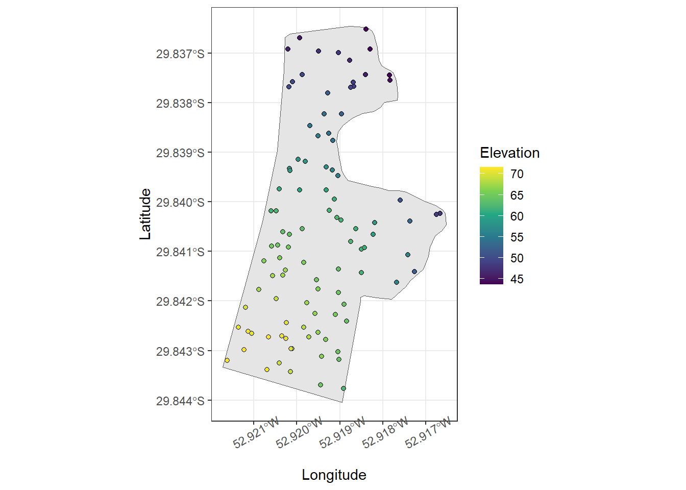
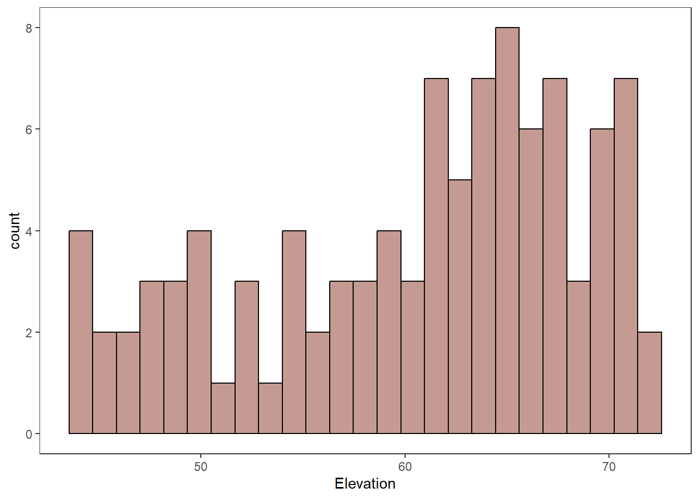
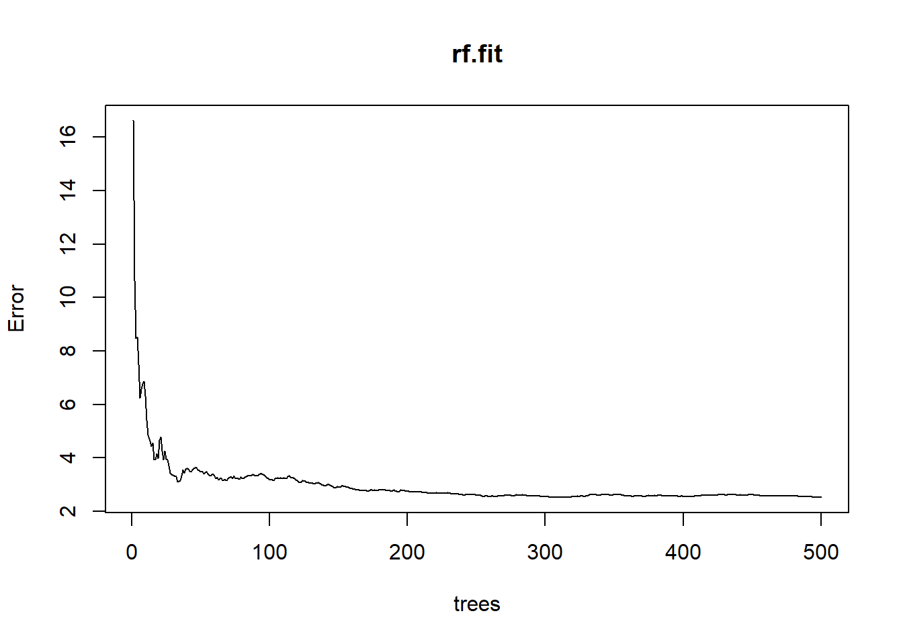
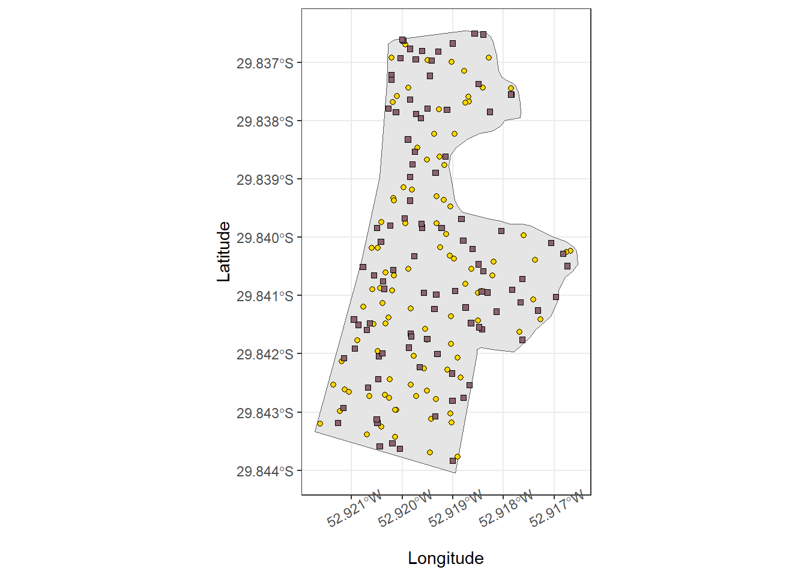
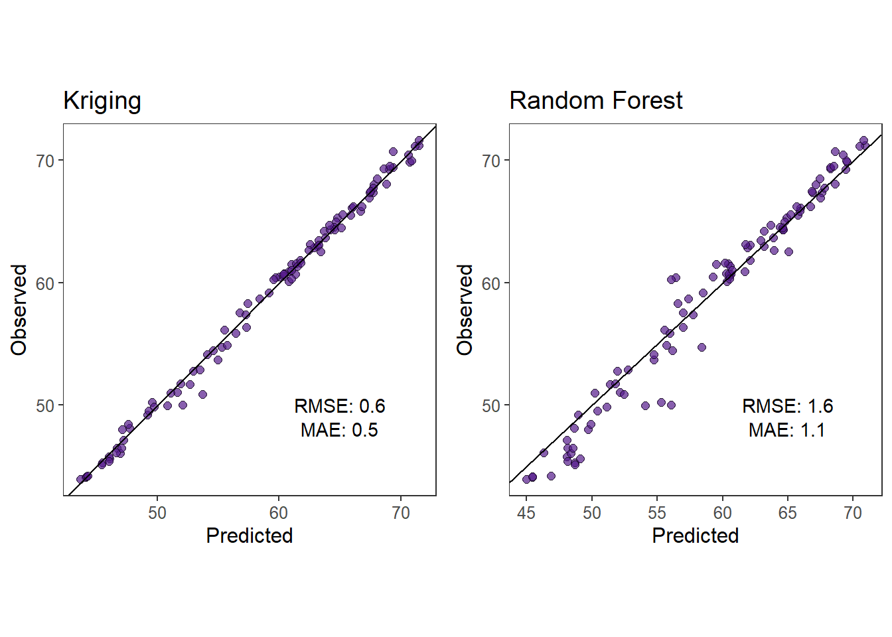

# Activity 2


## Chose an area on or close to campus where it is easy for you to understand how the elevation changes. For example, I chose the parking lot outside of Dickens Hall. Using a smartphone record the elevation at several locations (points) within the area you chose. I recommend using the app Strava, but you can use whatever you want.

*I decided to use a harvest map retrieved from a combine from my dad's farm. I used to operate the combine and I know the field very well. So I believe it will meet the requirements. Also, all the required information is available, such as coordinates, elevation and time.*

## Obtain a .gpx or .csv file for your elevation data. At minimum the file should contain the location and time of the elevation measurements.

**Upload data**


```r
# Points
points <-  st_read('https://www.dropbox.com/scl/fi/5km5t8yzjqh9fltq5wz2f/soybean23map.geojson?rlkey=7k2ppf8hl9v4oq4nxvx6n2ket&st=xhmxfx42&dl=1') %>% 
  dplyr::select(Elevation, geometry, Time) %>% 
  .[sample(nrow(.), 100), ] 
#> Reading layer `OGRGeoJSON' from data source 
#>   `https://www.dropbox.com/scl/fi/5km5t8yzjqh9fltq5wz2f/soybean23map.geojson?rlkey=7k2ppf8hl9v4oq4nxvx6n2ket&st=xhmxfx42&dl=1' 
#>   using driver `GeoJSON'
#> Simple feature collection with 25601 features and 13 fields
#> Geometry type: POINT
#> Dimension:     XY
#> Bounding box:  xmin: 314352.5 ymin: 6696958 xmax: 314835.8 ymax: 6697787
#> Projected CRS: WGS 84 / UTM zone 22S
# There are thousands of points, so for the purpose of this activity only a few will be utilized randomly.

# Polygon
polygon <- st_read('https://www.dropbox.com/scl/fi/bxbwxmgs22yx17j2g8m3y/pol.geojson?rlkey=lx39y99fewf8qgzfh87p0ptmp&st=ngala0hj&dl=1')
#> Reading layer `OGRGeoJSON' from data source 
#>   `https://www.dropbox.com/scl/fi/bxbwxmgs22yx17j2g8m3y/pol.geojson?rlkey=lx39y99fewf8qgzfh87p0ptmp&st=ngala0hj&dl=1' 
#>   using driver `GeoJSON'
#> Simple feature collection with 1 feature and 3 fields
#> Geometry type: POLYGON
#> Dimension:     XY
#> Bounding box:  xmin: -5891219 ymin: -3483519 xmax: -5890641 ymax: -3482545
#> Projected CRS: WGS 84 / Pseudo-Mercator
```

## Plot/map your elevation data. I would recommend using R and/or Google earth.


```r
ggplot()+
  geom_sf(data = polygon)+
  geom_sf(data = points, aes(fill = Elevation), shape = 21)+
  scale_fill_viridis_c()+
  labs(x = 'Longitude', y = 'Latitude')+
  theme_bw()+
  theme(axis.text.x = element_text(angle = 30))
```



## Explore your elevation data. For example, are there any unique features of your data? Do your data contain obvious measurement error (e.g., an elevation that can’t possibly be true)? Really try to explore your data as best as possible using the plots/maps you made in .


```r
ggplot()+
  geom_histogram(data = points, aes(x = Elevation), 
                 bins = 25, 
                 color = 'black',
                 fill = 'tomato4',
                 alpha = .5)+
  theme_bw()+
  theme(panel.grid = element_blank())
```



## Write out the goals that you wish to accomplish using your elevation data. For example, my goal was to make a map of the Dicken’s Hall parking lot. This involves using the elevation data I collected to make predictions of the elevation at any possible spatial locations within the parking lot. I would also like to make inference about the location where the elevation is lowest within the parking lot.

*My goal is to make predictions of the elevation at any location of the field and also make inference about where the elevation is highest.*

## Write out several statistical or machine learning models that you think you can use to answer the questions/goals you wrote in prompt #5. Be as creative and inclusive here. For each statistical or machine learning model, make sure you explain each component (piece) of the model

**Model 1 - Random Forest**

$\hat{y}(\textbf{X}) = \frac{1}{B} \sum_{b=1}^B T_b (\textbf{X})$

$B$: number of trees in the forest.\
$T_b(\textbf{X})$: prediction of the b-th tree of input $X$.\
$\hat{y}(\textbf{X})$: final prediction of the random forest for input $X$.

**Model 2 - Kriging**

*Data Model*

$Y(s_i) = m(s_i) + \epsilon(s_i)$\
$\epsilon(s_i) \sim N(0, \sigma^2)$

*Process Model*

$\hat{Y}(s_0) \sim m(s_0) + \sum_{i=1}^{n} \lambda_i [Y(s_i) - m(s_i)]$

$\hat{Y}(s_0)$ represents the predicted elevation at the new location $s_0$.\
$m(s_0)$ is the estimated mean trend at the new location $s_0$.\
$Y(s_i)$ are the observed elevations at known locations $s_i$.\
${\lambda}_i$ are the weights calculated to minimize the variance of the prediction error, based on the spatial autocorrelation structure.\
$m(s_i)$ is the mean trend at the observed locations.\
$n$ is the number of observed locations used in the predictions.

## 7). Of the models you developed in prompt #6, find (or develop) software to fit at least two of these models to your elevation data. Note that in a perfect world, you would be able to either find existing software or develop new programs that enable you to fit any statistical or machine learning model you want. In reality, you may may end up having to make some unwanted changes to your models in prompt #6 to be able to find existing software to fit these models to the data.


**Kriging**


```r

# Create random points
newPoints <- st_sample(polygon, size = 10000, type = "random") %>% 
  as(., 'Spatial') %>% 
  spTransform(., CRS(proj4string(points %>% as(.,'Spatial'))))
```


```r
points
#> Simple feature collection with 100 features and 2 fields
#> Geometry type: POINT
#> Dimension:     XY
#> Bounding box:  xmin: 314356.1 ymin: 6696981 xmax: 314828.5 ymax: 6697785
#> Projected CRS: WGS 84 / UTM zone 22S
#> First 10 features:
#>       Elevation                Time
#> 18847  46.69362 4/8/2023 7:40:08 PM
#> 18895  48.92382 4/8/2023 7:40:56 PM
#> 25102  61.36804 4/8/2023 9:41:34 PM
#> 2986   66.15939 4/8/2023 2:30:08 PM
#> 1842   50.01868 4/8/2023 2:04:36 PM
#> 3371   50.05362 4/8/2023 2:36:33 PM
#> 11638  71.28713 4/8/2023 5:14:48 PM
#> 4761   60.44254 4/8/2023 3:03:38 PM
#> 6746   58.86041 4/8/2023 3:42:34 PM
#> 16128  43.89501 4/8/2023 6:46:11 PM
#>                       geometry
#> 18847 POINT (314620.2 6697715)
#> 18895 POINT (314630.1 6697657)
#> 25102 POINT (314639.5 6697339)
#> 2986  POINT (314557.5 6697202)
#> 1842  POINT (314484.4 6697654)
#> 3371  POINT (314492.5 6697664)
#> 11638   POINT (314446 6697021)
#> 4761  POINT (314512.1 6697424)
#> 6746    POINT (314489 6697471)
#> 16128 POINT (314655.1 6697785)

krig.df <- data.frame(ele = points$Elevation,
                      lon = st_coordinates(points$geometry)[,1],
                      lat = st_coordinates(points$geometry)[,2])

krig.mod <- gam(ele ~ s(lon,lat, bs = 'gp'), data = krig.df)

newpoints.krig <-  as.data.frame(newPoints) %>% 
  rename("lon" = 'coords.x1', 
         'lat' = 'coords.x2')

newpoints.krig$ele <- predict(krig.mod, newpoints.krig, type = 'response')
```


**Random Forest**


```r
df.rf <- as.data.frame(points)
df.rf$lon <- st_coordinates(points)[,1]
df.rf$lat <- st_coordinates(points)[,2]

rf.fit <- randomForest(Elevation ~ lon + lat, data=df.rf, ntree=500, importance=TRUE)

plot(rf.fit)
```



```r

newPoints.rf <- as.data.frame(newPoints) %>% 
  rename("lon" = 'coords.x1', 
         'lat' = 'coords.x2')

pred.rf <- predict(rf.fit, newPoints.rf) %>% as.data.frame()

newPoints.rf$ele <- pred.rf$.
```

## Related to prompt #5, use both models you fit to your elevation data in prompt #7 to answer the questions/goals. For my elevation data, this would include making a predictive heatmap showing the elevation of the Dickens Hall parking lot and then estimating the coordinates of the point where elevation is at a minimum.


**Kriging**


```r
krig.sf <- st_as_sf(newpoints.krig, coords = c('lon','lat'), crs = st_crs(points))

ggplot()+
  geom_sf(data = krig.sf, aes(fill = ele), 
          shape = 21)+
    geom_sf(data = polygon, fill = NA, color = 'black')+
  geom_sf(data = krig.sf %>% filter(ele == max(ele)), fill = 'darkred', shape = 22,
          size = 3)+
  scale_fill_viridis_c()+
  labs(x = 'Longitude', y = 'Latitude')+
  theme_bw()+
  theme(axis.text.x = element_text(angle = 30))
```


**Random Forest**


```r
rf.sf <- st_as_sf(newPoints.rf, coords = c('lon','lat'), crs = st_crs(points))

ggplot()+
  geom_sf(data = rf.sf, aes(fill = ele), 
          shape = 21)+
    geom_sf(data = polygon, fill = NA, color = 'black')+
  geom_sf(data = krig.sf %>% filter(ele == max(ele)), fill = 'darkred', shape = 22,
          size = 3)+
  scale_fill_viridis_c()+
  labs(x = 'Longitude', y = 'Latitude')+
  theme_bw()+
  theme(axis.text.x = element_text(angle = 30))
```


## Based on the material in Chapter 6 of Spatio-Temporal Statistics with R and our discussion in class on March 26, compare, check and evaluate the two models from #8.


```r
# Obtain new points at the same area for model testing.
newpoints.test <- st_read('https://www.dropbox.com/scl/fi/5km5t8yzjqh9fltq5wz2f/soybean23map.geojson?rlkey=7k2ppf8hl9v4oq4nxvx6n2ket&st=xhmxfx42&dl=1') %>% 
  dplyr::select(Elevation, geometry, Time) %>% 
  .[sample(nrow(.), 100), ]
#> Reading layer `OGRGeoJSON' from data source 
#>   `https://www.dropbox.com/scl/fi/5km5t8yzjqh9fltq5wz2f/soybean23map.geojson?rlkey=7k2ppf8hl9v4oq4nxvx6n2ket&st=xhmxfx42&dl=1' 
#>   using driver `GeoJSON'
#> Simple feature collection with 25601 features and 13 fields
#> Geometry type: POINT
#> Dimension:     XY
#> Bounding box:  xmin: 314352.5 ymin: 6696958 xmax: 314835.8 ymax: 6697787
#> Projected CRS: WGS 84 / UTM zone 22S

# Plot training and testing datasets
ggplot()+
  geom_sf(data = polygon)+
  geom_sf(data = points, shape = 21, fill = 'gold')+
  geom_sf(data = newpoints.test, shape = 22, fill = 'pink4')+
  scale_fill_viridis_c()+
  labs(x = 'Longitude', y = 'Latitude')+
  theme_bw()+
  theme(axis.text.x = element_text(angle = 30))
```




```r
# Predictions
test.df <- data.frame(ele = newpoints.test$Elevation,
                      lon = st_coordinates(newpoints.test$geometry)[,1],
                      lat = st_coordinates(newpoints.test$geometry)[,2])

test.df$pred.krig <- predict(krig.mod, newdata = test.df, type = 'response')
test.df$pred.rf <- predict(rf.fit, newdata = test.df)
```


```r
rmse.krig <- rmse(test.df$ele, as.numeric(test.df$pred.krig))
mae.krig <- mae(test.df$ele, as.numeric(test.df$pred.krig))

rmse.rf <- rmse(test.df$ele, as.numeric(test.df$pred.rf))
mae.rf <- mae(test.df$ele, as.numeric(test.df$pred.rf))

#Kriging metrics

krigingMetrics <- test.df %>% 
  ggplot()+
  geom_point(aes(pred.krig, ele), fill = 'purple4', color = 'black', shape = 21, size = 2,
             alpha = .7)+
  geom_abline(slope = 1)+
  #scale_y_continuous(limits = c(0,90), breaks = seq(0,100, 20))+
  #scale_x_continuous(limits = c(0,90), breaks = seq(0,100, 20))+
  theme_bw()+
  labs(title = 'Kriging', x = 'Predicted', y = 'Observed')+
  annotate('text', label = paste0('RMSE: ', round(rmse.krig,1)), x = 65, y = 50)+
  annotate('text', label = paste0('MAE: ', round(mae.krig,1)), x = 65, y = 48)+
  theme(panel.grid = element_blank(),
        aspect.ratio = 1,
        text = element_text(size = 12)
        )

#Rf metrics

rfMetrics <- test.df %>% 
  ggplot()+
  geom_point(aes(pred.rf, ele), fill = 'purple4', color = 'black', shape = 21, size = 2,
             alpha = .7)+
  geom_abline(slope = 1)+
  #scale_y_continuous(limits = c(0,90), breaks = seq(0,100, 20))+
  #scale_x_continuous(limits = c(0,90), breaks = seq(0,100, 20))+
  theme_bw()+
  labs(title = 'Random Forest', x = 'Predicted', y = 'Observed')+
  annotate('text', label = paste0('RMSE: ', round(rmse.rf,1)), x = 65, y = 50)+
  annotate('text', label = paste0('MAE: ', round(mae.rf,1)), x = 65, y = 48)+
  theme(panel.grid = element_blank(),
        aspect.ratio = 1,
        text = element_text(size = 12)
        )

ggarrange(krigingMetrics,rfMetrics)
```



