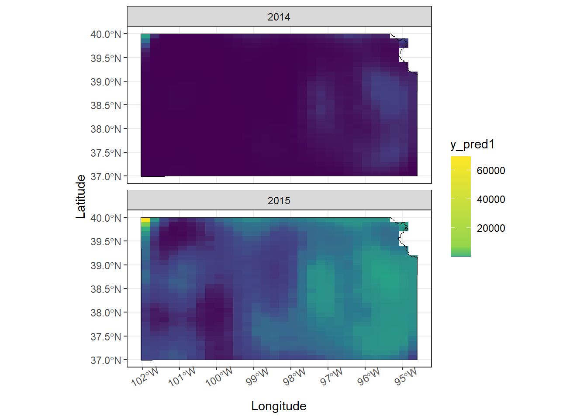

# Activity 3


## Upload data


```r
# Upload data
url <- "https://www.dropbox.com/scl/fi/9ymxt900s77uq50ca6dgc/Enders-et-al.-2018-data.csv?rlkey=0rxjwleenhgu0gvzow5p0x9xf&dl=1"
df <- read.csv(url)
df <- df[,c(2,8:10)] %>% 
  mutate(presence = ifelse(EGA != 0, 1, 0))# Keep only the data on bird cherry-oat aphid

# Download KS shapefile
ks <- raster::getData(name="GADM", country="USA", level=1) %>% 
  st_as_sf() %>% 
  filter(NAME_1 == 'Kansas')

df_sf <- df %>% st_as_sf(coords = c('long', 'lat'), crs = st_crs(ks))
```

## Upload covariates


```r
url.nlcd <- "https://www.dropbox.com/scl/fi/ew7yzm93aes7l8l37cn65/KS_2011_NLCD.img?rlkey=60ahyvxhq18gt0yr47tuq5fig&dl=1"
rl.nlcd2011 <- raster(url.nlcd)

plot(rl.nlcd2011)
```


```r


# Make raster file that contains pixels with value of 1 if grassland and 
# zero if other type of land cover.
# NLCD legend can be found here: https://www.mrlc.gov/data/legends/national-land-cover-database-2011-nlcd2011-legend
rl.nlcd.grass <- rl.nlcd2011
rl.nlcd.grass[] <- ifelse(rl.nlcd.grass[]==71,1,0)

plot(rl.nlcd.grass)
```


```r

pts.sample<- df

coordinates(pts.sample) =~ long + lat
proj4string(pts.sample) <- CRS("+proj=longlat +datum=WGS84 +no_defs +ellps=WGS84 +towgs84=0,0,0")

# Calculate percentage of land area that is grassland within 5 km of sampled location
df$grass.perc <- unlist(lapply(extract(rl.nlcd.grass,pts.sample,buffer=5000),mean))*100

hist(df$grass.perc,col="grey",main="",xlab="% grassland within \n5 km at sample location")
```


## For the data on the abundance of English grain aphids, propose three different statistical models (or machine learning approach) that are capable of predicting the number of English grain aphids at any location within the state of Kansas at any time for the years 2014 and 2015. Make sure to write out the three statistical models using formal notation and fully describe each component using words.

*Model 1*

Data model $$Z = y$$ Process model Using Poisson distribution

$$[y|\lambda] = Poisson(\lambda) $$

$$\eta_s\sim MUN(0, \sigma)$$ $$\eta_t\sim MVN(0, \sigma)$$
$$E(y)=e^{\beta_0+\beta_1\cdot X~\eta_s+\eta_t}$$

*Model 2*

Data model

$$Z = y$$ Process model Using Negative binomial distribution

$$[y|r,p] = NB(r, p)$$ $$\eta_s\sim MVN(0, \sigma)$$
$$\eta_t\sim  MVN(0, \sigma)$$
$$E(y)=e^{\beta_0+\beta_1\cdot X~\eta_s+\eta_t}$$

*Model 3*

Data model

$$Z = y$$ Process model Using zero inflated poisson distribution

$$[y|p, \lambda]=ZIP(p,\lambda)$$ $$\eta_s\sim MVN(0, \sigma^2)$$
$$E(y)=e^{\beta_0+\beta_1\cdot X~\eta_s+\eta_t}$$

## For the three statistical models you proposed in question #1, propose a way to measure the accuracy (and perhaps the calibration) of predictions.

RMSE and MAE and AIC.

## Fit the three statistical models you proposed in question #1 to the English grain aphid abundance data.


```r

ggplot()+
  geom_sf(data = ks)+
  geom_sf(data = df_sf, shape = 21, aes(size = EGA, fill = factor(presence)))+
  theme_bw()+
  facet_wrap(~year, ncol = 1)
```


### Model 1


```r
m1 <- gam(EGA ~ grass.perc + as.factor(year) + s(long,lat, bs = "gp"), 
          family = poisson(link = "log"), data = df)

summary(m1)
#> 
#> Family: poisson 
#> Link function: log 
#> 
#> Formula:
#> EGA ~ grass.perc + as.factor(year) + s(long, lat, bs = "gp")
#> 
#> Parametric coefficients:
#>                       Estimate Std. Error z value Pr(>|z|)
#> (Intercept)         -3.1624342  0.2629681 -12.026   <2e-16
#> grass.perc          -0.0084544  0.0009811  -8.617   <2e-16
#> as.factor(year)2015  5.5241770  0.2584600  21.373   <2e-16
#>                        
#> (Intercept)         ***
#> grass.perc          ***
#> as.factor(year)2015 ***
#> ---
#> Signif. codes:  
#> 0 '***' 0.001 '**' 0.01 '*' 0.05 '.' 0.1 ' ' 1
#> 
#> Approximate significance of smooth terms:
#>               edf Ref.df Chi.sq p-value    
#> s(long,lat) 31.97     32   8009  <2e-16 ***
#> ---
#> Signif. codes:  
#> 0 '***' 0.001 '**' 0.01 '*' 0.05 '.' 0.1 ' ' 1
#> 
#> R-sq.(adj) =  0.395   Deviance explained = 69.9%
#> UBRE = 28.333  Scale est. = 1         n = 341
```

### Model 2


```r
m2 <- gam(EGA ~ grass.perc + as.factor(year) + s(long,lat, bs = "gp"), 
          family = nb(theta = NULL,link = "log"), data = df)

summary(m2)
#> 
#> Family: Negative Binomial(0.623) 
#> Link function: log 
#> 
#> Formula:
#> EGA ~ grass.perc + as.factor(year) + s(long, lat, bs = "gp")
#> 
#> Parametric coefficients:
#>                      Estimate Std. Error z value Pr(>|z|)
#> (Intercept)         -2.512753   0.343910  -7.306 2.74e-13
#> grass.perc          -0.005170   0.004665  -1.108    0.268
#> as.factor(year)2015  5.164253   0.325909  15.846  < 2e-16
#>                        
#> (Intercept)         ***
#> grass.perc             
#> as.factor(year)2015 ***
#> ---
#> Signif. codes:  
#> 0 '***' 0.001 '**' 0.01 '*' 0.05 '.' 0.1 ' ' 1
#> 
#> Approximate significance of smooth terms:
#>               edf Ref.df Chi.sq p-value    
#> s(long,lat) 8.884  11.75  372.1  <2e-16 ***
#> ---
#> Signif. codes:  
#> 0 '***' 0.001 '**' 0.01 '*' 0.05 '.' 0.1 ' ' 1
#> 
#> R-sq.(adj) =  0.247   Deviance explained = 68.6%
#> -REML = 962.32  Scale est. = 1         n = 341
```

### Model 3


```r

m3 <- gam(list(EGA ~ grass.perc + as.factor(year) + s(long,lat, bs = "gp"), ~ grass.perc + s(long,lat, bs = "gp")), 
          family = ziplss(), data = df)

summary(m3)
#> 
#> Family: ziplss 
#> Link function: identity identity 
#> 
#> Formula:
#> EGA ~ grass.perc + as.factor(year) + s(long, lat, bs = "gp")
#> ~grass.perc + s(long, lat, bs = "gp")
#> 
#> Parametric coefficients:
#>                       Estimate Std. Error z value Pr(>|z|)
#> (Intercept)         -1.5217298  0.3565564  -4.268 1.97e-05
#> grass.perc          -0.0098653  0.0009923  -9.942  < 2e-16
#> as.factor(year)2015  4.0446085  0.3513845  11.510  < 2e-16
#> (Intercept).1       -0.0430138  0.1513463  -0.284    0.776
#> grass.perc.1         0.0026990  0.0044434   0.607    0.544
#>                        
#> (Intercept)         ***
#> grass.perc          ***
#> as.factor(year)2015 ***
#> (Intercept).1          
#> grass.perc.1           
#> ---
#> Signif. codes:  
#> 0 '***' 0.001 '**' 0.01 '*' 0.05 '.' 0.1 ' ' 1
#> 
#> Approximate significance of smooth terms:
#>                 edf Ref.df  Chi.sq  p-value    
#> s(long,lat)   31.55  31.84 6583.32  < 2e-16 ***
#> s.1(long,lat) 11.98  15.64   43.45 0.000195 ***
#> ---
#> Signif. codes:  
#> 0 '***' 0.001 '**' 0.01 '*' 0.05 '.' 0.1 ' ' 1
#> 
#> Deviance explained = 61.3%
#> -REML = 5369.7  Scale est. = 1         n = 341
```

## Create points for prediction


```r
####
rl.E.y <- raster(,nrow=30,ncols=30,ext=extent(ks),crs=crs(ks))
newPoints <- data.frame(long = xyFromCell(rl.E.y,cell=1:length(rl.E.y[]))[,1],
                      lat = xyFromCell(rl.E.y,cell=1:length(rl.E.y[]))[,2]) %>%
  st_as_sf(coords = c('long', 'lat'), crs = st_crs(ks)) %>% 
  st_filter(ks) %>% as.data.frame() %>% 
  cross_join(data.frame(year = as.factor(c('2014', '2015'))))

newPoints$lat <- st_coordinates(newPoints$geometry)[,2]
newPoints$long <- st_coordinates(newPoints$geometry)[,1]

# 
# newPoints <- st_sample(ks, size = 1000, type = "regular") %>%
#   as(., 'Spatial') %>% as.data.frame() %>%
#     rename("long" = 'coords.x1',
#          'lat' = 'coords.x2') %>%
#   cross_join(data.frame(year = as.factor(c('2014', '2015'))))

    
pts.sample<- newPoints

coordinates(pts.sample) =~ long + lat
proj4string(pts.sample) <- CRS("+proj=longlat +datum=WGS84 +no_defs +ellps=WGS84 +towgs84=0,0,0")

newPoints$grass.perc <- unlist(lapply(extract(rl.nlcd.grass,pts.sample,buffer=5000),mean))*100

```


```r
# Fit mod 1
newPoints$y_pred1 <- predict(m1, newPoints, type = 'response')

# m1.pred <- st_as_sf(newPoints, coords = c('long', 'lat'), crs = st_crs(ks),
#                     agr = 'constant') 

ggplot()+

  geom_tile(data = newPoints, aes(x = long, y = lat, fill = y_pred1))+
    geom_sf(data = ks, fill = NA, color = 'black')+
  scale_fill_viridis_c(values = c(0, 0.00001, 0.0001, 0.001, 0.01, 0.1, 1))+
  labs(x = 'Longitude', y = 'Latitude')+
  theme_bw()+
  theme(axis.text.x = element_text(angle = 30))+
  facet_wrap(~year, ncol = 1)
```




```r
# Fit mod 2
newPoints$y_pred2 <- predict(m2, newPoints, type = 'response')


ggplot()+

  geom_tile(data = newPoints, aes(x = long, y = lat, fill = y_pred2))+
    geom_sf(data = ks, fill = NA, color = 'black')+
  scale_fill_viridis_c()+
  labs(x = 'Longitude', y = 'Latitude')+
  theme_bw()+
  theme(axis.text.x = element_text(angle = 30))+
  facet_wrap(~year, ncol = 1)
```


```r
# Fit mod 3
newPoints$y_pred3 <- predict(m3, newPoints, type = 'response')

# m3.pred <- st_as_sf(newPoints, coords = c('long', 'lat'), crs = st_crs(ks),
                    # agr = 'constant') 

ggplot()+

  geom_tile(data = newPoints, aes(x = long, y = lat, fill = y_pred3))+
    geom_sf(data = ks, fill = NA, color = 'black')+
  scale_fill_viridis_c(values = c(0, 0.00001, 0.0001, 0.001, 0.01, 0.1, 1))+
  labs(x = 'Longitude', y = 'Latitude')+
  theme_bw()+
  theme(axis.text.x = element_text(angle = 30))+
  facet_wrap(~year, ncol = 1)
```


## For the three models you fit in question #3, which model makes the most accurate predictions? How good is the best model in real world terms? Remember we are trying to predict the number of English grain aphids, which is a count!


```r
rmse.m1 <- rmse(df$EGA, as.numeric(predict(m1, df, type = 'response')))
mae.m1 <- mae(df$EGA, as.numeric(predict(m1, df, type = 'response')))

rmse.m2 <- rmse(df$EGA, as.numeric(predict(m2, df, type = 'response')))
mae.m2 <- mae(df$EGA, as.numeric(predict(m2, df, type = 'response')))

rmse.m3 <- rmse(df$EGA, as.numeric(predict(m3, df, type = 'response')))
mae.m3 <- mae(df$EGA, as.numeric(predict(m3, df, type = 'response')))

#m1 metrics

m1Metrics <- df %>% 
  ggplot()+
  geom_point(aes(predict(m1, df, type = 'response'), EGA), 
fill = 'purple4', color = 'black', shape = 21, size = 2,
             alpha = .7)+
  geom_abline(slope = 1)+
  scale_y_continuous(limits = c(0,1000), breaks = seq(0,1000, 200))+
  scale_x_continuous(limits = c(0,1000), breaks = seq(0,1000, 200))+  theme_bw()+
  labs(title = 'm1', x = 'Predicted', y = 'Observed')+
  annotate('text', label = paste0('RMSE: ', round(rmse.m1,1)), x = 700, y = 200)+
  annotate('text', label = paste0('MAE: ', round(mae.m1,1)), x = 700, y = 100)+
  theme(panel.grid = element_blank(),
        aspect.ratio = 1,
        text = element_text(size = 12)
        )

#m2 metrics

m2Metrics <- df %>% 
  ggplot()+
  geom_point(aes(predict(m2, df, type = 'response'), EGA), 
             fill = 'purple4', color = 'black', shape = 21, size = 2,
             alpha = .7)+
  geom_abline(slope = 1)+
  scale_y_continuous(limits = c(0,1000), breaks = seq(0,1000, 200))+
  scale_x_continuous(limits = c(0,1000), breaks = seq(0,1000, 200))+  theme_bw()+
  labs(title = 'm2', x = 'Predicted', y = 'Observed')+
  annotate('text', label = paste0('RMSE: ', round(rmse.m2,1)), x = 700, y = 200)+
  annotate('text', label = paste0('MAE: ', round(mae.m2,1)), x = 700, y = 100)+
  theme(panel.grid = element_blank(),
        aspect.ratio = 1,
        text = element_text(size = 12)
        )

m3Metrics <- df %>% 
  ggplot()+
  geom_point(aes(predict(m3, df, type = 'response'), EGA), 
             fill = 'purple4', color = 'black', shape = 21, size = 2,
             alpha = .7)+
  geom_abline(slope = 1)+
  scale_y_continuous(limits = c(0,1000), breaks = seq(0,1000, 200))+
  scale_x_continuous(limits = c(0,1000), breaks = seq(0,1000, 200))+
  theme_bw()+
  labs(title = 'm3', x = 'Predicted', y = 'Observed')+
  annotate('text', label = paste0('RMSE: ', round(rmse.m3,1)), x = 700, y = 200)+
  annotate('text', label = paste0('MAE: ', round(mae.m3,1)), x = 700, y = 100)+
  theme(panel.grid = element_blank(),
        aspect.ratio = 1,
        text = element_text(size = 12)
        )

ggarrange(m1Metrics,m2Metrics, m3Metrics, nrow = 1)
```


```r

AIC(m1, m2, m3)
#>          df       AIC
#> m1 34.97341 10896.425
#> m2 13.90150  1913.024
#> m3 50.09095 10464.469
```

## Summarize your results using words, numerical values and figures/maps.

